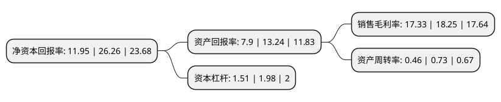

> 本页面由自动化程序生成于 2022年5月20日 01:23
> 内容可能存在错误，如有bug请提交issue至：https://github.com/Eroleice/doc-pi/issues
{.is-warning}

# 上市公司基本情况

## 基本资料

安徽省建筑设计研究总院股份有限公司（以下简称“建研设计”）成立于1992年07月11日，合肥市。于2021年12月06日在深交所创业板上市。

建研设计注册资本8,000万元，公司主要从事建筑设计，咨询，研发及其延伸业务，包含常规建筑设计业务，新兴业务设计与咨询，EPC总承包业务，施工图审查业务等。以下是详细信息：

- 公司名称: 安徽省建筑设计研究总院股份有限公司
- 股票代码: 301167.SZ
- 所在地: 安徽 - 合肥市
- 成立日期: 1992年07月11日
- 注册资本: 8,000万元
- 法定代表人: 高松
- 主营业务: 公司主要从事建筑设计，咨询，研发及其延伸业务，包含常规建筑设计业务，新兴业务设计与咨询，EPC总承包业务，施工图审查业务等
- 公司官网: www.aadri.com
- 公司介绍: 公司成立于1955年，凭借着全面的专业资质、雄厚的人才力量、优良的服务能力，在安徽省建筑设计行业处于领先地位，在国内建筑设计行业也拥有较高的知名度。公司主要从事建筑设计、咨询、研发及其延伸业务，包含常规建筑设计业务、新兴业务设计与咨询、EPC总承包业务、施工图审查业务等。报告期主营业务收入占比均在99%以上，主营业务突出。报告期内，公司实现营业收入分别为29,878.54万元、33,954.10万元、37,391.82万元和17,672.34万元；归属于母公司所有者的净利润分别为5,022.89万元、5,398.32万元、6,454.35万元和2,928.03万元，整体保持稳步增长的趋势。公司在业界赢得了良好口碑，具有较高美誉度，现有安徽省学术和技术带头人5名，安徽省工程勘察设计大师11名，安徽省建设系统有突出贡献中青年专家12名，持有各类注册专业技术资格的人员152名。累计获得各类国家、省市优秀设计奖300余项，多次被评为“中国诚信勘察设计单位”、“全国工程勘察设计行业先进企业”及“当代中国建筑设计百家名院”等称号。公司系安徽省建筑产业现代化示范基地单位和低碳环保推广标杆企业，并在医疗建筑、教育建筑、酒店建筑、文体建筑、商业综合体等专项设计领域均形成自己的特色。

## 股东及高管情况

上市公司第一大股东为安徽省国有资本运营控股集团有限公司，持股24,000,000股，占比30%，**疑似为**上市公司实际控制人。

截至2022年03月31日，上市公司的前十大股东中，共有9名自然人股东，1名机构股东，其中5%以上大股东共有1名。上市公司前十大股东明细如下：

> 截至2022年03月31日，上市公司前十大股东信息如下：

| 股东名称 | 持股数量（股） | 持股比例 |
| --- | --- | --- |
| 安徽省国有资本运营控股集团有限公司 | 24,000,000 | 30% |
| 左玉琅 | 2,797,092 | 3.5% |
| 高松 | 2,317,860 | 2.9% |
| 徐正安 | 1,644,212 | 2.06% |
| 毕功华 | 1,527,612 | 1.91% |
| 姚茂举 | 1,523,612 | 1.9% |
| 朱兆晴 | 1,484,612 | 1.86% |
| 韦法华 | 850,600 | 1.06% |
| 孙苹 | 611,800 | 0.76% |
| 李惠 | 602,700 | 0.75% |

## 利润表分析

上市公司2021年总收入为3.93亿元，净利润为0.68亿元，实现盈利。

## 杜邦分析

> 数据列示周期：2021年 | 2020年 | 2019年
{.is-info}

上市公司的净资产收益率在近一年有所下降，下降幅度为-54.49%，其变化情况分解如下：
- 上市公司的销售毛利率在近一年下降了-5.04%，可能是生产效率的下降、商品原材料价格上涨或商品价格的下跌所致。
- 上市公司的资产周转率在近一年下降了-36.99%，可能是源自于更慢的销售回款或库存管理效果下降。
- 上市公司的财务杠杆比率在近一年下降了-23.74%，可能是减少负债降低财务费用。

