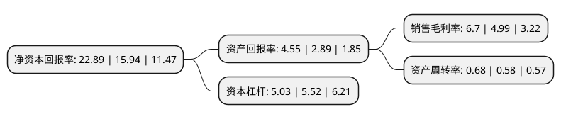

> 本页面由自动化程序生成于 2022年5月20日 01:23
> 内容可能存在错误，如有bug请提交issue至：https://github.com/Eroleice/doc-pi/issues
{.is-warning}

# 上市公司基本情况

## 基本资料

四川路桥建设集团股份有限公司（以下简称“四川路桥”）成立于1999年12月28日，成都市。于2003年03月25日在上交所主板上市。

四川路桥注册资本477,497.389万元，主要业务:桥梁施工，道路施工，通行费收入，电力销售。以下是详细信息：

- 公司名称: 四川路桥建设集团股份有限公司
- 股票代码: 600039.SH
- 所在地: 四川 - 成都市
- 成立日期: 1999年12月28日
- 注册资本: 477,497.389万元
- 法定代表人: 熊国斌
- 主营业务: 桥梁施工，道路施工，通行费收入，电力销售
- 公司官网: www.scrbc.com.cn
- 公司介绍: 公司是一家路桥类上市公司,具有国家公路工程施工总承包一级资质,主要从事交通基础设施的设计、投资、建设和运营。公司在高速公路、特大型桥梁和隧道等领域施工具有明显的竞争优势,尤其是高速公路沥青路面施工和深基大跨度高难度桥梁、特大型桥梁施工是公司的强项,桥梁工程的多项技术特别是特大桥梁建设施工技术的科技含量已处于同类桥型国内和世界先进水平。公司在立足施工的基础上，正积极拓展水电行业，组建了四川巴朗河水电开发有限公司,该公司主要负责投资和经营巴朗河流域水电开发项目。公司秉承“发展交通、造福人民”的企业宗旨，弘扬“攻坚克难、甘于奉献、勇于胜利”的新时代路桥精神，致力于构建综合实力雄厚、经济运行高效、国际竞争力突出、品牌影响宽广的现代化综合性跨国企业集团。

## 股东及高管情况

上市公司第一大股东为蜀道投资集团有限责任公司，持股3,297,876,523股，占比69.0659%，为上市公司实际控制人。

截至2022年05月17日，上市公司的前十大股东中，共有3名机构股东，6个产品账户，1个海外主体，其中5%以上大股东共有2名。上市公司前十大股东明细如下：

> 截至2022年05月17日，上市公司前十大股东信息如下：

| 股东名称 | 持股数量（股） | 持股比例 |
| --- | --- | --- |
| 蜀道投资集团有限责任公司 | 3,297,876,523 | 69.0659% |
| 蜀道投资集团有限责任公司 | 3,280,945,218 | 68.7113% |
| 香港中央结算有限公司(陆股通) | 66,293,714 | 1.39% |
| 中央汇金资产管理有限责任公司 | 44,599,889 | 0.93% |
| 广发基金-农业银行-广发中证金融资产管理计划 | 26,744,500 | 0.56% |
| 南方基金-农业银行-南方中证金融资产管理计划 | 26,744,500 | 0.56% |
| 银华基金-农业银行-银华中证金融资产管理计划 | 26,744,500 | 0.56% |
| 中欧基金-农业银行-中欧中证金融资产管理计划 | 26,744,500 | 0.56% |
| 大成基金-农业银行-大成中证金融资产管理计划 | 26,744,500 | 0.56% |
| 博时基金-农业银行-博时中证金融资产管理计划 | 26,744,500 | 0.56% |

## 利润表分析

上市公司2021年总收入为850.48亿元，净利润为56.94亿元，实现盈利。

## 杜邦分析

> 数据列示周期：2021年 | 2020年 | 2019年
{.is-info}

上市公司的净资产收益率在近一年有所上升，上升幅度为43.6%，其变化情况分解如下：
- 上市公司的销售毛利率在近一年上升了34.27%，可能是生产效率的提升、商品原材料价格下跌或商品价格的上涨所致。
- 上市公司的资产周转率在近一年上升了17.24%，可能是源自于更快的销售回款或库存管理效果提升。
- 上市公司的财务杠杆比率在近一年下降了-8.88%，可能是减少负债降低财务费用。

