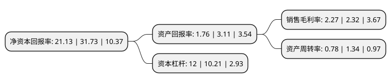

> 本页面由自动化程序生成于 2022年5月20日 01:25
> 内容可能存在错误，如有bug请提交issue至：https://github.com/Eroleice/doc-pi/issues
{.is-warning}

# 上市公司基本情况

## 基本资料

陕西建工集团股份有限公司（以下简称“陕西建工”）成立于1998年11月30日，西安市。于2000年06月22日在上交所主板上市。

陕西建工注册资本368,888.229万元，主营业务:石油化工安装。以下是详细信息：

- 公司名称: 陕西建工集团股份有限公司
- 股票代码: 600248.SH
- 所在地: 陕西 - 西安市
- 成立日期: 1998年11月30日
- 注册资本: 368,888.229万元
- 法定代表人: 张义光
- 主营业务: 主营业务:石油化工安装
- 公司官网: www.sxjgkg.com
- 公司介绍: 公司主要业务为石油化工工程施工、房屋建筑工程施工、市政公用工程施工总承包、机电设备安装工程、防腐保温工程、土石方工程、钢结构工程专业承包、设备制造及销售、设备吊装及运输、物资销售、以及工程技术服务等业务。公司具有石油化工工程施工总承包、建筑工程施工总承包、机电工程施工总承包一级资质，市政公用工程施工总承包二级资质，钢结构、防水防腐保温、消防设施专业承包一级资质。取得了美国机械工程师协会ASME压力容器“U”钢印认证；A2类压力容器设计许可证；A1、A2、A3(现场组焊)类压力容器制造许可证和一级锅炉安装资质；GA1、GC1压力管道安装及起重机械安装等资质。

## 股东及高管情况

上市公司第一大股东为陕西建工控股集团有限公司，持股2,473,935,223股，占比67.06%，为上市公司实际控制人。

截至2022年03月31日，上市公司的前十大股东中，共有1名自然人股东，6名机构股东，3个产品账户，其中5%以上大股东共有1名。上市公司前十大股东明细如下：

> 截至2022年03月31日，上市公司前十大股东信息如下：

| 股东名称 | 持股数量（股） | 持股比例 |
| --- | --- | --- |
| 陕西建工控股集团有限公司 | 2,473,935,223 | 67.06% |
| 陕西延长石油(集团)有限责任公司 | 163,498,712 | 4.43% |
| 中信证券-长安汇通投资管理有限公司-中信证券长安汇通1号单一资产管理计划 | 85,684,034 | 2.32% |
| 刘纯权 | 53,694,457 | 1.46% |
| 陕西金资精工投资基金(有限合伙) | 49,627,119 | 1.35% |
| 长安汇通投资管理有限公司 | 47,774,119 | 1.3% |
| 中国工商银行股份有限公司-海富通改革驱动灵活配置混合型证券投资基金 | 32,823,900 | 0.89% |
| 陕西建工实业有限公司 | 22,300,292 | 0.6% |
| 陕西交控投资集团有限公司 | 16,255,799 | 0.44% |
| 陕西延化工程建设有限责任公司 | 12,520,326 | 0.34% |

## 利润表分析

上市公司2021年总收入为1,594.77亿元，净利润为36.22亿元，实现盈利。

## 杜邦分析

> 数据列示周期：2021年 | 2020年 | 2019年
{.is-info}

上市公司的净资产收益率在近一年有所下降，下降幅度为-33.41%，其变化情况分解如下：
- 上市公司的销售毛利率在近一年下降了-2.16%，可能是生产效率的下降、商品原材料价格上涨或商品价格的下跌所致。
- 上市公司的资产周转率在近一年下降了-41.79%，可能是源自于更慢的销售回款或库存管理效果下降。
- 上市公司的财务杠杆比率在近一年上升了17.53%，可能是增加负债扩大生产规模。

