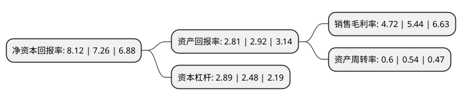

> 本页面由自动化程序生成于 2022年5月20日 01:25
> 内容可能存在错误，如有bug请提交issue至：https://github.com/Eroleice/doc-pi/issues
{.is-warning}

# 上市公司基本情况

## 基本资料

上海浦东建设股份有限公司（以下简称“浦东建设”）成立于1998年01月09日，上海市。于2004年03月16日在上交所主板上市。

浦东建设注册资本97,025.6万元，主要业务:市政基础工程，沥青路面摊铺，沥青砼销售，其他建筑材料销售。以下是详细信息：

- 公司名称: 上海浦东建设股份有限公司
- 股票代码: 600284.SH
- 所在地: 上海 - 上海市
- 成立日期: 1998年01月09日
- 注册资本: 97,025.6万元
- 法定代表人: 杨明
- 主营业务: 市政基础工程，沥青路面摊铺，沥青砼销售，其他建筑材料销售
- 公司官网: www.pdjs.com.cn
- 公司介绍: 公司是以城市基础设施投融资为龙头，工程建设为主业，集工程投资、管理、研发、施工、测试、养护、沥青混合料供应、环保产品供应、绿化工程为一体的综合型股份制企业。公司拥有市政公用工程施工总承包一级、公路路面工程专业承包一级、公路工程施工总承包二级以及水利水电工程施工总承包三级等多项专业资质。公司承建的工程多次荣获中国市政工程金杯奖等国家、市级各类奖项。

## 股东及高管情况

上市公司第一大股东为上海浦东发展(集团)有限公司，持股318,002,033股，占比32.78%，为上市公司实际控制人。

截至2022年03月31日，上市公司的前十大股东中，共有2名自然人股东，5名机构股东，2个产品账户，1个海外主体，其中5%以上大股东共有1名。上市公司前十大股东明细如下：

> 截至2022年03月31日，上市公司前十大股东信息如下：

| 股东名称 | 持股数量（股） | 持股比例 |
| --- | --- | --- |
| 上海浦东发展(集团)有限公司 | 318,002,033 | 32.78% |
| 上海浦东投资经营有限公司 | 40,990,280 | 4.22% |
| 中央汇金资产管理有限责任公司 | 19,832,443 | 2.04% |
| 上海张桥经济发展总公司 | 19,494,444 | 2.01% |
| 香港中央结算有限公司(陆股通) | 15,358,071 | 1.58% |
| 交通银行股份有限公司-广发中证基建工程交易型开放式指数证券投资基金 | 10,583,100 | 1.09% |
| 基本养老保险基金一零零三组合 | 6,859,547 | 0.71% |
| 同济创新创业控股有限公司 | 5,818,782 | 0.6% |
| 王根源 | 3,308,657 | 0.34% |
| 盛杜妹 | 3,302,021 | 0.34% |

## 利润表分析

上市公司2021年总收入为113.94亿元，净利润为5.37亿元，实现盈利。

## 杜邦分析

> 数据列示周期：2021年 | 2020年 | 2019年
{.is-info}

上市公司的净资产收益率在近一年有所上升，上升幅度为11.85%，其变化情况分解如下：
- 上市公司的销售毛利率在近一年下降了-13.24%，可能是生产效率的下降、商品原材料价格上涨或商品价格的下跌所致。
- 上市公司的资产周转率在近一年上升了11.11%，可能是源自于更快的销售回款或库存管理效果提升。
- 上市公司的财务杠杆比率在近一年上升了16.53%，可能是增加负债扩大生产规模。

