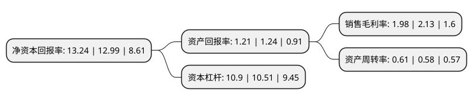

> 本页面由自动化程序生成于 2022年5月20日 01:26
> 内容可能存在错误，如有bug请提交issue至：https://github.com/Eroleice/doc-pi/issues
{.is-warning}

# 上市公司基本情况

## 基本资料

安徽建工集团股份有限公司（以下简称“安徽建工”）成立于1998年06月15日，蚌埠市。于2003年04月15日在上交所主板上市。

安徽建工注册资本172,116.027万元，主营业务为以工程总承包为主，业务涵盖房屋建筑，水利水电，市政，公路，桥梁，隧道，港口航道，机电设备安装，装饰，科研，设计，咨询，监理，房地产开发，建机建材，水力发电，劳务输出以下是详细信息：

- 公司名称: 安徽建工集团股份有限公司
- 股票代码: 600502.SH
- 所在地: 安徽 - 蚌埠市
- 成立日期: 1998年06月15日
- 注册资本: 172,116.027万元
- 法定代表人: 李有贵
- 主营业务: 主营业务为以工程总承包为主，业务涵盖房屋建筑，水利水电，市政，公路，桥梁，隧道，港口航道，机电设备安装，装饰，科研，设计，咨询，监理，房地产开发，建机建材，水力发电，劳务输出
- 公司官网: www.aceg.com.cn
- 公司介绍: 公司是一家国有控股上市公司，主营业务包括工程施工、房地产开发、水电投资建设与运营。公司发展成为以工程总承包为主，业务涵盖房屋建筑、水利水电、市政、公路、桥梁、隧道、港口航道、机电设备安装、装饰、科研、设计、咨询、监理、房地产开发、建机建材、水力发电、劳务输出等为一体的跨行业、跨国经营的大型综合性建筑企业集团。目前，公司主营业务为建筑工程和房地产开发，其中建筑工程包含房屋建筑工程和基础设施建设与投资。

## 股东及高管情况

上市公司第一大股东为安徽建工集团控股有限公司，持股556,265,118股，占比32.32%，为上市公司实际控制人。

截至2022年03月31日，上市公司的前十大股东中，共有3名机构股东，5个产品账户，1个海外主体，1名其他股东，其中5%以上大股东共有1名。上市公司前十大股东明细如下：

> 截至2022年03月31日，上市公司前十大股东信息如下：

| 股东名称 | 持股数量（股） | 持股比例 |
| --- | --- | --- |
| 安徽建工集团控股有限公司 | 556,265,118 | 32.32% |
| 安徽高新毅达皖江产业发展创业投资基金(有限合伙) | 49,342,694 | 2.87% |
| 凤台县永幸河灌区管理中心 | 36,192,922 | 2.1% |
| 安徽水利开发股份有限公司-2016年度员工持股计划 | 27,926,966 | 1.62% |
| 安徽省盐业投资控股集团有限公司 | 27,522,935 | 1.6% |
| 金寨水电开发有限责任公司 | 25,024,897 | 1.45% |
| 香港中央结算有限公司(陆股通) | 23,536,056 | 1.37% |
| 交通银行股份有限公司-广发中证基建工程交易型开放式指数证券投资基金 | 17,831,700 | 1.04% |
| 中国建设银行股份有限公司-华安宏利混合型证券投资基金 | 10,664,862 | 0.62% |
| 安徽高新金通安益二期创业投资基金(有限合伙) | 9,427,074 | 0.55% |

## 利润表分析

上市公司2021年总收入为713.39亿元，净利润为14.13亿元，实现盈利。

## 杜邦分析

> 数据列示周期：2021年 | 2020年 | 2019年
{.is-info}

上市公司的净资产收益率在近一年有所上升，上升幅度为1.92%，其变化情况分解如下：
- 上市公司的销售毛利率在近一年下降了-7.04%，可能是生产效率的下降、商品原材料价格上涨或商品价格的下跌所致。
- 上市公司的资产周转率在近一年上升了5.17%，可能是源自于更快的销售回款或库存管理效果提升。
- 上市公司的财务杠杆比率在近一年上升了3.71%，可能是增加负债扩大生产规模。

