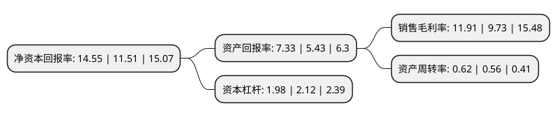

> 本页面由自动化程序生成于 2022年5月20日 01:27
> 内容可能存在错误，如有bug请提交issue至：https://github.com/Eroleice/doc-pi/issues
{.is-warning}

# 上市公司基本情况

## 基本资料

腾达建设集团股份有限公司（以下简称“腾达建设”）成立于1995年08月21日，台州市。于2002年12月26日在上交所主板上市。

腾达建设注册资本159,890.283万元，主要业务:市政，公路工程，一级公路运营。以下是详细信息：

- 公司名称: 腾达建设集团股份有限公司
- 股票代码: 600512.SH
- 所在地: 浙江 - 台州市
- 成立日期: 1995年08月21日
- 注册资本: 159,890.283万元
- 法定代表人: 杨九如
- 主营业务: 市政，公路工程，一级公路运营
- 公司官网: www.tengdajs.com
- 公司介绍: 公司是集市政、公路、建筑、装饰、轨道交通、房地产为一体的大型综合性建设企业集团、主要从事城市道路、桥梁、高架道路、轨道交道、污水处理、高速公路、房屋建筑等工程，并已向投资领域和房地产业拓展。具有建设部颁发的市政公用工程总承包特级、公路工程施工总承包一级资质和公路路基工程、公路路面工程，桥梁工程专业承包一级资质，房屋建筑工程施工总承包一级、建筑装修装饰工程承包二级资质及轨道交通专业承包资质。

## 股东及高管情况

上市公司第一大股东为叶林富，持股132,047,177股，占比8.26%，**疑似为**上市公司实际控制人。

截至2022年03月31日，上市公司的前十大股东中，共有9名自然人股东，1个产品账户，其中5%以上大股东共有2名。上市公司前十大股东明细如下：

> 未能通过持股比例判定出上市公司实际控制人（持股30%以上）
> 可能存在通过间接持股、联合持股、协议控制等方式拥有实际控制权的主体，具体请参考上市公司定期公告！
{.is-warning}

> 上市公司第一大股东持股不超过10%，请检查是否存在公司控制权风险！
{.is-danger}

> 截至2022年03月31日，上市公司前十大股东信息如下：

| 股东名称 | 持股数量（股） | 持股比例 |
| --- | --- | --- |
| 叶林富 | 132,047,177 | 8.26% |
| 徐爽 | 95,692,673 | 5.98% |
| 叶洋友 | 33,079,360 | 2.07% |
| 叶小根 | 27,502,484 | 1.72% |
| 腾达建设集团股份有限公司回购专用证券账户 | 16,425,242 | 1.03% |
| 叶立春 | 15,640,932 | 0.98% |
| 黄荷玲 | 11,488,321 | 0.72% |
| 叶亚妮 | 11,450,000 | 0.72% |
| 项兆云 | 11,101,924 | 0.69% |
| 冯云浩 | 10,420,000 | 0.65% |

## 利润表分析

上市公司2021年总收入为69.25亿元，净利润为8.24亿元，实现盈利。

## 杜邦分析

> 数据列示周期：2021年 | 2020年 | 2019年
{.is-info}

上市公司的净资产收益率在近一年有所上升，上升幅度为26.41%，其变化情况分解如下：
- 上市公司的销售毛利率在近一年上升了22.4%，可能是生产效率的提升、商品原材料价格下跌或商品价格的上涨所致。
- 上市公司的资产周转率在近一年上升了10.71%，可能是源自于更快的销售回款或库存管理效果提升。
- 上市公司的财务杠杆比率在近一年下降了-6.6%，可能是减少负债降低财务费用。

