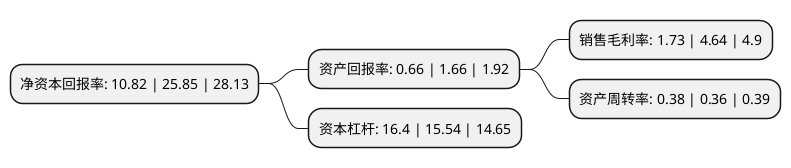

> 本页面由自动化程序生成于 2022年5月20日 01:27
> 内容可能存在错误，如有bug请提交issue至：https://github.com/Eroleice/doc-pi/issues
{.is-warning}

# 上市公司基本情况

## 基本资料

绿地控股集团股份有限公司（以下简称“绿地控股”）成立于1992年07月08日，上海市。于1992年03月27日在上交所主板上市。

绿地控股注册资本1,277,656.21万元，住宅流通业务，住宅开发业务，住宅配套服务。以下是详细信息：

- 公司名称: 绿地控股集团股份有限公司
- 股票代码: 600606.SH
- 所在地: 上海 - 上海市
- 成立日期: 1992年07月08日
- 注册资本: 1,277,656.21万元
- 法定代表人: 张玉良
- 主营业务: 住宅流通业务，住宅开发业务，住宅配套服务
- 公司官网: www.ldjt.com.cn
- 公司介绍: 公司是一家全球经营的多元化企业集团，创立于1992年，总部设立于中国上海，在中国A股实现整体上市(600606.SH)，并控股多家中国香港上市公司。公司目前已在全球范围内形成了“以房地产开发为主业，大基建、大金融、大消费等综合产业并举发展”的多元经营格局，实施资本化、公众化、国际化发展战略，旗下企业及项目遍及全球四大洲十国百城。公司依托房地产主业优势，积极发展大基建、大金融、大消费及新兴产业等关联板块集群，实现“3+X”综合产业布局，保障企业平衡经济波动、实现持续增长。“一业特强、多元并举”的多元产业板块，更有利于充分打通并嫁接各产业板块优势，打造稳健增长、基业长青的“绿地系”企业群。

## 股东及高管情况

上市公司第一大股东为上海格林兰投资企业(有限合伙)，持股3,721,765,534股，占比29.13%，**疑似为**上市公司实际控制人。

截至2022年03月31日，上市公司的前十大股东中，共有1名自然人股东，5名机构股东，3个产品账户，1个海外主体，其中5%以上大股东共有5名。上市公司前十大股东明细如下：

> 未能通过持股比例判定出上市公司实际控制人（持股30%以上）
> 可能存在通过间接持股、联合持股、协议控制等方式拥有实际控制权的主体，具体请参考上市公司定期公告！
{.is-warning}

> 截至2022年03月31日，上市公司前十大股东信息如下：

| 股东名称 | 持股数量（股） | 持股比例 |
| --- | --- | --- |
| 上海格林兰投资企业(有限合伙) | 3,721,765,534 | 29.13% |
| 上海格林兰投资企业(有限合伙) | 3,488,657,534 | 27.3051% |
| 上海地产(集团)有限公司 | 3,299,273,009 | 25.82% |
| 上海地产(集团)有限公司 | 3,299,273,009 | 25.82% |
| 上海城投(集团)有限公司 | 2,625,879,460 | 20.55% |
| 香港中央结算有限公司(陆股通) | 182,426,940 | 1.43% |
| 中国工商银行股份有限公司-中证上海国企交易型开放式指数证券投资基金 | 47,489,478 | 0.37% |
| 祝世华 | 31,000,000 | 0.24% |
| 中国工商银行股份有限公司-富国中证红利指数增强型证券投资基金 | 24,611,505 | 0.19% |
| 中国银行股份有限公司-招商沪深300地产等权重指数分级证券投资基金 | 23,689,066 | 0.19% |

## 利润表分析

上市公司2021年总收入为5,447.55亿元，净利润为94.42亿元，实现盈利。

## 杜邦分析

> 数据列示周期：2021年 | 2020年 | 2019年
{.is-info}

上市公司的净资产收益率在近一年有所下降，下降幅度为-58.14%，其变化情况分解如下：
- 上市公司的销售毛利率在近一年下降了-62.72%，可能是生产效率的下降、商品原材料价格上涨或商品价格的下跌所致。
- 上市公司的资产周转率在近一年上升了5.56%，可能是源自于更快的销售回款或库存管理效果提升。
- 上市公司的财务杠杆比率在近一年上升了5.53%，可能是增加负债扩大生产规模。

