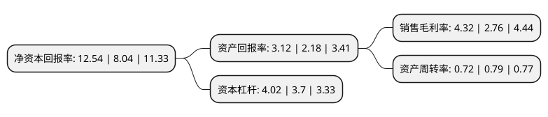

> 本页面由自动化程序生成于 2022年5月20日 01:27
> 内容可能存在错误，如有bug请提交issue至：https://github.com/Eroleice/doc-pi/issues
{.is-warning}

# 上市公司基本情况

## 基本资料

华东建筑集团股份有限公司（以下简称“华建集团”）成立于1992年06月12日，上海市。于1993年02月09日在上交所主板上市。

华建集团注册资本65,594.141万元，主要业务:工程勘察，规划设计，工程设计，市政设计，水利工程设计，风景园林设计，建设装饰设计，历史建筑保护和利用设计，建筑声学设计，全过程项目管理，建设工程承包(EPC)，工程监理，建设工程投资控制，科技咨询，项目策划等以下是详细信息：

- 公司名称: 华东建筑集团股份有限公司
- 股票代码: 600629.SH
- 所在地: 上海 - 上海市
- 成立日期: 1992年06月12日
- 注册资本: 65,594.141万元
- 法定代表人: 顾伟华
- 主营业务: 工程勘察，规划设计，工程设计，市政设计，水利工程设计，风景园林设计，建设装饰设计，历史建筑保护和利用设计，建筑声学设计，全过程项目管理，建设工程承包(EPC)，工程监理，建设工程投资控制，科技咨询，项目策划等
- 公司官网: www.arcplus.com.cn
- 公司介绍: 公司是以工程设计咨询为核心，为城镇建设提供高品质综合解决方案的集成服务供应商。公司主营业务领域涵盖建筑、规划、市政、水利等多个行业，并紧紧依托建筑设计核心业务，积极开展包含工程勘察、规划设计、工程设计、市政设计、水利工程设计、风景园林设计、建设装饰设计、历史建筑保护和利用设计、建筑声学设计、全过程项目管理、建设工程承包(EPC)、工程监理、建设工程投资控制、科技咨询、项目策划等。旗下拥有华东建筑设计研究总院、上海建筑设计研究院、华东都市建筑设计研究总院、工程建设咨询公司、上海市水利工程设计研究院、建筑装饰环境设计研究院、美国威尔逊室内设计公司等多家分子公司和专业机构。连续多年被美国《工程新闻纪录》(ENR)列入“全球工程设计公司150强”企业。

## 股东及高管情况

上市公司第一大股东为上海国有资本投资有限公司，持股250,512,797股，占比30.96%，为上市公司实际控制人。

截至2022年04月21日，上市公司的前十大股东中，共有2名自然人股东，7名机构股东，1个产品账户，其中5%以上大股东共有6名。上市公司前十大股东明细如下：

> 截至2022年04月21日，上市公司前十大股东信息如下：

| 股东名称 | 持股数量（股） | 持股比例 |
| --- | --- | --- |
| 上海国有资本投资有限公司 | 250,512,797 | 30.96% |
| 上海国有资本投资有限公司 | 250,512,797 | 38.19% |
| 上海现代建筑设计(集团)有限公司 | 98,622,911 | 12.19% |
| 上海现代建筑设计(集团)有限公司 | 98,622,911 | 15.04% |
| 上海国盛(集团)有限公司 | 95,160,194 | 11.76% |
| 上海国盛(集团)有限公司 | 95,160,194 | 14.51% |
| 傅宁 | 2,600,000 | 0.4% |
| 上海市北高新股份有限公司 | 1,989,145 | 0.3% |
| 中国工商银行股份有限公司-中证上海国企交易型开放式指数证券投资基金 | 1,750,058 | 0.27% |
| 侍倩 | 1,732,496 | 0.26% |

## 利润表分析

上市公司2021年总收入为90.54亿元，净利润为3.91亿元，实现盈利。

## 杜邦分析

> 数据列示周期：2021年 | 2020年 | 2019年
{.is-info}

上市公司的净资产收益率在近一年有所上升，上升幅度为55.97%，其变化情况分解如下：
- 上市公司的销售毛利率在近一年上升了56.52%，可能是生产效率的提升、商品原材料价格下跌或商品价格的上涨所致。
- 上市公司的资产周转率在近一年下降了-8.86%，可能是源自于更慢的销售回款或库存管理效果下降。
- 上市公司的财务杠杆比率在近一年上升了8.65%，可能是增加负债扩大生产规模。

