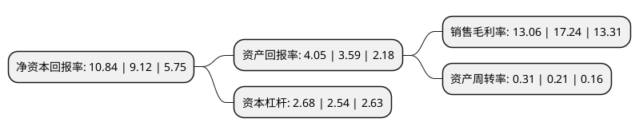

> 本页面由自动化程序生成于 2022年5月20日 01:28
> 内容可能存在错误，如有bug请提交issue至：https://github.com/Eroleice/doc-pi/issues
{.is-warning}

# 上市公司基本情况

## 基本资料

武汉祥龙电业股份有限公司（以下简称“祥龙电业”）成立于1993年07月19日，武汉市。于1996年11月01日在上交所主板上市。

祥龙电业注册资本37,497.72万元，化工产品，供电供汽，运输。以下是详细信息：

- 公司名称: 武汉祥龙电业股份有限公司
- 股票代码: 600769.SH
- 所在地: 湖北 - 武汉市
- 成立日期: 1993年07月19日
- 注册资本: 37,497.72万元
- 法定代表人: 董耀军
- 主营业务: 化工产品，供电供汽，运输
- 公司官网: www.whghjt.com
- 公司介绍: 公司是华中地区大型基本化工原料制造企业，对武汉乃至华中地区汽车、建材、冶金、造纸、轻纺及化工等产业中起着重要的作用。公司拥有生产烧碱、PVC树脂等十大系列数十余种化工产品的能力，还拥有自备热电厂、水厂及码头、铁路专用线的污水处理厂等，与生产配套的基础设施上比较完善，同时还在土地、人力、资产潜在资源优势，具有相当坚实的发展基础；在国内外市场上拥有地域优势、技术优势、产品优势、管理优势和客户优势等一系列发展优势。

## 股东及高管情况

上市公司第一大股东为武汉葛化集团有限公司，持股75,291,177股，占比20.08%，**疑似为**上市公司实际控制人。

截至2022年03月31日，上市公司的前十大股东中，共有7名自然人股东，2名机构股东，1个海外主体，其中5%以上大股东共有2名。上市公司前十大股东明细如下：

> 未能通过持股比例判定出上市公司实际控制人（持股30%以上）
> 可能存在通过间接持股、联合持股、协议控制等方式拥有实际控制权的主体，具体请参考上市公司定期公告！
{.is-warning}

> 截至2022年03月31日，上市公司前十大股东信息如下：

| 股东名称 | 持股数量（股） | 持股比例 |
| --- | --- | --- |
| 武汉葛化集团有限公司 | 75,291,177 | 20.08% |
| 武汉华原能源物资开发公司 | 23,913,080 | 6.38% |
| BARCLAYS BANK PLC | 7,437,560 | 1.98% |
| 代玉萍 | 4,040,000 | 1.08% |
| 王月红 | 3,600,700 | 0.96% |
| 盛雪萍 | 3,330,549 | 0.89% |
| 刘玉贤 | 2,721,900 | 0.73% |
| 黄合明 | 2,341,721 | 0.62% |
| 敬少琼 | 2,311,800 | 0.62% |
| 侯健 | 2,122,900 | 0.57% |

## 利润表分析

上市公司2021年总收入为0.52亿元，净利润为0.06亿元，实现盈利。

## 杜邦分析

> 数据列示周期：2021年 | 2020年 | 2019年
{.is-info}

上市公司的净资产收益率在近一年有所上升，上升幅度为18.86%，其变化情况分解如下：
- 上市公司的销售毛利率在近一年下降了-24.25%，可能是生产效率的下降、商品原材料价格上涨或商品价格的下跌所致。
- 上市公司的资产周转率在近一年上升了47.62%，可能是源自于更快的销售回款或库存管理效果提升。
- 上市公司的财务杠杆比率在近一年上升了5.51%，可能是增加负债扩大生产规模。

