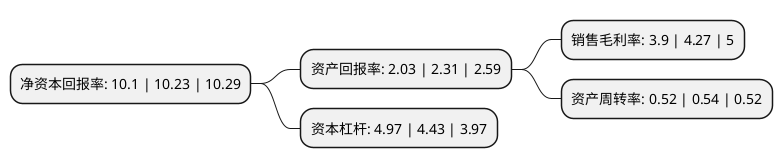

> 本页面由自动化程序生成于 2022年5月20日 01:29
> 内容可能存在错误，如有bug请提交issue至：https://github.com/Eroleice/doc-pi/issues
{.is-warning}

# 上市公司基本情况

## 基本资料

上海隧道工程股份有限公司（以下简称“隧道股份”）成立于1993年11月26日，上海市。于1994年01月28日在上交所主板上市。

隧道股份注册资本314,409.609万元，投资，设计，施工，运营一体化的城市基础设施建设运营。以下是详细信息：

- 公司名称: 上海隧道工程股份有限公司
- 股票代码: 600820.SH
- 所在地: 上海 - 上海市
- 成立日期: 1993年11月26日
- 注册资本: 314,409.609万元
- 法定代表人: 张焰
- 主营业务: 投资，设计，施工，运营一体化的城市基础设施建设运营
- 公司官网: www.stec.net
- 公司介绍: 公司是一家专门从事软土隧道施工的企业，是中国施工行业第一家上市的股份制公司和中国第一家设立博士后工作站的施工企业。公司主要从事隧道、路桥、轨道交通、水务、能源和地下空间等城市基础设施的设计、施工、投资和运营业务，以及部分盾构设备的制造业务。凭借隧道及地下工程施工的技术优势，公司承建了上海黄浦江底绝大多数越江公路隧道和轨道交通越江段，获得“市政公用总承包特级资质”和“设计市政行业甲级资质”。承建的工程遍布上海和国内多个大中城市，还在中国香港及新加坡占据相当份额。公司先后依托国家863计划研制了具有自主知识产权的“先进号”土压平衡盾构和“进越号”大型泥水平衡盾构，并率先实现盾构装备的国产化、产业化与批量出口。

## 股东及高管情况

上市公司第一大股东为上海城建(集团)有限公司，持股958,716,588股，占比30.49%，为上市公司实际控制人。

截至2022年03月31日，上市公司的前十大股东中，共有2名机构股东，7个产品账户，1个海外主体，其中5%以上大股东共有2名。上市公司前十大股东明细如下：

> 截至2022年03月31日，上市公司前十大股东信息如下：

| 股东名称 | 持股数量（股） | 持股比例 |
| --- | --- | --- |
| 上海城建(集团)有限公司 | 958,716,588 | 30.49% |
| 上海国盛(集团)有限公司 | 288,120,143 | 9.16% |
| 香港中央结算有限公司(陆股通) | 73,522,103 | 2.34% |
| 海富通基金-上海国盛(集团)有限公司-海富通基金光虹单一资产管理计划 | 38,829,400 | 1.23% |
| 全国社保基金四一三组合 | 29,400,000 | 0.94% |
| 交通银行股份有限公司-广发中证基建工程交易型开放式指数证券投资基金 | 29,351,200 | 0.93% |
| 银华基金-农业银行-银华中证金融资产管理计划 | 12,009,500 | 0.38% |
| 工银瑞信基金-农业银行-工银瑞信中证金融资产管理计划 | 12,009,500 | 0.38% |
| 中欧基金-农业银行-中欧中证金融资产管理计划 | 12,009,500 | 0.38% |
| 广发基金-农业银行-广发中证金融资产管理计划 | 12,009,500 | 0.38% |

## 利润表分析

上市公司2021年总收入为622.26亿元，净利润为24.26亿元，实现盈利。

## 杜邦分析

> 数据列示周期：2021年 | 2020年 | 2019年
{.is-info}

上市公司的净资产收益率在近一年有所下降，下降幅度为-1.27%，其变化情况分解如下：
- 上市公司的销售毛利率在近一年下降了-8.67%，可能是生产效率的下降、商品原材料价格上涨或商品价格的下跌所致。
- 上市公司的资产周转率在近一年下降了-3.7%，可能是源自于更慢的销售回款或库存管理效果下降。
- 上市公司的财务杠杆比率在近一年上升了12.19%，可能是增加负债扩大生产规模。

