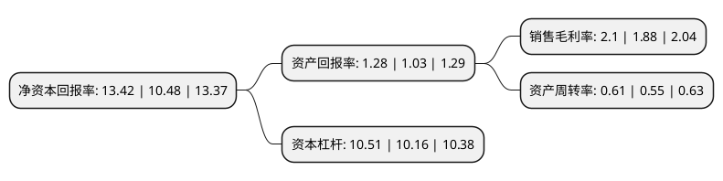

> 本页面由自动化程序生成于 2022年5月20日 01:29
> 内容可能存在错误，如有bug请提交issue至：https://github.com/Eroleice/doc-pi/issues
{.is-warning}

# 上市公司基本情况

## 基本资料

龙建路桥股份有限公司（以下简称“龙建股份”）成立于1993年01月18日，哈尔滨市。于1994年04月04日在上交所主板上市。

龙建股份注册资本101,490.255万元，主要业务:公路桥梁施工建设。以下是详细信息：

- 公司名称: 龙建路桥股份有限公司
- 股票代码: 600853.SH
- 所在地: 黑龙江 - 哈尔滨市
- 成立日期: 1993年01月18日
- 注册资本: 101,490.255万元
- 法定代表人: 田玉龙
- 主营业务: 公路桥梁施工建设
- 公司官网: www.longjianlq.com
- 公司介绍: 公司主营业务为公路桥梁施工。公司目前具有公路工程施工总承包特级、市政公用工程施工总承包壹级、公路工程路基专业承包壹级、公路工程路面专业承包壹级、公路工程桥梁专业承包壹级、公路行业设计甲级、对外经营等资质，具有“对外援助成套项目管理企业资格许可”，目前已经获批，成为国内拥有此项资格许可的10家公司之一，为承揽援外工程项目管理任务创造了有利条件。公司的实际控制人为黑龙江省国资委，公司及其控股股东与黑龙江省内各地交通运输部门有着长期的良好合作关系。凭借优秀的技术人才队伍、先进的专业设备装备、过硬的技术和丰富的经验，公司多年来承接的国内外多项工程均取得了客户的认可，公司也有着良好的市场信誉。自成立至今，公司多次被评为全国优秀施工企业、全国用户满意企业、全国最佳施工企业、全国交通百强企业，公司承建的路桥项目曾荣获中国建设工程鲁班奖(国家优质工程奖)。丰富的项目经验及良好的品牌形象，将有助于提升公司在投标过程中的竞争力。

## 股东及高管情况

上市公司第一大股东为黑龙江省建设投资集团有限公司，持股446,690,030股，占比44.01%，为上市公司实际控制人。

截至2022年03月31日，上市公司的前十大股东中，共有7名自然人股东，3名机构股东，其中5%以上大股东共有1名。上市公司前十大股东明细如下：

> 截至2022年03月31日，上市公司前十大股东信息如下：

| 股东名称 | 持股数量（股） | 持股比例 |
| --- | --- | --- |
| 黑龙江省建设投资集团有限公司 | 446,690,030 | 44.01% |
| 谢文娟 | 3,533,236 | 0.35% |
| 曹桂香 | 2,914,956 | 0.29% |
| 陈文生 | 2,585,980 | 0.25% |
| 申万宏源证券有限公司 | 2,475,380 | 0.24% |
| 肖克 | 2,000,000 | 0.2% |
| 孙培好 | 1,996,696 | 0.2% |
| 中国铁路哈尔滨局集团有限公司 | 1,887,600 | 0.19% |
| 孟亚君 | 1,720,000 | 0.17% |
| 夏晞如 | 1,393,236 | 0.14% |

## 利润表分析

上市公司2021年总收入为151.98亿元，净利润为3.19亿元，实现盈利。

## 杜邦分析

> 数据列示周期：2021年 | 2020年 | 2019年
{.is-info}

上市公司的净资产收益率在近一年有所上升，上升幅度为28.05%，其变化情况分解如下：
- 上市公司的销售毛利率在近一年上升了11.7%，可能是生产效率的提升、商品原材料价格下跌或商品价格的上涨所致。
- 上市公司的资产周转率在近一年上升了10.91%，可能是源自于更快的销售回款或库存管理效果提升。
- 上市公司的财务杠杆比率在近一年上升了3.44%，可能是增加负债扩大生产规模。

