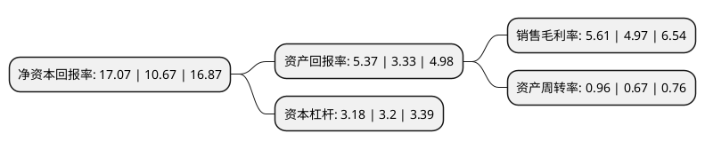

> 本页面由自动化程序生成于 2022年5月20日 01:30
> 内容可能存在错误，如有bug请提交issue至：https://github.com/Eroleice/doc-pi/issues
{.is-warning}

# 上市公司基本情况

## 基本资料

中国中材国际工程股份有限公司（以下简称“中材国际”）成立于2001年12月28日，南京市。于2005年04月12日在上交所主板上市。

中材国际注册资本221,908.295万元，主营业务为大中型新型干法水泥生产线的建设，包括水泥生产线的研发与设计，装备采购与制造和设备安装业务，还包括工程监理及混凝土制品研发及生产，销售。以下是详细信息：

- 公司名称: 中国中材国际工程股份有限公司
- 股票代码: 600970.SH
- 所在地: 江苏 - 南京市
- 成立日期: 2001年12月28日
- 注册资本: 221,908.295万元
- 法定代表人: 刘燕
- 主营业务: 主营业务为大中型新型干法水泥生产线的建设，包括水泥生产线的研发与设计，装备采购与制造和设备安装业务，还包括工程监理及混凝土制品研发及生产，销售
- 公司官网: www.sinoma.com.cn
- 公司介绍: 公司主要从事新型干法水泥生产线的建设业务，包括水泥生产线的研发与设计、装务采购及制造、设备安装等业务，是国内外大型新型干法水泥工程建设的领军企业。公司拥有完整的水泥工程产业链及国际领先的自主知识产权的新型干法水泥生产线工艺技术，具有从水泥项目咨询、工程设计、装备成套与供货、土建施工、设备安装到生产线调试并实现正常稳定运行的全过程系统集成服务能力。公司利用丰富的海外工程经验和品牌优势，向矿业、化工、电力、公路、民用建筑等非水泥工程领域拓展，逐步由水泥工程专业服务商向综合性工程服务商转型。公司拥有完整的水泥工程技术及装备、资源综合利用、能源节约与环境保护核心技术体系。

## 股东及高管情况

上市公司第一大股东为中国建材股份有限公司，持股1,082,389,012股，占比48.78%，为上市公司实际控制人。

截至2022年03月31日，上市公司的前十大股东中，共有1名自然人股东，3名机构股东，5个产品账户，1个海外主体，其中5%以上大股东共有1名。上市公司前十大股东明细如下：

> 截至2022年03月31日，上市公司前十大股东信息如下：

| 股东名称 | 持股数量（股） | 持股比例 |
| --- | --- | --- |
| 中国建材股份有限公司 | 1,082,389,012 | 48.78% |
| 中国工商银行股份有限公司-中欧价值智选回报混合型证券投资基金 | 63,646,259 | 2.87% |
| 中国建材国际工程集团有限公司 | 45,245,186 | 2.04% |
| 中国建筑材料科学研究总院有限公司 | 45,245,186 | 2.04% |
| 香港中央结算有限公司(陆股通) | 30,138,072 | 1.36% |
| 王琴英 | 29,297,348 | 1.32% |
| 平安银行股份有限公司-中欧新兴价值一年持有期混合型证券投资基金 | 18,564,750 | 0.84% |
| 交通银行股份有限公司-广发中证基建工程交易型开放式指数证券投资基金 | 17,242,900 | 0.78% |
| 中欧基金-农业银行-中国太平洋人寿股票相对收益型产品(保额分红)委托投资计划 | 16,998,956 | 0.77% |
| 中欧基金-兴业银行-新华人寿保险股份有限公司委托中欧基金管理有限公司价值均衡型组合 | 13,200,599 | 0.59% |

## 利润表分析

上市公司2021年总收入为362.42亿元，净利润为20.32亿元，实现盈利。

## 杜邦分析

> 数据列示周期：2021年 | 2020年 | 2019年
{.is-info}

上市公司的净资产收益率在近一年有所上升，上升幅度为59.98%，其变化情况分解如下：
- 上市公司的销售毛利率在近一年上升了12.88%，可能是生产效率的提升、商品原材料价格下跌或商品价格的上涨所致。
- 上市公司的资产周转率在近一年上升了43.28%，可能是源自于更快的销售回款或库存管理效果提升。
- 上市公司的财务杠杆比率在近一年下降了-0.62%，可能是减少负债降低财务费用。

