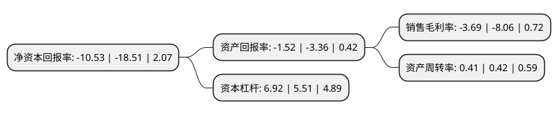

> 本页面由自动化程序生成于 2022年5月20日 01:30
> 内容可能存在错误，如有bug请提交issue至：https://github.com/Eroleice/doc-pi/issues
{.is-warning}

# 上市公司基本情况

## 基本资料

中铝国际工程股份有限公司（以下简称“中铝国际”）成立于2003年12月16日，北京市。于2018年08月31日在上交所主板上市。

中铝国际注册资本295,906.667万元，主营业务:主要从事工程设计及咨询，工程及施工承包，装备制造及贸易业务。以下是详细信息：

- 公司名称: 中铝国际工程股份有限公司
- 股票代码: 601068.SH
- 所在地: 北京 - 北京市
- 成立日期: 2003年12月16日
- 注册资本: 295,906.667万元
- 法定代表人: 李宜华
- 主营业务: 主营业务:主要从事工程设计及咨询，工程及施工承包，装备制造及贸易业务
- 公司官网: www.chalieco.com.cn
- 公司介绍: 公司是中国铝业集团有限公司的工程技术板块，是集测绘勘察、工程设计、工程施工、工程总承包、科技研发、装备制造和置业发展为一体的高新技术企业。其主要从事工程设计和咨询、工程及施工承包及装备制造业务。中铝国际参与了中国有色金属、冶金、交通、电力、石油、化工、建材、军工等十多个行业的规划、设计、科研和工程建设。中铝国际坚持实施人才战略、科技战略和国际化战略，利用两个市场、两种资源构建多元化产业格局，致力于建设国际一流的工程公司，集研发、设计、施工于一体，形成了完整产业链，拥有国内领先、国际先进和具有自主知识产权的成套技术与装备。中铝国际积极参与基础设施建设、生态建设、环境工程、城市公用事业、置业发展等其它领域的建设与开发，为构建资源节约型和环境友好型社会做出了突出贡献。

## 股东及高管情况

上市公司第一大股东为中国铝业集团有限公司，持股2,176,758,534股，占比73.56%，为上市公司实际控制人。

截至2022年03月31日，上市公司的前十大股东中，共有3名自然人股东，3名机构股东，2个产品账户，2个海外主体，其中5%以上大股东共有2名。上市公司前十大股东明细如下：

> 截至2022年03月31日，上市公司前十大股东信息如下：

| 股东名称 | 持股数量（股） | 持股比例 |
| --- | --- | --- |
| 中国铝业集团有限公司 | 2,176,758,534 | 73.56% |
| 香港中央结算(代理人)有限公司 | 399,476,000 | 13.5% |
| 洛阳有色金属加工设计研究院有限公司 | 86,925,466 | 2.94% |
| 香港中央结算有限公司(陆股通) | 7,411,141 | 0.25% |
| 阿拉丁环保集团有限公司 | 5,600,000 | 0.19% |
| 交通银行股份有限公司-广发中证基建工程交易型开放式指数证券投资基金 | 4,807,400 | 0.16% |
| 顾璟 | 2,567,000 | 0.09% |
| 赵长云 | 1,900,000 | 0.06% |
| 领航投资澳洲有限公司-领航新兴市场股指基金(交易所) | 1,830,300 | 0.06% |
| 孙焕勇 | 1,487,500 | 0.05% |

## 利润表分析

上市公司2021年总收入为233.48亿元，净利润为-8.62亿元，**未实现盈利**。

## 杜邦分析

> 数据列示周期：2021年 | 2020年 | 2019年
{.is-info}

上市公司的净资产收益率在近一年有所下降，下降幅度为-43.11%，其变化情况分解如下：
- 上市公司的销售毛利率在近一年下降了-54.22%，可能是生产效率的下降、商品原材料价格上涨或商品价格的下跌所致。
- 上市公司的资产周转率在近一年下降了-2.38%，可能是源自于更慢的销售回款或库存管理效果下降。
- 上市公司的财务杠杆比率在近一年上升了25.59%，可能是增加负债扩大生产规模。

