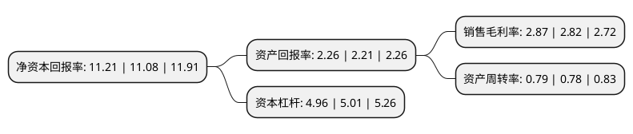

> 本页面由自动化程序生成于 2022年5月20日 01:30
> 内容可能存在错误，如有bug请提交issue至：https://github.com/Eroleice/doc-pi/issues
{.is-warning}

# 上市公司基本情况

## 基本资料

中国铁建股份有限公司（以下简称“中国铁建”）成立于2007年11月05日，北京市。于2008年03月10日在上交所主板上市。

中国铁建注册资本1,357,954.15万元，主营业务:工程承包，勘察设计咨询，工业制造，房地产开发，资本运营及物流等;矿产资源开发。以下是详细信息：

- 公司名称: 中国铁建股份有限公司
- 股票代码: 601186.SH
- 所在地: 北京 - 北京市
- 成立日期: 2007年11月05日
- 注册资本: 1,357,954.15万元
- 法定代表人: 汪建平
- 主营业务: 主营业务:工程承包，勘察设计咨询，工业制造，房地产开发，资本运营及物流等;矿产资源开发
- 公司官网: www.crcc.cn
- 公司介绍: 公司是中国乃至全球具实力、具规模的特大型综合建设集团之一，2018年《财富》“世界500强企业”排名第58位、“全球250家最大承包商”排名第3位，2017年“中国企业500强”排名第14位。公司业务涵盖工程承包、勘察设计咨询、房地产、投资服务、装备制造、物资物流、金融服务以及新兴产业。经营范围遍及包括中国台湾省在内的全国32个省、自治区、直辖市和中国香港、中国澳门特别行政区，以及世界一百多个国家。已经从以施工承包为主发展成为具有科研、规划、勘察、设计、施工、监理、维护、运营和投融资完整的行业产业链，具备了为业主提供一站式综合服务的能力。在高原铁路、高速铁路、高速公路、桥梁、隧道和城市轨道交通工程设计及建设领域确立了行业领先地位。公司拥有工程院院士、国家勘察设计大师、“百千万人才工程”国家级人选和享受国务院特殊津贴的专家。累计获多项国家科技进步奖，国家勘察设计“四优”奖，詹天佑土木工程大奖，国家优质工程奖，中国建筑工程鲁班奖；累计拥有多项专利，以及国家级工法。

## 股东及高管情况

上市公司第一大股东为中国铁道建筑集团有限公司，持股6,942,736,590股，占比51.13%，为上市公司实际控制人。

截至2022年03月31日，上市公司的前十大股东中，共有2名机构股东，7个产品账户，1个海外主体，其中5%以上大股东共有2名。上市公司前十大股东明细如下：

> 截至2022年03月31日，上市公司前十大股东信息如下：

| 股东名称 | 持股数量（股） | 持股比例 |
| --- | --- | --- |
| 中国铁道建筑集团有限公司 | 6,942,736,590 | 51.13% |
| 香港中央结算(代理人)有限公司 | 2,060,555,507 | 15.17% |
| 中国证券金融股份有限公司 | 323,087,956 | 2.38% |
| 广发基金-农业银行-广发中证金融资产管理计划 | 81,847,500 | 0.6% |
| 大成基金-农业银行-大成中证金融资产管理计划 | 81,847,500 | 0.6% |
| 嘉实基金-农业银行-嘉实中证金融资产管理计划 | 81,847,500 | 0.6% |
| 易方达基金-农业银行-易方达中证金融资产管理计划 | 81,847,500 | 0.6% |
| 华夏基金-农业银行-华夏中证金融资产管理计划 | 81,847,500 | 0.6% |
| 南方基金-农业银行-南方中证金融资产管理计划 | 81,847,500 | 0.6% |
| 工银瑞信基金-农业银行-工银瑞信中证金融资产管理计划 | 81,847,500 | 0.6% |

## 利润表分析

上市公司2021年总收入为10,200.1亿元，净利润为293.15亿元，实现盈利。

## 杜邦分析

> 数据列示周期：2021年 | 2020年 | 2019年
{.is-info}

上市公司的净资产收益率在近一年有所上升，上升幅度为1.17%，其变化情况分解如下：
- 上市公司的销售毛利率在近一年上升了1.77%，可能是生产效率的提升、商品原材料价格下跌或商品价格的上涨所致。
- 上市公司的资产周转率在近一年上升了1.28%，可能是源自于更快的销售回款或库存管理效果提升。
- 上市公司的财务杠杆比率在近一年下降了-1%，可能是减少负债降低财务费用。

