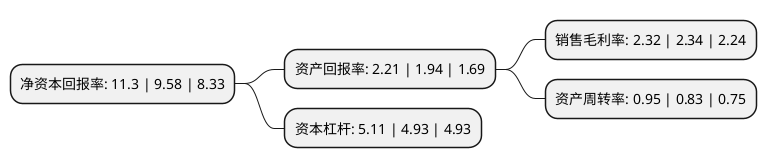

> 本页面由自动化程序生成于 2022年5月20日 01:31
> 内容可能存在错误，如有bug请提交issue至：https://github.com/Eroleice/doc-pi/issues
{.is-warning}

# 上市公司基本情况

## 基本资料

中国冶金科工股份有限公司（以下简称“中国中冶”）成立于2008年12月01日，北京市。于2009年09月21日在上交所主板上市。

中国中冶注册资本2,072,361.917万元，工程承包，资源开发，装备制造及房地产开发等业务以下是详细信息：

- 公司名称: 中国冶金科工股份有限公司
- 股票代码: 601618.SH
- 所在地: 北京 - 北京市
- 成立日期: 2008年12月01日
- 注册资本: 2,072,361.917万元
- 法定代表人: 张孟星
- 主营业务: 工程承包，资源开发，装备制造及房地产开发等业务
- 公司官网: www.mccchina.com
- 公司介绍: 公司是国务院国资委监管的特大型企业集团，是新中国最早一支钢铁工业建设力量，是中国钢铁工业的开拓者和主力军。中冶集团是全球性的冶金建设承包商和冶金企业运营服务商；是国家确定的重点资源类企业之一；也是中国基本建设的主力军，在改革开放初期，创造了著名的“深圳速度”。公司按照“做冶金建设国家队、基本建设主力军、新兴产业领跑者，长期坚持走高技术高质量发展之路”的战略定位，以卓越的科研、勘察、设计、建设能力为依托，加快转型升级，打造“四梁八柱”综合业务体系，锻造成为国家基本建设的主导力量。公司以“一天也不耽误，一天也不懈怠”朴实厚重的中冶精神，大力提升质量效益，全力推进改革创新。

## 股东及高管情况

上市公司第一大股东为中国石油天然气集团有限公司，持股1,227,760,000股，占比5.92%，**疑似为**上市公司实际控制人。

截至2022年03月31日，上市公司的前十大股东中，共有2名机构股东，7个产品账户，1个海外主体，其中5%以上大股东共有1名。上市公司前十大股东明细如下：

> 未能通过持股比例判定出上市公司实际控制人（持股30%以上）
> 可能存在通过间接持股、联合持股、协议控制等方式拥有实际控制权的主体，具体请参考上市公司定期公告！
{.is-warning}

> 上市公司第一大股东持股不超过10%，请检查是否存在公司控制权风险！
{.is-danger}

> 截至2022年03月31日，上市公司前十大股东信息如下：

| 股东名称 | 持股数量（股） | 持股比例 |
| --- | --- | --- |
| 中国石油天然气集团有限公司 | 1,227,760,000 | 5.92% |
| 中国证券金融股份有限公司 | 589,038,427 | 2.84% |
| 香港中央结算有限公司(陆股通) | 321,307,087 | 1.55% |
| 交通银行股份有限公司-广发中证基建工程交易型开放式指数证券投资基金 | 110,461,700 | 0.53% |
| 华夏基金-农业银行-华夏中证金融资产管理计划 | 63,516,600 | 0.31% |
| 银华基金-农业银行-银华中证金融资产管理计划 | 63,516,600 | 0.31% |
| 大成基金-农业银行-大成中证金融资产管理计划 | 63,516,600 | 0.31% |
| 工银瑞信基金-农业银行-工银瑞信中证金融资产管理计划 | 63,516,600 | 0.31% |
| 南方基金-农业银行-南方中证金融资产管理计划 | 63,516,600 | 0.31% |
| 嘉实基金-农业银行-嘉实中证金融资产管理计划 | 63,516,600 | 0.31% |

## 利润表分析

上市公司2021年总收入为5,005.71亿元，净利润为116.07亿元，实现盈利。

## 杜邦分析

> 数据列示周期：2021年 | 2020年 | 2019年
{.is-info}

上市公司的净资产收益率在近一年有所上升，上升幅度为17.95%，其变化情况分解如下：
- 上市公司的销售毛利率在近一年下降了-0.85%，可能是生产效率的下降、商品原材料价格上涨或商品价格的下跌所致。
- 上市公司的资产周转率在近一年上升了14.46%，可能是源自于更快的销售回款或库存管理效果提升。
- 上市公司的财务杠杆比率在近一年上升了3.65%，可能是增加负债扩大生产规模。

