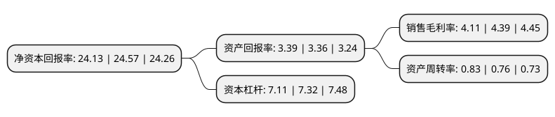

> 本页面由自动化程序生成于 2022年5月20日 01:31
> 内容可能存在错误，如有bug请提交issue至：https://github.com/Eroleice/doc-pi/issues
{.is-warning}

# 上市公司基本情况

## 基本资料

中国建筑股份有限公司（以下简称“中国建筑”）成立于2007年12月10日，北京市。于2009年07月29日在上交所主板上市。

中国建筑注册资本4,194,816.784万元，房屋建筑工程，房地产开发与投资，国际工程承包，基础设施建设与投资及设计勘察业务以下是详细信息：

- 公司名称: 中国建筑股份有限公司
- 股票代码: 601668.SH
- 所在地: 北京 - 北京市
- 成立日期: 2007年12月10日
- 注册资本: 4,194,816.784万元
- 法定代表人: 郑学选
- 主营业务: 房屋建筑工程，房地产开发与投资，国际工程承包，基础设施建设与投资及设计勘察业务
- 公司官网: www.cscec.com
- 公司介绍: 公司是我国专业化发展久、市场化经营早、一体化程度高、全球规模大的投资建设集团，也是我国建筑领域一家由中央直接管理的国有重要骨干企业。公司业务布局涵盖投资开发(地产开发、建造融资、持有运营)、工程建设(房屋建筑、基础设施建设)、勘察设计、新业务(绿色建造、节能环保、电子商务)等板块。国际三大评级机构标普、穆迪、惠誉继续将公司的评级维持为A/A2/A，展望维持“稳定”，保持行业内全球信用评级。以“拓展幸福空间”为使命，秉承“品质保障、价值创造”的核心价值观和“诚信、创新、超越、共赢”的企业精神，贯彻“五位一体”总体布局和“四个全面”战略布局，落实新发展理念，致力打造具有全球竞争力的世界一流企业，为实现中华民族伟大复兴的中国梦不断奋进。

## 股东及高管情况

上市公司第一大股东为中国建筑集团有限公司，持股23,630,695,997股，占比56.33%，为上市公司实际控制人。

截至2022年03月31日，上市公司的前十大股东中，共有3名机构股东，6个产品账户，1个海外主体，其中5%以上大股东共有1名。上市公司前十大股东明细如下：

> 截至2022年03月31日，上市公司前十大股东信息如下：

| 股东名称 | 持股数量（股） | 持股比例 |
| --- | --- | --- |
| 中国建筑集团有限公司 | 23,630,695,997 | 56.33% |
| 香港中央结算有限公司(陆股通) | 1,708,822,279 | 4.07% |
| 中国证券金融股份有限公司 | 1,258,300,898 | 3% |
| 中央汇金资产管理有限责任公司 | 583,327,120 | 1.39% |
| 交通银行股份有限公司-广发中证基建工程交易型开放式指数证券投资基金 | 189,129,800 | 0.45% |
| 中国工商银行-上证50交易型开放式指数证券投资基金 | 148,219,803 | 0.35% |
| 全国社保基金四一三组合 | 133,561,820 | 0.32% |
| 交通银行股份有限公司-易方达上证50指数增强型证券投资基金 | 120,642,126 | 0.29% |
| 招商银行股份有限公司-工银瑞信战略远见混合型证券投资基金 | 108,803,126 | 0.26% |
| 全国社保基金一零六组合 | 101,998,513 | 0.24% |

## 利润表分析

上市公司2021年总收入为18,913.38亿元，净利润为777.32亿元，实现盈利。

## 杜邦分析

> 数据列示周期：2021年 | 2020年 | 2019年
{.is-info}

上市公司的净资产收益率在近一年有所下降，下降幅度为-1.79%，其变化情况分解如下：
- 上市公司的销售毛利率在近一年下降了-6.38%，可能是生产效率的下降、商品原材料价格上涨或商品价格的下跌所致。
- 上市公司的资产周转率在近一年上升了9.21%，可能是源自于更快的销售回款或库存管理效果提升。
- 上市公司的财务杠杆比率在近一年下降了-2.87%，可能是减少负债降低财务费用。

