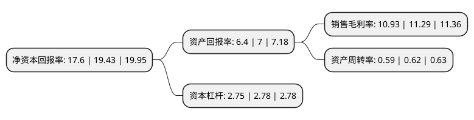

> 本页面由自动化程序生成于 2022年5月20日 01:32
> 内容可能存在错误，如有bug请提交issue至：https://github.com/Eroleice/doc-pi/issues
{.is-warning}

# 上市公司基本情况

## 基本资料

华设设计集团股份有限公司（以下简称“华设集团”）成立于2005年08月12日，南京市。于2014年10月13日在上交所主板上市。

华设集团注册资本68,378.095万元，勘察设计，规划研究，试验检测，工程管理等工程咨询服务。核心业务是交通领域建设工程勘察设计咨询业务。以下是详细信息：

- 公司名称: 华设设计集团股份有限公司
- 股票代码: 603018.SH
- 所在地: 江苏 - 南京市
- 成立日期: 2005年08月12日
- 注册资本: 68,378.095万元
- 法定代表人: 杨卫东
- 主营业务: 勘察设计，规划研究，试验检测，工程管理等工程咨询服务核心业务是交通领域建设工程勘察设计咨询业务
- 公司官网: www.cdg.com.cn
- 公司介绍: 公司是一家综合性工程咨询集团也是一家全国性的工程咨询公司和高新技术企业。公司业务主要包括公路、桥梁、水运、航空、市政、铁路与城市轨道、水利、建筑、环境和智能工程等领域，可提供从战略规划、工程咨询、勘察设计到科研开发、检验检测、项目管理、建设施工、后期运营的全寿命周期的一体化解决方案。集团先后荣获数百项国家、部、省级科技进步奖、优秀工程勘察设计奖和咨询成果奖以及多项国际大奖。集团系ISO9001认证企业和江苏省高新技术企业。

## 股东及高管情况

上市公司第一大股东为杨卫东，持股27,222,434股，占比3.98%，**疑似为**上市公司实际控制人。

截至2022年04月27日，上市公司的前十大股东中，共有6名自然人股东，3个产品账户，1个海外主体。上市公司前十大股东明细如下：

> 未能通过持股比例判定出上市公司实际控制人（持股30%以上）
> 可能存在通过间接持股、联合持股、协议控制等方式拥有实际控制权的主体，具体请参考上市公司定期公告！
{.is-warning}

> 上市公司第一大股东持股不超过10%，请检查是否存在公司控制权风险！
{.is-danger}

> 截至2022年04月27日，上市公司前十大股东信息如下：

| 股东名称 | 持股数量（股） | 持股比例 |
| --- | --- | --- |
| 杨卫东 | 27,222,434 | 3.98% |
| 邱桂松 | 24,962,342 | 3.65% |
| 明图章 | 22,314,570 | 3.26% |
| 胡安兵 | 19,703,574 | 2.88% |
| 香港中央结算有限公司(陆股通) | 18,658,178 | 2.73% |
| 中国建设银行股份有限公司-国投瑞银优化增强债券型证券投资基金 | 14,497,632 | 2.12% |
| 袁建华 | 14,216,000 | 2.08% |
| 上海浦东发展银行股份有限公司-易方达裕祥回报债券型证券投资基金 | 11,743,229 | 1.72% |
| 中国农业银行股份有限公司-工银瑞信战略转型主题股票型证券投资基金 | 11,324,064 | 1.66% |
| 王辉 | 10,840,292 | 1.59% |

## 利润表分析

上市公司2021年总收入为58.21亿元，净利润为6.36亿元，实现盈利。

## 杜邦分析

> 数据列示周期：2021年 | 2020年 | 2019年
{.is-info}

上市公司的净资产收益率在近一年有所下降，下降幅度为-9.42%，其变化情况分解如下：
- 上市公司的销售毛利率在近一年下降了-3.19%，可能是生产效率的下降、商品原材料价格上涨或商品价格的下跌所致。
- 上市公司的资产周转率在近一年下降了-4.84%，可能是源自于更慢的销售回款或库存管理效果下降。
- 上市公司的财务杠杆比率在近一年下降了-1.08%，可能是减少负债降低财务费用。

