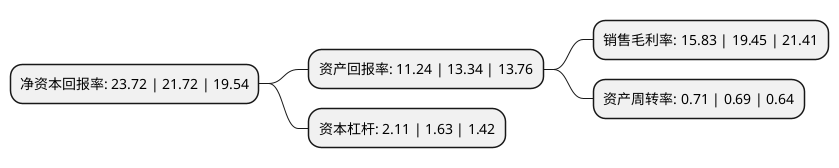

> 本页面由自动化程序生成于 2022年5月20日 01:32
> 内容可能存在错误，如有bug请提交issue至：https://github.com/Eroleice/doc-pi/issues
{.is-warning}

# 上市公司基本情况

## 基本资料

中国国检测试控股集团股份有限公司（以下简称“国检集团”）成立于1984年10月18日，北京市。于2016年11月09日在上交所主板上市。

国检集团注册资本60,368万元，主要从事建筑材料，建筑装饰装修材料，建设工程质量的检测;并为客户提供产品质量，环保，安全，节能认证，管理体系认证服务;除检测认证服务外，公司利用其在行业的品牌，技术和渠道优势，开展检测用仪器设备的研发，销售和安全生产技术服务等业务;并提供业务培训，标准样品，标准物质研发，销售，职业技能鉴定等延伸服务。以下是详细信息：

- 公司名称: 中国国检测试控股集团股份有限公司
- 股票代码: 603060.SH
- 所在地: 北京 - 北京市
- 成立日期: 1984年10月18日
- 注册资本: 60,368万元
- 法定代表人: 马振珠
- 主营业务: 主要从事建筑材料，建筑装饰装修材料，建设工程质量的检测;并为客户提供产品质量，环保，安全，节能认证，管理体系认证服务;除检测认证服务外，公司利用其在行业的品牌，技术和渠道优势，开展检测用仪器设备的研发，销售和安全生产技术服务等业务;并提供业务培训，标准样品，标准物质研发，销售，职业技能鉴定等延伸服务
- 公司官网: www.ctc.ac.cn
- 公司介绍: 中国建材检验认证集团股份有限公司属于中国建材集团的高技术服务业务板块，是中央企业系统内唯一一家检验认证主板上市公司，公司总部设在北京，在国内拥有58家分支机构，16个国家级中心、18个级行业中心，检验检测业务涵盖建材、建工、水利、环境、新材料、食品等领域，覆盖近8千个检测对象，十万余个参数，年平均出具检测报告数量90余万份；可提供体系认证、产品认证及服务认证，有效客户5千余家，其中国外客户2百余家，累计出具认证证书5万余份，是国内建筑和装饰装修材料及建设工程领域内为规模最大的、覆盖环保、绿色、安全、健康、节能等领域综合型第三方检验认证技术服务机构。国检集团坚持创新发展，近年来获得国家科技进步二等奖2项，主持制定国际标准14项，国家、行业和地方标准600余项，获授知识产权900余项，是奥运工程、上合峰会、APEC会议、金砖会议等国家重点工程唯一环境质量控制服务商，自2005年成立以来，年营业收入、利润总额复合增长率分别达31.60%和46.23%。未来，国检集团将秉承“公正为本、服务社会”“让生活更美好”的核心理念，以建设世界一流综合型检验认证机构、打造检测认证服务的“中国品牌”为目标，持续推动高质量发展，为“质量兴国”贡献力量。

## 股东及高管情况

上市公司第一大股东为中国建筑材料科学研究总院有限公司，持股390,272,118股，占比64.65%，为上市公司实际控制人。

截至2022年03月31日，上市公司的前十大股东中，共有2名自然人股东，6名机构股东，1个海外主体，1名其他股东，其中5%以上大股东共有1名。上市公司前十大股东明细如下：

> 截至2022年03月31日，上市公司前十大股东信息如下：

| 股东名称 | 持股数量（股） | 持股比例 |
| --- | --- | --- |
| 中国建筑材料科学研究总院有限公司 | 390,272,118 | 64.65% |
| 香港中央结算有限公司(陆股通) | 13,658,960 | 2.26% |
| 秦皇岛玻璃工业研究设计院有限公司 | 10,308,831 | 1.71% |
| 咸阳陶瓷研究设计院有限公司 | 10,221,565 | 1.69% |
| 挪威中央银行-自有资金 | 10,026,087 | 1.66% |
| 北京鼎汇科技有限公司 | 5,339,688 | 0.88% |
| 西安墙体材料研究设计院有限公司 | 4,717,601 | 0.78% |
| 北京泰鼎盛信息技术有限公司 | 3,779,120 | 0.63% |
| 万桦 | 2,560,960 | 0.42% |
| 张晓寅 | 2,150,471 | 0.36% |

## 利润表分析

上市公司2021年总收入为22.16亿元，净利润为3.5亿元，实现盈利。

## 杜邦分析

> 数据列示周期：2021年 | 2020年 | 2019年
{.is-info}

上市公司的净资产收益率在近一年有所上升，上升幅度为9.21%，其变化情况分解如下：
- 上市公司的销售毛利率在近一年下降了-18.61%，可能是生产效率的下降、商品原材料价格上涨或商品价格的下跌所致。
- 上市公司的资产周转率在近一年上升了2.9%，可能是源自于更快的销售回款或库存管理效果提升。
- 上市公司的财务杠杆比率在近一年上升了29.45%，可能是增加负债扩大生产规模。

