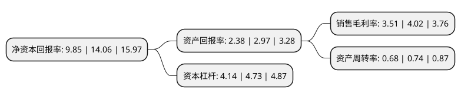

> 本页面由自动化程序生成于 2022年5月20日 01:33
> 内容可能存在错误，如有bug请提交issue至：https://github.com/Eroleice/doc-pi/issues
{.is-warning}

# 上市公司基本情况

## 基本资料

汇通建设集团股份有限公司（以下简称“汇通集团”）成立于2005年04月08日，保定市。于2021年12月31日在上交所主板上市。

汇通集团注册资本46,666万元，公路，市政，房屋建筑工程施工及相关建筑材料销售，勘察设计，试验检测等。以下是详细信息：

- 公司名称: 汇通建设集团股份有限公司
- 股票代码: 603176.SH
- 所在地: 河北 - 保定市
- 成立日期: 2005年04月08日
- 注册资本: 46,666万元
- 法定代表人: 赵亚尊
- 主营业务: 公路，市政，房屋建筑工程施工及相关建筑材料销售，勘察设计，试验检测等
- 公司官网: www.htlq.com.cn
- 公司介绍: 公司主营业务为公路、市政、房屋建筑工程施工及相关建筑材料销售、勘察设计、试验检测等。成立十多年来，秉承“尊重、合作、分享、共荣”的发展理念，以“让路在没有路的地方延伸”为使命，依靠科技进步，倾力打造精品，先后完成了一大批国家、省重点公路工程建设，企业实力迅速增强，现已成为一家具有公路工程施工总承包一级,路基、路面、桥梁、隧道工程专业承包一级资质、房地产开发、物业管理、市政公用工程、公路养护、试验检测、污水、中水处理、生物制品研发生产等多元化发展的集团化企业。

## 股东及高管情况

上市公司第一大股东为张忠山，持股106,716,666股，占比22.87%，**疑似为**上市公司实际控制人。

截至2022年03月31日，上市公司的前十大股东中，共有6名自然人股东，4名机构股东，其中5%以上大股东共有4名。上市公司前十大股东明细如下：

> 未能通过持股比例判定出上市公司实际控制人（持股30%以上）
> 可能存在通过间接持股、联合持股、协议控制等方式拥有实际控制权的主体，具体请参考上市公司定期公告！
{.is-warning}

> 截至2022年03月31日，上市公司前十大股东信息如下：

| 股东名称 | 持股数量（股） | 持股比例 |
| --- | --- | --- |
| 张忠山 | 106,716,666 | 22.87% |
| 张忠强 | 106,716,666 | 22.87% |
| 张籍文 | 31,666,667 | 6.7858% |
| 张中奎 | 25,333,333 | 5.43% |
| 保定恒广基业企业管理中心(有限合伙) | 15,833,334 | 3.39% |
| 张磊 | 15,200,000 | 3.26% |
| 张馨文 | 15,200,000 | 3.26% |
| 保定厚义达远企业管理中心(有限合伙) | 12,823,334 | 2.75% |
| 保定义厚德广企业管理中心(有限合伙) | 12,810,000 | 2.745% |
| 保定仁山智海企业管理中心(有限合伙) | 7,700,000 | 1.65% |

## 利润表分析

上市公司2021年总收入为23.68亿元，净利润为0.83亿元，实现盈利。

## 杜邦分析

> 数据列示周期：2021年 | 2020年 | 2019年
{.is-info}

上市公司的净资产收益率在近一年有所下降，下降幅度为-29.94%，其变化情况分解如下：
- 上市公司的销售毛利率在近一年下降了-12.69%，可能是生产效率的下降、商品原材料价格上涨或商品价格的下跌所致。
- 上市公司的资产周转率在近一年下降了-8.11%，可能是源自于更慢的销售回款或库存管理效果下降。
- 上市公司的财务杠杆比率在近一年下降了-12.47%，可能是减少负债降低财务费用。

