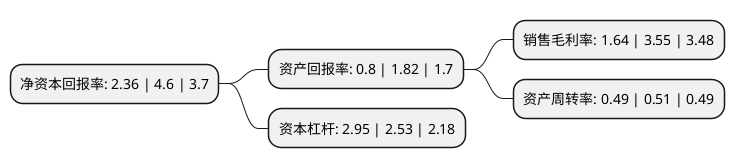

> 本页面由自动化程序生成于 2022年5月20日 01:33
> 内容可能存在错误，如有bug请提交issue至：https://github.com/Eroleice/doc-pi/issues
{.is-warning}

# 上市公司基本情况

## 基本资料

诚邦生态环境股份有限公司（以下简称“诚邦股份”）成立于1996年04月08日，杭州市。于2017年06月19日在上交所主板上市。

诚邦股份注册资本26,426.4万元，公司的主营业务为园林景观建设，系集园林景观设计及施工，园林养护，苗木种植于一体的综合性园林景观建设企业，重点服务于市政园林景观，地产园林景观等园林景观相关领域，同时公司不断拓展和延伸相关产业方向，在滨水生态环境建设方向积累了相关技术和业务基础。以下是详细信息：

- 公司名称: 诚邦生态环境股份有限公司
- 股票代码: 603316.SH
- 所在地: 浙江 - 杭州市
- 成立日期: 1996年04月08日
- 注册资本: 26,426.4万元
- 法定代表人: 张兴桥
- 主营业务: 公司的主营业务为园林景观建设，系集园林景观设计及施工，园林养护，苗木种植于一体的综合性园林景观建设企业，重点服务于市政园林景观，地产园林景观等园林景观相关领域，同时公司不断拓展和延伸相关产业方向，在滨水生态环境建设方向积累了相关技术和业务基础
- 公司官网: www.cbgfcn.com
- 公司介绍: 公司以综合设计为先导，以环境建设、生态治理、文化旅游为核心业务，以投资发展为推力，发展成为集投资、设计、建设、运营于一体的生态环境综合服务运营商。公司已形成4+1业务体系：设计集团业务，主要涵盖城乡规划、建筑、景观、旅游、环保等设计领域；环境建设业务，主要围绕园林绿化、市政公用、古建筑、水利水电、电力照明等工程领域；生态治理业务，积极拓展水污染及流域治理、土壤及矿山修复、边坡治理、地质灾害治理等业务；文化旅游业务，主要包括全域旅游、主题景区、特色小镇、美丽乡村、田园综合体等领域的投资建设和运营管理；投资发展业务，围绕生态环境全产业链开展投资并购，同时积极拓展和布局新兴产业。公司是生态环境行业内业务资质齐备的企业之一。公司及下属全资控股子公司拥有市政公用工程施工总承包壹级、古建筑工程专业承包壹级、环境污染治理工程总承包甲级、风景园林工程设计专项甲级、旅游规划设计甲级、建筑设计甲级、环境污染防治工程专项设计甲级，以及水利水电工程施工、建筑工程施工、城市及道路照明工程、文物保护工程等多项专业资质。公司获得了国家高新技术企业、浙江省工商企业AAA级“重合同守信用”企业、浙江省低碳经济标兵企业等荣誉。

## 股东及高管情况

上市公司第一大股东为方利强，持股91,485,422股，占比34.62%，为上市公司实际控制人。

截至2022年03月31日，上市公司的前十大股东中，共有9名自然人股东，1个产品账户，其中5%以上大股东共有2名。上市公司前十大股东明细如下：

> 截至2022年03月31日，上市公司前十大股东信息如下：

| 股东名称 | 持股数量（股） | 持股比例 |
| --- | --- | --- |
| 方利强 | 91,485,422 | 34.62% |
| 李敏 | 36,179,000 | 13.69% |
| 诚邦生态环境股份有限公司-第一期员工持股计划 | 6,438,640 | 2.44% |
| 徐刚 | 1,990,000 | 0.75% |
| 李国英 | 1,957,120 | 0.74% |
| 叶帆 | 1,726,400 | 0.65% |
| 沈渊博 | 1,693,550 | 0.64% |
| 宁予彤 | 1,626,400 | 0.62% |
| 方强 | 1,287,731 | 0.49% |
| 彭水生 | 927,000 | 0.35% |

## 利润表分析

上市公司2021年总收入为13.13亿元，净利润为0.21亿元，实现盈利。

## 杜邦分析

> 数据列示周期：2021年 | 2020年 | 2019年
{.is-info}

上市公司的净资产收益率在近一年有所下降，下降幅度为-48.7%，其变化情况分解如下：
- 上市公司的销售毛利率在近一年下降了-53.8%，可能是生产效率的下降、商品原材料价格上涨或商品价格的下跌所致。
- 上市公司的资产周转率在近一年下降了-3.92%，可能是源自于更慢的销售回款或库存管理效果下降。
- 上市公司的财务杠杆比率在近一年上升了16.6%，可能是增加负债扩大生产规模。

