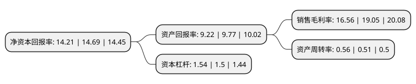

> 本页面由自动化程序生成于 2022年5月20日 01:33
> 内容可能存在错误，如有bug请提交issue至：https://github.com/Eroleice/doc-pi/issues
{.is-warning}

# 上市公司基本情况

## 基本资料

安徽省交通规划设计研究总院股份有限公司（以下简称“设计总院”）成立于1994年03月11日，合肥市。于2017年08月01日在上交所主板上市。

设计总院注册资本45,454.27万元，主营业务为交通工程咨询服务，主要提供道路，桥梁，岩土与隧道工程，水运工程与市政工程的勘察设计，咨询研发，试验检测，工程管理等相关技术服务，核心业务是交通领域工程勘察设计咨询业务。以下是详细信息：

- 公司名称: 安徽省交通规划设计研究总院股份有限公司
- 股票代码: 603357.SH
- 所在地: 安徽 - 合肥市
- 成立日期: 1994年03月11日
- 注册资本: 45,454.27万元
- 法定代表人: 苏新国
- 主营业务: 主营业务为交通工程咨询服务，主要提供道路，桥梁，岩土与隧道工程，水运工程与市政工程的勘察设计，咨询研发，试验检测，工程管理等相关技术服务，核心业务是交通领域工程勘察设计咨询业务
- 公司官网: www.atcdi.com.cn
- 公司介绍: 公司是一家为公路、水运、市政、水利行业的建设工程提供专业技术服务的工程咨询公司和国家高新技术企业，是交通部交通节能环保技术与装备研发中心、安徽省省级企业技术中心、合肥市桥梁诊断工程技术研究中心，是国家级“守合同重信用”企业。公司主营业务为道路与桥隧工程、市政与轨道工程、水运与水利工程、建筑与风景园林工程、环境与国土整治工程等提供集成一体化综合解决方案和相关产业链延伸业务。主要包括咨询研发、勘察设计、试验检测等工程前期勘察设计类业务，工程监理、工程代建、运行维护管理等工程建设、运营期的工程管理类业务，以及总承包、专业化施工、PPP\EPC\BOT\BT\PMC\EMC、资本投资等相关产业链延伸业务。公司目前形成了面向全国、涉足海外，涵盖“路、城、水”三大业务领域的多元化经营格局。

## 股东及高管情况

上市公司第一大股东为安徽省交通控股集团有限公司，持股221,032,000股，占比48.63%，为上市公司实际控制人。

截至2022年03月31日，上市公司的前十大股东中，共有8名自然人股东，1名机构股东，1个海外主体，其中5%以上大股东共有1名。上市公司前十大股东明细如下：

> 截至2022年03月31日，上市公司前十大股东信息如下：

| 股东名称 | 持股数量（股） | 持股比例 |
| --- | --- | --- |
| 安徽省交通控股集团有限公司 | 221,032,000 | 48.63% |
| 香港中央结算有限公司(陆股通) | 9,589,909 | 2.11% |
| 王吉双 | 2,380,000 | 0.52% |
| 吴立人 | 1,745,000 | 0.38% |
| 谢洪新 | 1,540,000 | 0.34% |
| 徐启文 | 1,540,000 | 0.34% |
| 刘新 | 1,540,000 | 0.34% |
| 王莉 | 1,493,100 | 0.33% |
| 沈国栋 | 1,493,100 | 0.33% |
| 杨晓明 | 1,493,100 | 0.33% |

## 利润表分析

上市公司2021年总收入为23.56亿元，净利润为3.9亿元，实现盈利。

## 杜邦分析

> 数据列示周期：2021年 | 2020年 | 2019年
{.is-info}

上市公司的净资产收益率在近一年有所下降，下降幅度为-3.27%，其变化情况分解如下：
- 上市公司的销售毛利率在近一年下降了-13.07%，可能是生产效率的下降、商品原材料价格上涨或商品价格的下跌所致。
- 上市公司的资产周转率在近一年上升了9.8%，可能是源自于更快的销售回款或库存管理效果提升。
- 上市公司的财务杠杆比率在近一年上升了2.67%，可能是增加负债扩大生产规模。

