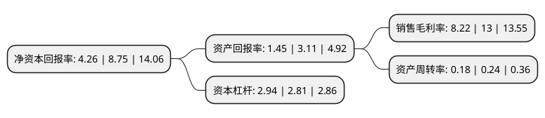

> 本页面由自动化程序生成于 2022年5月20日 01:34
> 内容可能存在错误，如有bug请提交issue至：https://github.com/Eroleice/doc-pi/issues
{.is-warning}

# 上市公司基本情况

## 基本资料

元成环境股份有限公司（以下简称“元成股份”）成立于1999年12月23日，杭州市。于2017年03月24日在上交所主板上市。

元成股份注册资本28,514.206万元，主营业务:园林施工，景观设计，绿化养护，苗木种植及信息服务。以下是详细信息：

- 公司名称: 元成环境股份有限公司
- 股票代码: 603388.SH
- 所在地: 浙江 - 杭州市
- 成立日期: 1999年12月23日
- 注册资本: 28,514.206万元
- 法定代表人: 祝昌人
- 主营业务: 主营业务:园林施工，景观设计，绿化养护，苗木种植及信息服务
- 公司官网: www.ycgf.cn
- 公司介绍: 公司是一家以服务于“大环境”为宗旨，以生态景观、绿色环保、休闲旅游为核心领域，以规划设计为引领，以产业投资为发展的产业链一体化的环境综合服务商，公司同时拥有城乡规划甲级、建筑工程设计甲级、旅游专项规划设计甲级、风景园林设计专项甲级、环境污染治理防治工程专项设计甲级、市政公用工程总承包壹级、城市园林绿化壹级、环境污染治理防治工程总承包甲级、建筑工程总承包贰级、古建筑专业承包贰级等众多资质。元成股份一直致力于建设生态文明，服务于大型基础设施建设工程，绿地生态景观工程、污染治理及生态修复工程、高端休闲旅游度假工程等项目。

## 股东及高管情况

上市公司第一大股东为祝昌人，持股80,401,820股，占比28.2%，**疑似为**上市公司实际控制人。

截至2022年03月31日，上市公司的前十大股东中，共有8名自然人股东，1名机构股东，1个产品账户，其中5%以上大股东共有3名。上市公司前十大股东明细如下：

> 未能通过持股比例判定出上市公司实际控制人（持股30%以上）
> 可能存在通过间接持股、联合持股、协议控制等方式拥有实际控制权的主体，具体请参考上市公司定期公告！
{.is-warning}

> 截至2022年03月31日，上市公司前十大股东信息如下：

| 股东名称 | 持股数量（股） | 持股比例 |
| --- | --- | --- |
| 祝昌人 | 80,401,820 | 28.2% |
| 杭州北嘉投资有限公司 | 33,057,000 | 11.59% |
| 长城资本管理有限公司-长城资本瑞鑫4号集合资产管理计划 | 20,000,000 | 7.01% |
| 陈芝浓 | 10,448,600 | 3.66% |
| 肖国华 | 9,005,579 | 3.16% |
| 周金海 | 7,171,500 | 2.52% |
| 张建和 | 5,688,800 | 2% |
| 沈国太 | 5,308,437 | 1.86% |
| 何钦辉 | 4,803,297 | 1.68% |
| 蔡杰 | 3,484,469 | 1.22% |

## 杜邦分析

> 数据列示周期：2021年 | 2020年 | 2019年
{.is-info}

上市公司的净资产收益率在近一年有所下降，下降幅度为-51.31%，其变化情况分解如下：
- 上市公司的销售毛利率在近一年下降了-36.77%，可能是生产效率的下降、商品原材料价格上涨或商品价格的下跌所致。
- 上市公司的资产周转率在近一年下降了-25%，可能是源自于更慢的销售回款或库存管理效果下降。
- 上市公司的财务杠杆比率在近一年上升了4.63%，可能是增加负债扩大生产规模。

