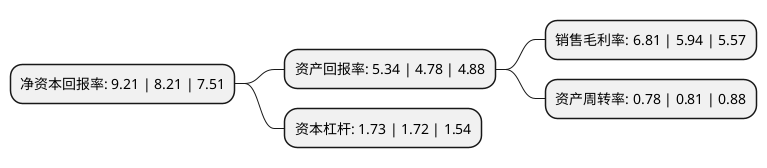

> 本页面由自动化程序生成于 2022年5月20日 01:34
> 内容可能存在错误，如有bug请提交issue至：https://github.com/Eroleice/doc-pi/issues
{.is-warning}

# 上市公司基本情况

## 基本资料

镇海石化工程股份有限公司（以下简称“镇海股份”）成立于1994年06月30日，宁波市。于2017年02月08日在上交所主板上市。

镇海股份注册资本24,367.837万元，主要产品:工程总承包业务，工程设计，工程咨询业务。主营业务是为石油，化工行业提供规划咨询，工程设计，工程总承包及工程管理，造价咨询等服务。以下是详细信息：

- 公司名称: 镇海石化工程股份有限公司
- 股票代码: 603637.SH
- 所在地: 浙江 - 宁波市
- 成立日期: 1994年06月30日
- 注册资本: 24,367.837万元
- 法定代表人: 范其海
- 主营业务: 主要产品:工程总承包业务，工程设计，工程咨询业务主营业务是为石油，化工行业提供规划咨询，工程设计，工程总承包及工程管理，造价咨询等服务
- 公司官网: www.izpec.com
- 公司介绍: 公司属于专业技术服务业，服务于石油化工行业，专业从事石油化工工程的建设和技术服务。公司向客户提供从工程前期的规划咨询到设计、采购、施工管理、开车、结算审核直到运营服务的一站式解决方案，致力于在环境保护、油品质量升级、装置节能减排等技术领域进行研发和创新。公司主营工程总承包，工程设计，工程管理、监理，工程咨询，工程审价，工程招投标代理等业务。公司为国家火炬计划重点高新技术企业，在科技开发和技术进步方面形成了独有的特色。公司具有石化、化工、石油天然气工程咨询甲级，化工石化医药行业、石油天然气(海洋石油)行业(油气库)工程设计甲级，化工石油工程监理甲级，房屋建筑工程监理甲级，工程造价咨询甲级等多个资质。公司为国家级高新技术企业，持有中国进出口商品检验总公司认证中心的ISO9001：2008管理体系认证证书，持有青岛中化阳光管理体系认证中心的HSE管理体系认证证书，持有商务部颁发的对外经济合作经营资格证书，并多次获得国家、省、市和中国石化集团公司的嘉奖和荣誉。

## 股东及高管情况

上市公司第一大股东为宁波舜通集团有限公司，持股40,279,836股，占比16.53%，**疑似为**上市公司实际控制人。

截至2022年03月31日，上市公司的前十大股东中，共有8名自然人股东，2名机构股东，其中5%以上大股东共有1名。上市公司前十大股东明细如下：

> 未能通过持股比例判定出上市公司实际控制人（持股30%以上）
> 可能存在通过间接持股、联合持股、协议控制等方式拥有实际控制权的主体，具体请参考上市公司定期公告！
{.is-warning}

> 截至2022年03月31日，上市公司前十大股东信息如下：

| 股东名称 | 持股数量（股） | 持股比例 |
| --- | --- | --- |
| 宁波舜通集团有限公司 | 40,279,836 | 16.53% |
| 宁波舜建集团有限公司 | 10,360,000 | 4.25% |
| 赵立渭 | 6,016,655 | 2.47% |
| 范晓梅 | 4,810,554 | 1.97% |
| 范其海 | 4,810,552 | 1.97% |
| 翁巍 | 4,810,552 | 1.97% |
| 丰建国 | 2,368,639 | 0.97% |
| 吴国勤 | 1,865,515 | 0.77% |
| 侯守山 | 1,839,500 | 0.75% |
| 张秀艳 | 1,775,200 | 0.73% |

## 利润表分析

上市公司2021年总收入为11亿元，净利润为0.74亿元，实现盈利。

## 杜邦分析

> 数据列示周期：2021年 | 2020年 | 2019年
{.is-info}

上市公司的净资产收益率在近一年有所上升，上升幅度为12.18%，其变化情况分解如下：
- 上市公司的销售毛利率在近一年上升了14.65%，可能是生产效率的提升、商品原材料价格下跌或商品价格的上涨所致。
- 上市公司的资产周转率在近一年下降了-3.7%，可能是源自于更慢的销售回款或库存管理效果下降。
- 上市公司的财务杠杆比率在近一年上升了0.58%，可能是增加负债扩大生产规模。

