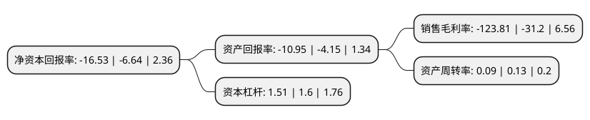

> 本页面由自动化程序生成于 2022年5月20日 01:35
> 内容可能存在错误，如有bug请提交issue至：https://github.com/Eroleice/doc-pi/issues
{.is-warning}

# 上市公司基本情况

## 基本资料

北京乾景园林股份有限公司（以下简称“乾景园林”）成立于2002年11月05日，北京市。于2015年12月31日在上交所主板上市。

乾景园林注册资本64,285.714万元，主要从事园林工程施工，园林景观设计，苗木种植和园林绿化养护等业务，主要为房地产开发企业，政府机关，企事业单位等提供园林绿化的综合服务，包括地产景观，市政绿化等园林景观工程的规划设计，施工与养护业务，另外，公司也从事苗木的种植和销售。以下是详细信息：

- 公司名称: 北京乾景园林股份有限公司
- 股票代码: 603778.SH
- 所在地: 北京 - 北京市
- 成立日期: 2002年11月05日
- 注册资本: 64,285.714万元
- 法定代表人: 回全福
- 主营业务: 主要从事园林工程施工，园林景观设计，苗木种植和园林绿化养护等业务，主要为房地产开发企业，政府机关，企事业单位等提供园林绿化的综合服务，包括地产景观，市政绿化等园林景观工程的规划设计，施工与养护业务，另外，公司也从事苗木的种植和销售
- 公司官网: www.qjyl.com
- 公司介绍: 公司目前主要从事园林工程施工、园林景观设计、苗木种植和园林绿化养护等业务，主要为房地产开发企业、政府机关、企事业单位等提供园林绿化的综合服务，包括地产景观、市政绿化等园林景观工程的规划设计、施工与养护业务以及苗木种植。公司自设立以来发展迅速公司拥有中华人民共和国住房和城乡建设部颁发的城市园林绿化企业一级资质、风景园林工程设计专项甲级资质，园林工程项目领域齐全、具备综合业务优势。根据《中国城市园林绿化企业经营状况调查报告2011-2012年度》对我国园林绿化企业综合竞争力的排名，公司综合竞争力名列全国第20位。通过各个分子公司的地区经营布局，公司积极开拓市场，目前拥有苗木培育、工程施工(一级资质)、园林设计(甲级资质)、绿化养护的一体化经营模式，形成了园林工程施工和园林景观设计两大主要业务领域，完成了多项跨领域的施工项目，包括地产景观、市政绿化等项目。公司客户主要包括信誉状况较好的地方政府机构、房地产行业的全国知名企业和区域龙头企业以及具有绿化需求的企事业单位等。

## 股东及高管情况

上市公司第一大股东为回全福，持股94,776,639股，占比14.74%，**疑似为**上市公司实际控制人。

截至2022年04月19日，上市公司的前十大股东中，共有6名自然人股东，1名机构股东，3个产品账户，其中5%以上大股东共有8名。上市公司前十大股东明细如下：

> 未能通过持股比例判定出上市公司实际控制人（持股30%以上）
> 可能存在通过间接持股、联合持股、协议控制等方式拥有实际控制权的主体，具体请参考上市公司定期公告！
{.is-warning}

> 截至2022年04月19日，上市公司前十大股东信息如下：

| 股东名称 | 持股数量（股） | 持股比例 |
| --- | --- | --- |
| 回全福 | 94,776,639 | 14.74% |
| 回全福 | 94,776,639 | 14.74% |
| 回全福 | 94,776,639 | 14.74% |
| 杨静 | 84,601,668 | 13.16% |
| 杨静 | 84,601,668 | 13.16% |
| 杨静 | 84,601,668 | 13.16% |
| 财达证券-邯郸市建设投资集团有限公司-财达冀资1号单一资产管理计划 | 67,226,891 | 10.46% |
| 财达证券-邯郸市建设投资集团有限公司-财达冀资1号单一资产管理计划 | 35,083,991 | 5.4575% |
| 邯郸和信股权投资基金管理有限公司-邯郸建投能源投资基金(有限合伙) | 31,227,911 | 4.86% |
| 北京通泰高华投资管理中心(有限合伙) | 4,400,000 | 0.68% |

## 利润表分析

上市公司2021年总收入为1.76亿元，净利润为-2.19亿元，**未实现盈利**。

## 杜邦分析

> 数据列示周期：2021年 | 2020年 | 2019年
{.is-info}

上市公司的净资产收益率在近一年有所上升，上升幅度为148.95%，其变化情况分解如下：
- 上市公司的销售毛利率在近一年上升了296.83%，可能是生产效率的提升、商品原材料价格下跌或商品价格的上涨所致。
- 上市公司的资产周转率在近一年下降了-30.77%，可能是源自于更慢的销售回款或库存管理效果下降。
- 上市公司的财务杠杆比率在近一年下降了-5.63%，可能是减少负债降低财务费用。

