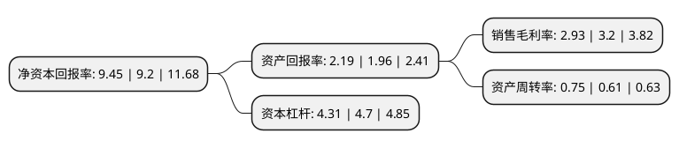

> 本页面由自动化程序生成于 2022年5月20日 01:35
> 内容可能存在错误，如有bug请提交issue至：https://github.com/Eroleice/doc-pi/issues
{.is-warning}

# 上市公司基本情况

## 基本资料

安徽省交通建设股份有限公司（以下简称“交建股份”）成立于1993年02月23日，合肥市。于2019年10月21日在上交所主板上市。

交建股份注册资本61,892.424万元，从事公路，市政基础设施建设相关的工程施工，勘察设计，试验检测等业务。以下是详细信息：

- 公司名称: 安徽省交通建设股份有限公司
- 股票代码: 603815.SH
- 所在地: 安徽 - 合肥市
- 成立日期: 1993年02月23日
- 注册资本: 61,892.424万元
- 法定代表人: 吴小辉
- 主营业务: 从事公路，市政基础设施建设相关的工程施工，勘察设计，试验检测等业务
- 公司官网: www.gourgen.com
- 公司介绍: 公司成立于1993年，拥有公路工程施工总承包特级资质、市政公用工程施工总承包壹级资质，同时还拥有桥梁、隧道、路基、路面等专项资质，公司管理基础扎实，内控完善，形成了规范的公司治理结构，具有较强的持续盈利能力，是安徽省资质齐全、资质等级较高的公路、市政基础设施施工企业之一。发行人系由交建有限整体变更设立，原交建有限的资产和负债全部由改制完成后的股份公司承继，主营业务为公路、市政基础设施建设相关的工程施工、勘察设计、试验检测。公司在设立时具有完整资产和业务体系，其所从事的主要业务未发生变化，保持了资产、业务的连续性和完整性。在科技创新方面，公司主持编制多项行业标准及地方标准，荣获多项国家级、部级和省级工法，多项专利授权。同时成立省级企业技术研发中心并成功获批。

## 股东及高管情况

上市公司第一大股东为祥源控股集团有限责任公司，持股274,293,290股，占比44.32%，为上市公司实际控制人。

截至2022年03月31日，上市公司的前十大股东中，共有3名自然人股东，4名机构股东，3个产品账户，其中5%以上大股东共有1名。上市公司前十大股东明细如下：

> 截至2022年03月31日，上市公司前十大股东信息如下：

| 股东名称 | 持股数量（股） | 持股比例 |
| --- | --- | --- |
| 祥源控股集团有限责任公司 | 274,293,290 | 44.32% |
| 俞发祥 | 15,729,100 | 2.54% |
| 黄山市为众投资管理中心(有限合伙) | 8,690,000 | 1.4% |
| 俞水祥 | 7,294,930 | 1.18% |
| 黄山市行远投资管理中心(有限合伙) | 6,965,000 | 1.13% |
| 安徽安元投资基金有限公司 | 6,689,300 | 1.08% |
| 胡先宽 | 6,000,000 | 0.97% |
| 黄山市启建投资管理中心(有限合伙) | 5,219,500 | 0.84% |
| 安徽高新金通安益二期创业投资基金(有限合伙) | 4,931,000 | 0.8% |
| 安徽安华基金投资有限公司 | 4,755,900 | 0.77% |

## 利润表分析

上市公司2021年总收入为51.27亿元，净利润为1.5亿元，实现盈利。

## 杜邦分析

> 数据列示周期：2021年 | 2020年 | 2019年
{.is-info}

上市公司的净资产收益率在近一年有所上升，上升幅度为2.72%，其变化情况分解如下：
- 上市公司的销售毛利率在近一年下降了-8.44%，可能是生产效率的下降、商品原材料价格上涨或商品价格的下跌所致。
- 上市公司的资产周转率在近一年上升了22.95%，可能是源自于更快的销售回款或库存管理效果提升。
- 上市公司的财务杠杆比率在近一年下降了-8.3%，可能是减少负债降低财务费用。

