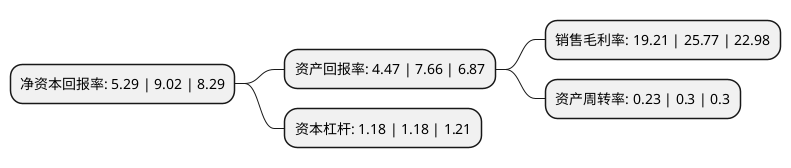

> 本页面由自动化程序生成于 2022年5月20日 01:35
> 内容可能存在错误，如有bug请提交issue至：https://github.com/Eroleice/doc-pi/issues
{.is-warning}

# 上市公司基本情况

## 基本资料

中公高科养护科技股份有限公司（以下简称“中公高科”）成立于2007年09月29日，北京市。于2017年08月02日在上交所主板上市。

中公高科注册资本6,668万元，主营业务:路况快速检测设备研发生产与销售，公路养护信息系统开发与销售，公路养护决策咨询服务;主要产品:多功能路况快速检测系统(CiCS I)，全断面路况快速检测系统(CiCS III)，农村公路智能检评系统一体化装备(CiCS IV)，多功能路况巡查系统(CRiS)。以下是详细信息：

- 公司名称: 中公高科养护科技股份有限公司
- 股票代码: 603860.SH
- 所在地: 北京 - 北京市
- 成立日期: 2007年09月29日
- 注册资本: 6,668万元
- 法定代表人: 孟书涛
- 主营业务: 主营业务:路况快速检测设备研发生产与销售，公路养护信息系统开发与销售，公路养护决策咨询服务;主要产品:多功能路况快速检测系统(CiCS I)，全断面路况快速检测系统(CiCS III)，农村公路智能检评系统一体化装备(CiCS IV)，多功能路况巡查系统(CRiS)
- 公司官网: www.roadmaint.com
- 公司介绍: 公司是能够为公路养护科学决策提供成套设备与技术服务一体化的供应商。拥有公路养护科学决策所必需的核心技术，并具有自主创新能力，以及生产与研发一体化、单元产品与成套设备一体化和快速开发大型成套设备及服务的能力。公司作为公路养护科学决策成套技术与服务提供商，主要面向各级政府公路管理机构、收费公路经营管理企(事)业单位，以及从事公路养护检测、养护设计、养护咨询和养护施工的企业，提供与公路养护科学决策相关的检测设备、信息系统和技术咨询服务。本公司主营业务包括公路养护决策咨询服务、路况快速检测设备生产与销售、公路养护信息系统开发与销售。公路养护技术国家工程研究中心为专业从事公路养护技术研发与推广的国家级创新平台，致力于为公路养护行业提供公路科学养护成套技术与服务，公司负责中心的建设、运营与管理。公司重点围绕“路况快速检测、诊断分析决策、养护工程设计、工程技术服务、公路资产管理、养护政策研究”六大领域，开展关键技术、高端装备、大型软件的开发、验证及产业化示范，深入开展养护管理政策及技术政策研究。公司主持多项国家及行业重大科技项目，拥有多项自主知识产权，荣获多项国家及省部级科技奖项。

## 股东及高管情况

上市公司第一大股东为中路高科交通科技集团有限公司，持股30,832,000股，占比46.24%，为上市公司实际控制人。

截至2022年03月31日，上市公司的前十大股东中，共有9名自然人股东，1名机构股东，其中5%以上大股东共有3名。上市公司前十大股东明细如下：

> 截至2022年03月31日，上市公司前十大股东信息如下：

| 股东名称 | 持股数量（股） | 持股比例 |
| --- | --- | --- |
| 中路高科交通科技集团有限公司 | 30,832,000 | 46.24% |
| 赵怀志 | 4,015,000 | 6.02% |
| 潘玉利 | 4,000,000 | 6% |
| 张桦 | 1,565,800 | 2.35% |
| 赵延东 | 967,300 | 1.45% |
| 张欣 | 856,600 | 1.28% |
| 边庄力 | 425,000 | 0.64% |
| 梅家华 | 420,000 | 0.63% |
| 朱红兵 | 287,800 | 0.43% |
| 李强 | 239,163 | 0.36% |

## 利润表分析

上市公司2021年总收入为2.03亿元，净利润为0.36亿元，实现盈利。

## 杜邦分析

> 数据列示周期：2020年 | 2019年 | 2018年
{.is-info}

上市公司的净资产收益率在近一年有所下降，下降幅度为-41.35%，其变化情况分解如下：
- 上市公司的销售毛利率在近一年下降了-25.46%，可能是生产效率的下降、商品原材料价格上涨或商品价格的下跌所致。
- 上市公司的资产周转率在近一年下降了-23.33%，可能是源自于更慢的销售回款或库存管理效果下降。
- 上市公司的财务杠杆比率在近一年下降了0%，可能是减少负债降低财务费用。

