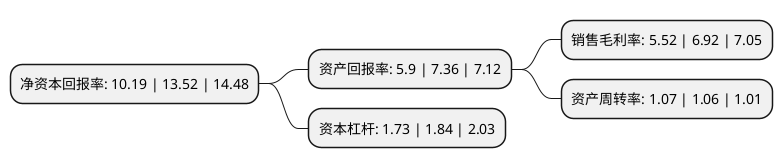

> 本页面由自动化程序生成于 2022年5月20日 01:36
> 内容可能存在错误，如有bug请提交issue至：https://github.com/Eroleice/doc-pi/issues
{.is-warning}

# 上市公司基本情况

## 基本资料

江苏利柏特股份有限公司（以下简称“利柏特”）成立于2006年10月20日，苏州市。于2021年07月26日在上交所主板上市。

利柏特注册资本44,907万元，专注于工业模块的设计和制造以下是详细信息：

- 公司名称: 江苏利柏特股份有限公司
- 股票代码: 605167.SH
- 所在地: 江苏 - 苏州市
- 成立日期: 2006年10月20日
- 注册资本: 44,907万元
- 法定代表人: 沈斌强
- 主营业务: 专注于工业模块的设计和制造
- 公司官网: www.cnlbt.com
- 公司介绍: 公司是国内少数具备大型工业模块设计和制造能力的企业，专注于工业模块的设计和制造，业务涉及结构、材料、电气、暖通、消防、控制等多个工程学科，并需要具备对大型装置工艺流程的深刻理解，具有较高的技术门槛，随着各行各业项目建设不断向模块化趋势发展，工业模块应用的广度和深度不断提升，公司的业务发展空间也将持续拓展。公司拥有在国际及国内开展相关业务的所有资质。在国际市场，公司拥有国际通行的美国机械工程师协会“ASME U”、“ASME S”资质认证证书，大部分国家对相关产品适用或参考该认证；此外公司还拥有欧盟焊接质量管理体系EN认证、加拿大焊接协会CWB焊接体系认证、韩国气体安全公社KGS认证等国际认证资质，能够覆盖全球大多数国家和地区对工业模块的准入要求。在国内市场，公司拥有《工程设计资质证书(化工石化医药行业甲级；建筑行业(建筑工程)甲级)》及压力管道、压力容器的设计和制造等相关资质，可以根据客户需求为其提供定制化服务,公司的主要客户为行业知名的跨国企业，多年来具有持续合作关系的有巴斯夫、林德气体、霍尼韦尔、科思创、优美科、陶氏化学、液化空气、英威达等数十家企业，并获得了客户颁发的优秀服务商、卓越贡献等奖项。

## 股东及高管情况

上市公司第一大股东为振石集团(香港)和石复合材料有限公司，持股76,727,336股，占比17.09%，**疑似为**上市公司实际控制人。

截至2022年03月31日，上市公司的前十大股东中，共有7名自然人股东，3名机构股东，其中5%以上大股东共有1名。上市公司前十大股东明细如下：

> 未能通过持股比例判定出上市公司实际控制人（持股30%以上）
> 可能存在通过间接持股、联合持股、协议控制等方式拥有实际控制权的主体，具体请参考上市公司定期公告！
{.is-warning}

> 截至2022年03月31日，上市公司前十大股东信息如下：

| 股东名称 | 持股数量（股） | 持股比例 |
| --- | --- | --- |
| 振石集团(香港)和石复合材料有限公司 | 76,727,336 | 17.09% |
| 中国核工业二三建设有限公司 | 16,509,112 | 3.68% |
| 沈斌强 | 7,500,000 | 1.67% |
| 福州医工投资有限公司 | 2,500,000 | 0.56% |
| 宋玉芹 | 2,000,000 | 0.45% |
| 李建平 | 2,000,000 | 0.45% |
| 陈裕纯 | 2,000,000 | 0.45% |
| 杨东燕 | 2,000,000 | 0.45% |
| 杨菁 | 2,000,000 | 0.45% |
| 杨清燕 | 2,000,000 | 0.45% |

## 利润表分析

上市公司2021年总收入为19.83亿元，净利润为1.09亿元，实现盈利。

## 杜邦分析

> 数据列示周期：2021年 | 2020年 | 2019年
{.is-info}

上市公司的净资产收益率在近一年有所下降，下降幅度为-24.63%，其变化情况分解如下：
- 上市公司的销售毛利率在近一年下降了-20.23%，可能是生产效率的下降、商品原材料价格上涨或商品价格的下跌所致。
- 上市公司的资产周转率在近一年上升了0.94%，可能是源自于更快的销售回款或库存管理效果提升。
- 上市公司的财务杠杆比率在近一年下降了-5.98%，可能是减少负债降低财务费用。

