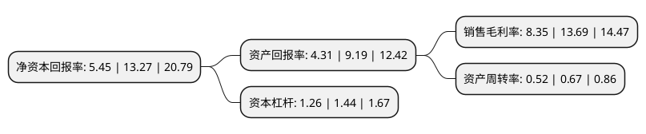

> 本页面由自动化程序生成于 2022年5月20日 01:37
> 内容可能存在错误，如有bug请提交issue至：https://github.com/Eroleice/doc-pi/issues
{.is-warning}

# 上市公司基本情况

## 基本资料

上海港湾基础建设(集团)股份有限公司（以下简称“上海港湾”）成立于2000年01月28日，上海市。于2021年09月17日在上交所主板上市。

上海港湾注册资本17,274.347万元，为全球客户提供集勘察，设计，施工，监测于一体的岩土工程综合服务，主要包括地基处理，桩基工程等业务。主营业务为地基处理，桩基工程等岩土工程业务。以下是详细信息：

- 公司名称: 上海港湾基础建设(集团)股份有限公司
- 股票代码: 605598.SH
- 所在地: 上海 - 上海市
- 成立日期: 2000年01月28日
- 注册资本: 17,274.347万元
- 法定代表人: 徐士龙
- 主营业务: 为全球客户提供集勘察，设计，施工，监测于一体的岩土工程综合服务，主要包括地基处理，桩基工程等业务主营业务为地基处理，桩基工程等岩土工程业务
- 公司官网: www.geoharbour.com
- 公司介绍: 公司经过多年不断研发和创新，获取了“快速‘高真空击密法’软地基处理方法”、“快速‘低位高真空分层预压击密’软地基处理方法”和“数头振冲器共振地基处理设备及其方法”等专利，逐步形成了高真空击密系列技术、真空预压系列技术、振冲密实系列技术等技术体系。公司荣获“军队科技进步一等奖”、教育部“科学技术进步奖一等奖”、“中国专利优秀奖”、“上海市科学技术成果”、“上海市发明创造专利奖-二等奖”等奖项。公司主编《吹填土地基处理技术规范》国家标准，参编《海岸软土地基堤坝工程技术规范》等国家标准，并正在参与印尼地基处理国家标准的制定。公司积极践行“一带一路”国家级顶层合作倡议，不断拓展“一带一路”沿线国家市场，已在沿线十余个国家形成工程业绩，推动了当地基础设施建设，成为“一带一路”合作倡议的积极践行者和受益者。

## 股东及高管情况

上市公司第一大股东为上海隆湾投资控股有限公司，持股120,000,000股，占比69.47%，为上市公司实际控制人。

截至2022年03月31日，上市公司的前十大股东中，共有7名自然人股东，3名机构股东，其中5%以上大股东共有2名。上市公司前十大股东明细如下：

> 截至2022年03月31日，上市公司前十大股东信息如下：

| 股东名称 | 持股数量（股） | 持股比例 |
| --- | --- | --- |
| 上海隆湾投资控股有限公司 | 120,000,000 | 69.47% |
| 宁波隆湾股权投资合伙企业(有限合伙) | 9,450,000 | 5.47% |
| 刘秀杰 | 308,500 | 0.18% |
| 李伟平 | 302,100 | 0.17% |
| 柳丽娟 | 231,000 | 0.13% |
| 朱衔华 | 210,400 | 0.12% |
| 陈佳敏 | 188,800 | 0.11% |
| 朱名登 | 184,200 | 0.11% |
| 滕江川 | 178,300 | 0.1% |
| 华泰证券股份有限公司 | 156,819 | 0.09% |

## 利润表分析

上市公司2021年总收入为7.34亿元，净利润为0.61亿元，实现盈利。

## 杜邦分析

> 数据列示周期：2021年 | 2020年 | 2019年
{.is-info}

上市公司的净资产收益率在近一年有所下降，下降幅度为-58.93%，其变化情况分解如下：
- 上市公司的销售毛利率在近一年下降了-39.01%，可能是生产效率的下降、商品原材料价格上涨或商品价格的下跌所致。
- 上市公司的资产周转率在近一年下降了-22.39%，可能是源自于更慢的销售回款或库存管理效果下降。
- 上市公司的财务杠杆比率在近一年下降了-12.5%，可能是减少负债降低财务费用。

