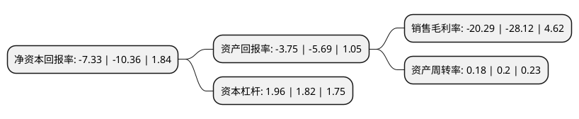

> 本页面由自动化程序生成于 2022年5月20日 01:02
> 内容可能存在错误，如有bug请提交issue至：https://github.com/Eroleice/doc-pi/issues
{.is-warning}

# 上市公司基本情况

## 基本资料

湖北省广播电视信息网络股份有限公司（以下简称“湖北广电”）成立于1991年02月05日，武汉市。于1996年12月10日在深交所主板上市。

湖北广电注册资本101,436.387万元，主营业务:对全省有线数字电视产业的投资及运营管理;有线数字电视技术的开发及应用;有线数字电视相关设备的销售;以下是详细信息：

- 公司名称: 湖北省广播电视信息网络股份有限公司
- 股票代码: 000665.SZ
- 所在地: 湖北 - 武汉市
- 成立日期: 1991年02月05日
- 注册资本: 101,436.387万元
- 法定代表人: 张建红
- 主营业务: 主营业务:对全省有线数字电视产业的投资及运营管理;有线数字电视技术的开发及应用;有线数字电视相关设备的销售;
- 公司官网: www.hrtn.net
- 公司介绍: 公司是由湖北省委、省政府于2011年1月批准成立的省属国有控股大型文化高新技术企业，是党委政府政策声音传播阵地、以及全省广电网络整合、三网融合、数字家庭和智慧城市建设的主体，是湖北省电子政务传输网重点支撑企业，担负着全省广播电视信息网络规划、设计、建设、管理、运营和开发应用等任务。公司致力于以“三网融合”为特征的下一代广播电视网建设，致力于以“互联网+”为主攻方向的智慧湖北、智慧城市、智慧社区、智慧家庭和宽带乡村等建设，致力于电视和互联网双主营业务的经营发展。公司积极实施“智慧广电”发展战略，搭建“云平台+光网络+慧终端”网络架构，推动“广电网+互联网+物联网”融合发展，提供“视频+宽带+本地化信息”综合服务，加快向综合信息服务商转型。公司荣获中宣部等部委颁发的“全国文化体制改革先进单位”称号，被中国证监会列为全国文化企业并购重组试点单位，被中宣部改发办列为上市文化企业并购重组示范单位，被授予“双百工程”龙头企业称号。

## 股东及高管情况

上市公司第一大股东为武汉广播电视台，持股117,217,386股，占比10.36%，**疑似为**上市公司实际控制人。

截至2022年03月31日，上市公司的前十大股东中，共有7名机构股东，3名其他股东，其中5%以上大股东共有4名。上市公司前十大股东明细如下：

> 未能通过持股比例判定出上市公司实际控制人（持股30%以上）
> 可能存在通过间接持股、联合持股、协议控制等方式拥有实际控制权的主体，具体请参考上市公司定期公告！
{.is-warning}

> 截至2022年03月31日，上市公司前十大股东信息如下：

| 股东名称 | 持股数量（股） | 持股比例 |
| --- | --- | --- |
| 武汉广播电视台 | 117,217,386 | 10.36% |
| 湖北省楚天视讯网络有限公司 | 100,090,620 | 8.84% |
| 中信国安信息产业股份有限公司 | 76,278,905 | 6.74% |
| 湖北楚天金纬广播电视信息网络有限公司 | 58,856,372 | 5.2% |
| 楚天襄阳有线电视股份有限公司 | 35,676,007 | 3.15% |
| 武汉有线广播电视网络有限公司 | 19,795,486 | 1.75% |
| 武汉有线广播电视网络有限公司 | 19,795,486 | 1.75% |
| 武汉市江夏区融媒体中心(武汉市江夏区广播电视台) | 17,361,165 | 1.53% |
| 武汉盘龙信息网络有限责任公司 | 16,872,376 | 1.49% |
| 武汉市新洲区融媒体中心 | 14,122,611 | 1.25% |

## 利润表分析

上市公司2021年总收入为21.71亿元，净利润为-4.41亿元，**未实现盈利**。

## 杜邦分析

> 数据列示周期：2021年 | 2020年 | 2019年
{.is-info}

上市公司的净资产收益率在近一年有所下降，下降幅度为-29.25%，其变化情况分解如下：
- 上市公司的销售毛利率在近一年下降了-27.84%，可能是生产效率的下降、商品原材料价格上涨或商品价格的下跌所致。
- 上市公司的资产周转率在近一年下降了-10%，可能是源自于更慢的销售回款或库存管理效果下降。
- 上市公司的财务杠杆比率在近一年上升了7.69%，可能是增加负债扩大生产规模。

