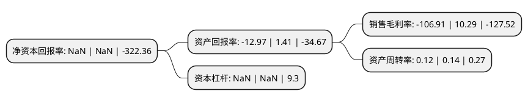

> 本页面由自动化程序生成于 2022年5月20日 01:03
> 内容可能存在错误，如有bug请提交issue至：https://github.com/Eroleice/doc-pi/issues
{.is-warning}

# 上市公司基本情况

## 基本资料

当代东方投资股份有限公司（以下简称“*ST当代”）成立于1997年01月17日，大同市。于1997年01月24日在深交所主板上市。

*ST当代注册资本78,960.411万元，主营业务;文化艺术，房地产业，物流业，矿业。以下是详细信息：

- 公司名称: 当代东方投资股份有限公司
- 股票代码: 000673.SZ
- 所在地: 山西 - 大同市
- 成立日期: 1997年01月17日
- 注册资本: 78,960.411万元
- 法定代表人: 王玺锭
- 主营业务: 主营业务;文化艺术，房地产业，物流业，矿业
- 公司官网: www.sz000673.com
- 公司介绍: 公司自2014年正式转型构建传媒产业生态，一直致力于打造成为一家拥有强大的自主创新能力、丰富的整合营销渠道、坚强的资本共享平台，依托于合伙人机制多元化布局的文化产业运营商。围绕“内容、渠道、衍生”战略，作为传媒生态领跑者，公司左手夯实内容投资加码渠道建设，右手布局新媒体、短视频、移动互联网、音乐等板块。目前，公司的主营业务涵盖电视剧、电影、综艺节目、影院运营、广告等。经过几年的快速发展，在资本助力下持续加码移动互联网、卫视平台、院线影城等渠道平台建设，夯实内容投资，实现内容与渠道融合发展。在布局音乐、教育等板块的基础上，公司提供包括影视、亲子、IP、爱情、时尚、演出、实业等系列内容产业的解决方案，致力于成为国内独具特色的特色小镇内容运营商。

## 股东及高管情况

上市公司第一大股东为厦门当代文化发展股份有限公司，持股120,694,443股，占比15.29%，**疑似为**上市公司实际控制人。

截至2022年04月28日，上市公司的前十大股东中，共有5名自然人股东，3名机构股东，2个产品账户，其中5%以上大股东共有6名。上市公司前十大股东明细如下：

> 未能通过持股比例判定出上市公司实际控制人（持股30%以上）
> 可能存在通过间接持股、联合持股、协议控制等方式拥有实际控制权的主体，具体请参考上市公司定期公告！
{.is-warning}

> 截至2022年04月28日，上市公司前十大股东信息如下：

| 股东名称 | 持股数量（股） | 持股比例 |
| --- | --- | --- |
| 厦门当代文化发展股份有限公司 | 120,694,443 | 15.29% |
| 厦门当代文化发展股份有限公司 | 120,694,443 | 15.29% |
| 南方资本-宁波银行-当代东方定向增发专项资产管理计划 | 93,938,052 | 11.9% |
| 南方资本-宁波银行-当代东方定向增发专项资产管理计划 | 93,938,052 | 11.9% |
| 鹰潭市当代投资集团有限公司 | 73,262,766 | 9.2784% |
| 吕达龙 | 54,861,111 | 6.95% |
| 林叶 | 11,055,648 | 1.4% |
| 蒋卫东 | 9,132,261 | 1.16% |
| 柯河彬 | 5,650,000 | 0.72% |
| 林通 | 4,916,800 | 0.62% |

## 利润表分析

上市公司2021年总收入为1.75亿元，净利润为-1.88亿元，**未实现盈利**。

## 杜邦分析

> 数据列示周期：2021年 | 2020年 | 2019年
{.is-info}

上市公司的净资产收益率在近一年有所下降，下降幅度为NaN%，其变化情况分解如下：
- 上市公司的销售毛利率在近一年下降了-1138.97%，可能是生产效率的下降、商品原材料价格上涨或商品价格的下跌所致。
- 上市公司的资产周转率在近一年下降了-14.29%，可能是源自于更慢的销售回款或库存管理效果下降。
- 上市公司的财务杠杆比率在近一年下降了NaN%，可能是减少负债降低财务费用。

