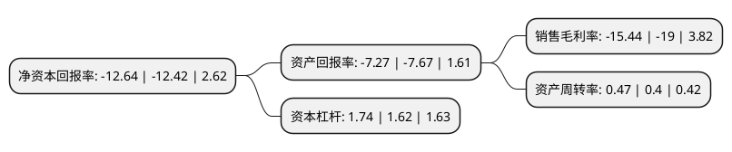

> 本页面由自动化程序生成于 2022年5月20日 01:07
> 内容可能存在错误，如有bug请提交issue至：https://github.com/Eroleice/doc-pi/issues
{.is-warning}

# 上市公司基本情况

## 基本资料

奥飞娱乐股份有限公司（以下简称“奥飞娱乐”）成立于1997年07月31日，汕头市。于2009年09月10日在深交所中小板上市。

奥飞娱乐注册资本147,869.97万元，动漫影视片制作，发行，授权以及动漫玩具和非动漫玩具的开发，生产与销售。以下是详细信息：

- 公司名称: 奥飞娱乐股份有限公司
- 股票代码: 002292.SZ
- 所在地: 广东 - 汕头市
- 成立日期: 1997年07月31日
- 注册资本: 147,869.97万元
- 法定代表人: 蔡东青
- 主营业务: 动漫影视片制作，发行，授权以及动漫玩具和非动漫玩具的开发，生产与销售
- 公司官网: www.gdalpha.com
- 公司介绍: 公司经过多年发展，从简单的制造与授权到原创并围绕IP进行全产业链开发，打造与积累了众多知名的IP形象，并通过多样化的媒体传播途径使IP渗透到动漫、游戏、影视、文学等多个文化产业领域。公司旗下拥有原创动力、狼烟动画、太极鼠等10多个原创动漫工作室，已打造出覆盖全年龄段的精品IP矩阵：其中包括面向K12人群的“喜羊羊与灰太狼”、“铠甲勇士”、“巴啦啦小魔仙”、“超级飞侠”、“开心超人”等IP；面向青少年以及全年龄段人群的“十万个冷笑话”、“端脑”、“雏蜂”、“镇魂街”、“贝肯熊”、“太极鼠”、“功夫料理娘”等IP。除了不断打造并培育众多知名IP之外，奥飞积极进行泛娱乐全产业开发，目前已构建以IP为核心，集小说、漫画、动画、电影为一体的内容生态，以及横跨媒体、玩具、消费品、教育、主题乐园等板块的产业平台。

## 股东及高管情况

上市公司第一大股东为蔡东青，持股561,696,985股，占比37.99%，为上市公司实际控制人。

截至2022年03月31日，上市公司的前十大股东中，共有5名自然人股东，1名机构股东，3个产品账户，1个海外主体，其中5%以上大股东共有2名。上市公司前十大股东明细如下：

> 截至2022年03月31日，上市公司前十大股东信息如下：

| 股东名称 | 持股数量（股） | 持股比例 |
| --- | --- | --- |
| 蔡东青 | 561,696,985 | 37.99% |
| 蔡晓东 | 109,481,442 | 7.4% |
| 李丽卿 | 21,326,715 | 1.44% |
| 中国银河证券股份有限公司 | 13,469,557 | 0.91% |
| 中国工商银行股份有限公司-华夏磐利一年定期开放混合型证券投资基金 | 13,392,856 | 0.91% |
| 信泰人寿保险股份有限公司-万能保险产品 | 13,212,485 | 0.89% |
| UBS   AG | 12,725,214 | 0.86% |
| 董坚强 | 11,856,428 | 0.8% |
| 中国邮政储蓄银行股份有限公司-中欧中小盘股票型证券投资基金(LOF) | 11,160,714 | 0.75% |
| 王洋 | 9,718,528 | 0.66% |

## 利润表分析

上市公司2021年总收入为26.44亿元，净利润为-4.09亿元，**未实现盈利**。

## 杜邦分析

> 数据列示周期：2021年 | 2020年 | 2019年
{.is-info}

上市公司的净资产收益率在近一年有所上升，上升幅度为1.77%，其变化情况分解如下：
- 上市公司的销售毛利率在近一年下降了-18.74%，可能是生产效率的下降、商品原材料价格上涨或商品价格的下跌所致。
- 上市公司的资产周转率在近一年上升了17.5%，可能是源自于更快的销售回款或库存管理效果提升。
- 上市公司的财务杠杆比率在近一年上升了7.41%，可能是增加负债扩大生产规模。

