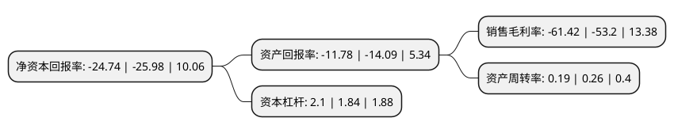

> 本页面由自动化程序生成于 2022年5月20日 01:08
> 内容可能存在错误，如有bug请提交issue至：https://github.com/Eroleice/doc-pi/issues
{.is-warning}

# 上市公司基本情况

## 基本资料

慈文传媒股份有限公司（以下简称“慈文传媒”）成立于1998年08月28日，嘉兴市。于2010年01月26日在深交所中小板上市。

慈文传媒注册资本47,494.969万元，主营业务:影视剧的投资，制作，发行及衍生业务，移动休闲游戏研发推广和渠道推广业务及艺人经纪业务。以下是详细信息：

- 公司名称: 慈文传媒股份有限公司
- 股票代码: 002343.SZ
- 所在地: 浙江 - 嘉兴市
- 成立日期: 1998年08月28日
- 注册资本: 47,494.969万元
- 法定代表人: 吴卫东
- 主营业务: 主营业务:影视剧的投资，制作，发行及衍生业务，移动休闲游戏研发推广和渠道推广业务及艺人经纪业务
- 公司官网: www.ciwen.com.cn
- 公司介绍: 公司主要从事影视剧的投资、制作、发行及衍生业务，移动休闲游戏研发推广和渠道推广业务及艺人经纪业务。公司已形成了以自有IP为核心资源，以电视剧投资、制作及发行业务为核心业务，积极延伸拓展电影、游戏和艺人经纪等相关业务领域，并形成了各业务板块良性互动、协同发展的业务体系。公司秉承“讲好中国故事，展现东方审美，面向世界表达”的理想和理念，坚持精品原创和IP开发并重，推进精品IP的培育和开发，优化产品结构，丰富剧作题材，提升制作品质，持续打造网台联动的头部剧和精品原创剧；加大对网生内容的投资力度，拓展付费模式网生内容，培育新的盈利增长点。公司坚持聚合优势、统筹核心、面向国际的基本思路，全面进行组织构架改革，发挥了影视、网娱、游戏、国际等泛娱乐全产业链整合共进的创新驱动效应，优化了创意研发、财务管理、投资拓展、品牌战略发展、综合服务等的服务支撑系统，初步建成了具有互联网基因的新型集团化构架。同时加大对影视制作发行、新媒体营销、衍生品研发、大数据运营、投资管理等方面优秀人才的引进，提升了公司的核心竞争力。

## 股东及高管情况

上市公司第一大股东为华章天地传媒投资控股集团有限公司，持股95,227,379股，占比20.05%，**疑似为**上市公司实际控制人。

截至2022年03月31日，上市公司的前十大股东中，共有6名自然人股东，3名机构股东，1个产品账户，其中5%以上大股东共有2名。上市公司前十大股东明细如下：

> 未能通过持股比例判定出上市公司实际控制人（持股30%以上）
> 可能存在通过间接持股、联合持股、协议控制等方式拥有实际控制权的主体，具体请参考上市公司定期公告！
{.is-warning}

> 截至2022年03月31日，上市公司前十大股东信息如下：

| 股东名称 | 持股数量（股） | 持股比例 |
| --- | --- | --- |
| 华章天地传媒投资控股集团有限公司 | 95,227,379 | 20.05% |
| 马中骏 | 43,892,974 | 9.24% |
| 中山证券-招商银行-中山证券启晨1号集合资产管理计划 | 15,662,543 | 3.3% |
| 杭州顺网科技股份有限公司 | 8,502,770 | 1.79% |
| 沈云平 | 7,675,677 | 1.62% |
| 任涛 | 3,990,000 | 0.84% |
| 袁利平 | 3,800,000 | 0.8% |
| 无锡市文化发展集团有限公司 | 3,717,472 | 0.78% |
| 王玫 | 2,352,233 | 0.5% |
| 马文文 | 2,307,800 | 0.49% |

## 利润表分析

上市公司2021年总收入为4.05亿元，净利润为-2.49亿元，**未实现盈利**。

## 杜邦分析

> 数据列示周期：2021年 | 2020年 | 2019年
{.is-info}

上市公司的净资产收益率在近一年有所下降，下降幅度为-4.77%，其变化情况分解如下：
- 上市公司的销售毛利率在近一年上升了15.45%，可能是生产效率的提升、商品原材料价格下跌或商品价格的上涨所致。
- 上市公司的资产周转率在近一年下降了-26.92%，可能是源自于更慢的销售回款或库存管理效果下降。
- 上市公司的财务杠杆比率在近一年上升了14.13%，可能是增加负债扩大生产规模。

