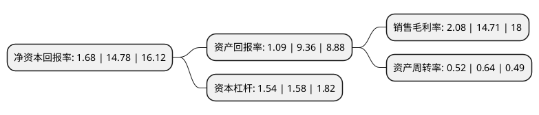

> 本页面由自动化程序生成于 2022年5月20日 01:10
> 内容可能存在错误，如有bug请提交issue至：https://github.com/Eroleice/doc-pi/issues
{.is-warning}

# 上市公司基本情况

## 基本资料

完美世界股份有限公司（以下简称“完美世界”）成立于1999年08月27日，湖州市。于2011年10月28日在深交所中小板上市。

完美世界注册资本193,996.84万元，电视剧(开发/制作/营销发行)，电影(开发/制作/营销发行)，综艺栏目，艺人经纪，商务广告，衍生经济及其他等各个影视业务板块。以下是详细信息：

- 公司名称: 完美世界股份有限公司
- 股票代码: 002624.SZ
- 所在地: 浙江 - 湖州市
- 成立日期: 1999年08月27日
- 注册资本: 193,996.84万元
- 法定代表人: 池宇峰
- 主营业务: 电视剧(开发/制作/营销发行)，电影(开发/制作/营销发行)，综艺栏目，艺人经纪，商务广告，衍生经济及其他等各个影视业务板块
- 公司官网: www.pwrd.com
- 公司介绍: 公司是中国大型的影游综合体，业务涵盖完美世界影视和完美世界游戏两大板块，包括：网络游戏的研发、发行和运营；电视剧、电影的制作、发行及衍生业务；综艺娱乐业务；艺人经纪服务及相关服务业务。公司影视作品荣获多项国内外知名奖项，其中包括电视剧飞天奖、白玉兰奖、华鼎奖，电影华表奖、大众电影百花奖、金马奖等。　作为中国最早进行海外运营的网络游戏公司，完美世界游戏在中国网络游戏海外出口市场收入中连续多年排名第一，用户群体覆盖至全球100多个国家和地区，在全球建立了自己的运营平台。

## 股东及高管情况

上市公司第一大股东为完美世界控股集团有限公司，持股491,300,348股，占比25.33%，**疑似为**上市公司实际控制人。

截至2022年03月31日，上市公司的前十大股东中，共有2名自然人股东，4名机构股东，3个产品账户，1个海外主体，其中5%以上大股东共有2名。上市公司前十大股东明细如下：

> 未能通过持股比例判定出上市公司实际控制人（持股30%以上）
> 可能存在通过间接持股、联合持股、协议控制等方式拥有实际控制权的主体，具体请参考上市公司定期公告！
{.is-warning}

> 截至2022年03月31日，上市公司前十大股东信息如下：

| 股东名称 | 持股数量（股） | 持股比例 |
| --- | --- | --- |
| 完美世界控股集团有限公司 | 491,300,348 | 25.33% |
| 池宇峰 | 149,122,401 | 7.69% |
| 天津东富锐进投资管理中心(有限合伙) | 96,995,898 | 5% |
| 香港中央结算有限公司(陆股通) | 83,013,696 | 4.28% |
| 石河子快乐永久股权投资有限公司 | 45,502,054 | 2.35% |
| 德清骏扬企业管理咨询合伙企业(有限合伙) | 33,011,752 | 1.7% |
| 钱桂英 | 22,231,219 | 1.15% |
| 交通银行-汇丰晋信动态策略混合型证券投资基金 | 17,263,250 | 0.89% |
| 中国银行股份有限公司-招商安华债券型证券投资基金 | 12,886,986 | 0.66% |
| 中国工商银行股份有限公司-广发中证传媒交易型开放式指数证券投资基金 | 10,966,673 | 0.57% |

## 利润表分析

上市公司2021年总收入为85.17亿元，净利润为1.77亿元，实现盈利。

## 杜邦分析

> 数据列示周期：2021年 | 2020年 | 2019年
{.is-info}

上市公司的净资产收益率在近一年有所下降，下降幅度为-88.63%，其变化情况分解如下：
- 上市公司的销售毛利率在近一年下降了-85.86%，可能是生产效率的下降、商品原材料价格上涨或商品价格的下跌所致。
- 上市公司的资产周转率在近一年下降了-18.75%，可能是源自于更慢的销售回款或库存管理效果下降。
- 上市公司的财务杠杆比率在近一年下降了-2.53%，可能是减少负债降低财务费用。

