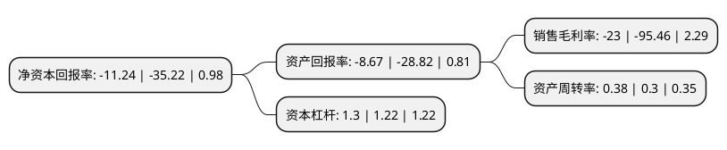

> 本页面由自动化程序生成于 2022年5月20日 01:11
> 内容可能存在错误，如有bug请提交issue至：https://github.com/Eroleice/doc-pi/issues
{.is-warning}

# 上市公司基本情况

## 基本资料

美盛文化创意股份有限公司（以下简称“美盛文化”）成立于2002年06月03日，绍兴市。于2012年09月11日在深交所中小板上市。

美盛文化注册资本90,957.273万元，主要产品:迪士尼形象动漫服饰，电影形象动漫服饰，传统节日动漫服饰以及装饰头巾等。主营业务:动漫衍生品细分产品动漫服饰的开发，生产和销售。以下是详细信息：

- 公司名称: 美盛文化创意股份有限公司
- 股票代码: 002699.SZ
- 所在地: 浙江 - 绍兴市
- 成立日期: 2002年06月03日
- 注册资本: 90,957.273万元
- 法定代表人: 袁贤苗
- 主营业务: 主要产品:迪士尼形象动漫服饰，电影形象动漫服饰，传统节日动漫服饰以及装饰头巾等主营业务:动漫衍生品细分产品动漫服饰的开发，生产和销售
- 公司官网: www.chinarising.com.cn
- 公司介绍: 公司总部位于浙江杭州，在欧洲、美国、中国香港、北京、上海、内蒙古等地拥有30余家分子公司。主要涉足IP、动漫、游戏、影视、衍生品设计研发生产等领域，是一家跨领域、跨行业、跨平台的生态型文化企业。多年来，公司不断优化产业布局，明确新昌基地、美盛游戏、美盛动漫、美盛视频、爱彼文化、美盛影业、美盛电商、JAKKS美盛、美盛海外等产业发展方向，提升产业层次。同时，公司以动漫衍生品为产业链建设基础，布局动漫、游戏、电商等各个板块，整合和开发优秀原创IP资源，逐步打通产业链中的各个环节，初步完成IP全产业链生态圈的构建，并积极投身IP文化市场，开启泛娱乐经营模式，实现全产业一体化战略，培育国内新型文化意识形态。随着产业的不断拓展，公司各项业务均取得突破性进展，获得了“国家文化产业示范基地”、“国家文化出口重点企业”、“国家文化出口重点项目”等多项荣誉，旗下的美盛游戏被认定为“国家动漫企业”。

## 股东及高管情况

上市公司第一大股东为赵小强，持股79,276,328股，占比8.72%，**疑似为**上市公司实际控制人。

截至2022年03月31日，上市公司的前十大股东中，共有4名自然人股东，5名机构股东，1个海外主体，其中5%以上大股东共有2名。上市公司前十大股东明细如下：

> 未能通过持股比例判定出上市公司实际控制人（持股30%以上）
> 可能存在通过间接持股、联合持股、协议控制等方式拥有实际控制权的主体，具体请参考上市公司定期公告！
{.is-warning}

> 上市公司第一大股东持股不超过10%，请检查是否存在公司控制权风险！
{.is-danger}

> 截至2022年03月31日，上市公司前十大股东信息如下：

| 股东名称 | 持股数量（股） | 持股比例 |
| --- | --- | --- |
| 赵小强 | 79,276,328 | 8.72% |
| 美盛控股集团有限公司 | 58,200,141 | 6.4% |
| 宁波广韬科技有限公司 | 31,777,200 | 3.49% |
| 宁波添润科技有限公司 | 23,028,116 | 2.53% |
| 浙江浙商产融投资发展有限公司 | 19,122,622 | 2.1% |
| 香港中央结算有限公司(陆股通) | 12,549,079 | 1.38% |
| 郭瑞 | 8,601,734 | 0.95% |
| 宁波泛海企业管理合伙企业(有限合伙) | 4,741,000 | 0.52% |
| 潘玉根 | 4,036,000 | 0.44% |
| 全益军 | 3,365,900 | 0.37% |

## 利润表分析

上市公司2021年总收入为10.3亿元，净利润为-2.38亿元，**未实现盈利**。

## 杜邦分析

> 数据列示周期：2021年 | 2020年 | 2019年
{.is-info}

上市公司的净资产收益率在近一年有所下降，下降幅度为-68.09%，其变化情况分解如下：
- 上市公司的销售毛利率在近一年下降了-75.91%，可能是生产效率的下降、商品原材料价格上涨或商品价格的下跌所致。
- 上市公司的资产周转率在近一年上升了26.67%，可能是源自于更快的销售回款或库存管理效果提升。
- 上市公司的财务杠杆比率在近一年上升了6.56%，可能是增加负债扩大生产规模。

