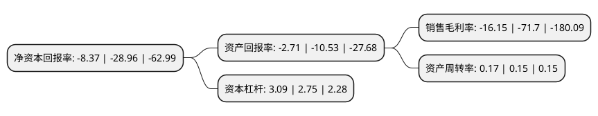

> 本页面由自动化程序生成于 2022年5月20日 01:14
> 内容可能存在错误，如有bug请提交issue至：https://github.com/Eroleice/doc-pi/issues
{.is-warning}

# 上市公司基本情况

## 基本资料

华谊兄弟传媒股份有限公司（以下简称“华谊兄弟”）成立于2004年11月19日，金华市。于2009年10月30日在深交所创业板上市。

华谊兄弟注册资本277,450.592万元，公司主要从事电影的制作，发行及衍生业务;电视剧的制作，发行及衍生业务;艺人经纪服务及相关服务业务。以下是详细信息：

- 公司名称: 华谊兄弟传媒股份有限公司
- 股票代码: 300027.SZ
- 所在地: 浙江 - 金华市
- 成立日期: 2004年11月19日
- 注册资本: 277,450.592万元
- 法定代表人: 王忠军
- 主营业务: 公司主要从事电影的制作，发行及衍生业务;电视剧的制作，发行及衍生业务;艺人经纪服务及相关服务业务
- 公司官网: www.huayimedia.com
- 公司介绍: 公司是中国影视行业首家上市公司，被称为“中国影视娱乐第一股”。近年来，公司以前瞻性思维引领业务布局，不断坚持创新，被业界评价为中国娱乐行业的先锋和领军者。目前，公司投资及运营四大业务板块：以电影、电视剧、艺人经纪等业务为代表的影视娱乐板块；以电影城、电影世界、电影小镇、文化城等业务为代表的品牌授权与实景娱乐板块；以游戏、新媒体、粉丝社区等业务为代表的互联网娱乐板块以及第四大业务板块产业投资板块。公司正着力打造一批年轻偶像，同时，逐步完善了集影视、艺人经纪、娱乐营销等为一体的艺人培养机制，运用全产业链资源整合能力对年轻艺人进行全方位孵化。其中，“综艺服务”经纪模式逐渐完善，随着公司对综艺节目制作投入的增加，其显现出巨大的增长潜力，为艺人提供了很好的发展舞台。公司还积极推进国际化布局，整合全球顶尖的娱乐创意人才，为中国文娱产业走出去探索新模式，通过海外布局平抑国内行业周期波动风险。

## 股东及高管情况

上市公司第一大股东为王忠军，持股468,404,062股，占比16.88%，**疑似为**上市公司实际控制人。

截至2022年03月31日，上市公司的前十大股东中，共有6名自然人股东，4名机构股东，其中5%以上大股东共有6名。上市公司前十大股东明细如下：

> 未能通过持股比例判定出上市公司实际控制人（持股30%以上）
> 可能存在通过间接持股、联合持股、协议控制等方式拥有实际控制权的主体，具体请参考上市公司定期公告！
{.is-warning}

> 截至2022年03月31日，上市公司前十大股东信息如下：

| 股东名称 | 持股数量（股） | 持股比例 |
| --- | --- | --- |
| 王忠军 | 468,404,062 | 16.88% |
| 王忠军 | 466,804,062 | 16.82% |
| 王忠军 | 466,404,062 | 16.81% |
| 深圳市腾讯计算机系统有限公司 | 220,363,501 | 7.94% |
| 深圳市腾讯计算机系统有限公司 | 220,363,501 | 7.94% |
| 深圳市腾讯计算机系统有限公司 | 220,363,501 | 7.94% |
| 杭州阿里创业投资有限公司 | 123,959,344 | 4.47% |
| 马云 | 99,782,788 | 3.6% |
| 王忠磊 | 92,956,970 | 3.35% |
| 鲁伟鼎 | 27,988,328 | 1.01% |

## 利润表分析

上市公司2021年总收入为13.99亿元，净利润为-2.27亿元，**未实现盈利**。

## 杜邦分析

> 数据列示周期：2021年 | 2020年 | 2019年
{.is-info}

上市公司的净资产收益率在近一年有所下降，下降幅度为-71.1%，其变化情况分解如下：
- 上市公司的销售毛利率在近一年下降了-77.48%，可能是生产效率的下降、商品原材料价格上涨或商品价格的下跌所致。
- 上市公司的资产周转率在近一年上升了13.33%，可能是源自于更快的销售回款或库存管理效果提升。
- 上市公司的财务杠杆比率在近一年上升了12.36%，可能是增加负债扩大生产规模。

