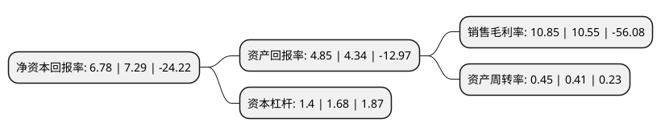

> 本页面由自动化程序生成于 2022年5月20日 01:15
> 内容可能存在错误，如有bug请提交issue至：https://github.com/Eroleice/doc-pi/issues
{.is-warning}

# 上市公司基本情况

## 基本资料

浙江华策影视股份有限公司（以下简称“华策影视”）成立于2005年10月25日，杭州市。于2010年10月26日在深交所创业板上市。

华策影视注册资本190,107.37万元，主要从事影视剧的制作，发行及衍生业务。公司电视剧投拍业务所形成的主要产品就是电视剧作品(即电视台播放的电视剧，音像制品等)及其衍生产品(广告等)。公司电影业务所形成的主要产品就是电影作品(即电影院放映的影片，音像制品等)及其衍生产品(广告等)。以下是详细信息：

- 公司名称: 浙江华策影视股份有限公司
- 股票代码: 300133.SZ
- 所在地: 浙江 - 杭州市
- 成立日期: 2005年10月25日
- 注册资本: 190,107.37万元
- 法定代表人: 赵依芳
- 主营业务: 主要从事影视剧的制作，发行及衍生业务公司电视剧投拍业务所形成的主要产品就是电视剧作品(即电视台播放的电视剧，音像制品等)及其衍生产品(广告等)公司电影业务所形成的主要产品就是电影作品(即电影院放映的影片，音像制品等)及其衍生产品(广告等)
- 公司官网: www.huacemedia.com
- 公司介绍: 公司专注打造电视剧、电影、综艺三大精品内容，并以内容为核心全面布局泛娱乐产业，深度推动产业革新和生态升级，形成了影视内容的规模优势、国际合作的先发优势、品牌地位的领先优势、率先上市的资金优势、科技数据的工业化优势，引领中国影视行业迈向产业格局的新高度和华流出海的新跨越。华策致力打造富有时代精神、弘扬中国文化的精品内容，出品的电视剧《国家命运》《海棠依旧》《解密》《推拿》《子夜》等深受观众喜爱，实现了集思想性、艺术性、观赏性、市场性于一体，社会效益和经济效益相统一的内容核心竞争力，多部作品荣获全国“五个一工程”奖、飞天奖、金鹰奖、金马奖、法国戛纳电影节、中美电影节等国际国内重要奖项。公司与英国最大商业电视台ITV、BBC，美国索尼电视、华纳兄弟、福克斯、俄罗斯领先的CTC传媒等全球影视巨头达成战略合作，与国际著名网络平台YouTube、JungoTV、Now TV、Dailymotion聚合传媒、美国Dramafever及华为、爱奇艺等海外新媒体平台深度合作，搭建全球华语影视联播体。

## 股东及高管情况

上市公司第一大股东为傅梅城，持股361,090,743股，占比18.99%，**疑似为**上市公司实际控制人。

截至2022年03月31日，上市公司的前十大股东中，共有4名自然人股东，3名机构股东，2个产品账户，1个海外主体，其中5%以上大股东共有3名。上市公司前十大股东明细如下：

> 未能通过持股比例判定出上市公司实际控制人（持股30%以上）
> 可能存在通过间接持股、联合持股、协议控制等方式拥有实际控制权的主体，具体请参考上市公司定期公告！
{.is-warning}

> 截至2022年03月31日，上市公司前十大股东信息如下：

| 股东名称 | 持股数量（股） | 持股比例 |
| --- | --- | --- |
| 傅梅城 | 361,090,743 | 18.99% |
| 傅梅城 | 348,135,743 | 18.31% |
| 杭州大策投资有限公司 | 324,381,020 | 17.06% |
| 北京鼎鹿中原科技有限公司 | 87,431,693 | 4.6% |
| 香港中央结算有限公司(陆股通) | 59,621,538 | 3.14% |
| 吴涛 | 59,560,229 | 3.13% |
| 中国建设银行股份有限公司-广发价值领先混合型证券投资基金 | 52,109,373 | 2.74% |
| 西藏泰富文化传媒有限公司 | 23,544,500 | 1.24% |
| 中国工商银行-广发聚富开放式证券投资基金 | 18,838,095 | 0.99% |
| 傅斌星 | 15,599,857 | 0.82% |

## 利润表分析

上市公司2021年总收入为38.06亿元，净利润为4.12亿元，实现盈利。

## 杜邦分析

> 数据列示周期：2021年 | 2020年 | 2019年
{.is-info}

上市公司的净资产收益率在近一年有所下降，下降幅度为-7%，其变化情况分解如下：
- 上市公司的销售毛利率在近一年上升了2.84%，可能是生产效率的提升、商品原材料价格下跌或商品价格的上涨所致。
- 上市公司的资产周转率在近一年上升了9.76%，可能是源自于更快的销售回款或库存管理效果提升。
- 上市公司的财务杠杆比率在近一年下降了-16.67%，可能是减少负债降低财务费用。

