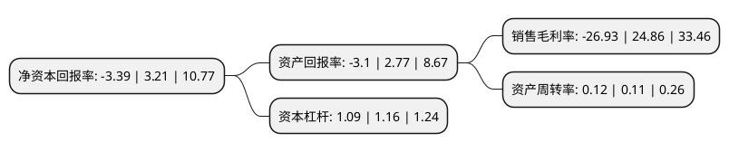

> 本页面由自动化程序生成于 2022年5月20日 01:16
> 内容可能存在错误，如有bug请提交issue至：https://github.com/Eroleice/doc-pi/issues
{.is-warning}

# 上市公司基本情况

## 基本资料

北京光线传媒股份有限公司（以下简称“光线传媒”）成立于2000年04月24日，北京市。于2011年08月03日在深交所创业板上市。

光线传媒注册资本293,360.843万元，主营业务是电视节目和影视剧的投资制作和发行业务。电视节目包括常规电视栏目和在电视台播出的演艺活动。演艺活动一般在电视台播出，属于特殊类型的电视节目。电视栏目，演艺活动和影视剧是公司的三大传媒内容产品。以下是详细信息：

- 公司名称: 北京光线传媒股份有限公司
- 股票代码: 300251.SZ
- 所在地: 北京 - 北京市
- 成立日期: 2000年04月24日
- 注册资本: 293,360.843万元
- 法定代表人: 王长田
- 主营业务: 主营业务是电视节目和影视剧的投资制作和发行业务电视节目包括常规电视栏目和在电视台播出的演艺活动演艺活动一般在电视台播出，属于特殊类型的电视节目电视栏目，演艺活动和影视剧是公司的三大传媒内容产品
- 公司官网: www.ewang.com
- 公司介绍: 公司业务以内容为核心、以影视为驱动，在横向的内容覆盖及纵向的产业链延伸两个维度同时布局，目前业务已覆盖电影、电视剧(网剧)、动漫、视频、音乐、文学、艺人经纪、戏剧、衍生品、实景娱乐等领域，是国内覆盖内容领域最全面、产业链纵向延伸最完整的综合内容集团之一。影视业务板块。主要包括电影、电视剧(网剧)等，是公司的核心竞争力所在，也是扩展并拉动其他业务板块的核心驱动力所在。动漫业务板块。主要包括动画影视及动漫题材的真人影视等，是公司在横向领域内优势最明显的业务板块，也是最具发展潜力的业务板块之一。内容关联业务板块。主要包括艺人经纪、文学、音乐、戏剧、衍生品、实景娱乐等，既涵括不同的内容形式，也包含内容的衍生和延展，是公司在以优质影视内容为核心建立行业地位和竞争优势后，孕育并促进其他业务板块发展的具体体现。产业投资板块。主要指公司对其他公司及实体的股权投资，均以内容投资和战略投资为核心，是公司布局内容产业链、扩大并延伸业务触角、丰富内容产品线及来源的重要保障。

## 股东及高管情况

上市公司第一大股东为光线控股有限公司，持股1,249,183,518股，占比42.58%，为上市公司实际控制人。

截至2022年04月29日，上市公司的前十大股东中，共有4名自然人股东，4名机构股东，1个产品账户，1个海外主体，其中5%以上大股东共有4名。上市公司前十大股东明细如下：

> 截至2022年04月29日，上市公司前十大股东信息如下：

| 股东名称 | 持股数量（股） | 持股比例 |
| --- | --- | --- |
| 光线控股有限公司 | 1,249,183,518 | 42.58% |
| 上海汉涛信息咨询有限公司 | 176,016,506 | 6% |
| 上海汉涛信息咨询有限公司 | 176,016,506 | 6% |
| 杭州阿里创业投资有限公司 | 170,637,446 | 5.82% |
| 香港中央结算有限公司(陆股通) | 118,251,718 | 4.03% |
| 杜英莲 | 102,690,536 | 3.5% |
| 李德来 | 87,621,524 | 2.99% |
| 招商银行股份有限公司-泓德丰润三年持有期混合型证券投资基金 | 42,687,464 | 1.46% |
| 王牮 | 29,633,600 | 1.01% |
| 王洪田 | 24,543,340 | 0.84% |

## 利润表分析

上市公司2021年总收入为11.67亿元，净利润为-3.15亿元，**未实现盈利**。

## 杜邦分析

> 数据列示周期：2021年 | 2020年 | 2019年
{.is-info}

上市公司的净资产收益率在近一年有所下降，下降幅度为-205.61%，其变化情况分解如下：
- 上市公司的销售毛利率在近一年下降了-208.33%，可能是生产效率的下降、商品原材料价格上涨或商品价格的下跌所致。
- 上市公司的资产周转率在近一年上升了9.09%，可能是源自于更快的销售回款或库存管理效果提升。
- 上市公司的财务杠杆比率在近一年下降了-6.03%，可能是减少负债降低财务费用。

