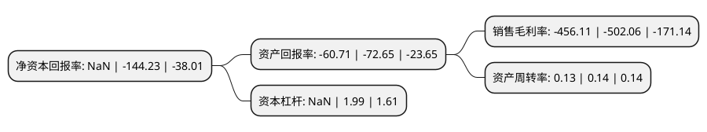

> 本页面由自动化程序生成于 2022年5月20日 01:16
> 内容可能存在错误，如有bug请提交issue至：https://github.com/Eroleice/doc-pi/issues
{.is-warning}

# 上市公司基本情况

## 基本资料

上海新文化传媒集团股份有限公司（以下简称“*ST新文”）成立于2004年12月30日，上海市。于2012年07月10日在深交所创业板上市。

*ST新文注册资本80,623.019万元，公司主要从事影视剧的策划，制作，发行及衍生业务。公司主要产品为电视剧和电影。以下是详细信息：

- 公司名称: 上海新文化传媒集团股份有限公司
- 股票代码: 300336.SZ
- 所在地: 上海 - 上海市
- 成立日期: 2004年12月30日
- 注册资本: 80,623.019万元
- 法定代表人: 杨震华
- 主营业务: 公司主要从事影视剧的策划，制作，发行及衍生业务公司主要产品为电视剧和电影
- 公司官网: www.ncmedia.com.cn
- 公司介绍: 公司成立于2004年12月，是一家以影视剧制作、发行为核心，电影、综艺、新媒体、户外广告投放、产业投资等多元化发展格局的全产业链型影视企业。公司通过不断优化内容和团队建设，进行传媒产业链横向纵向延伸，扩大产能规模，布局相关产业。公司构建了以“优质IP资源”为核心，电视剧、电影、大综艺、网剧为产品的四大类内容板块。定制拍摄4K3D电影、大型网络定制剧、时尚综艺节目等不同形式的影视节目，发展全方位的娱乐产品服务。并对旗下子公司进行全新的战略升级，从单一影视剧的制作、发行业务转向影视IP版权资源开发，自主研发、代理发行游戏业务。公司还专注于整合互动技术和媒体内容资源，户外大屏渠道和移动端小屏具有天然的互联关系，通过垂直化互联网社区及精准的营销模式，与户外LED大屏进行有效联动，形成大屏和手机的互动、广告和用户的联动。

## 股东及高管情况

上市公司第一大股东为拾分自然(上海)文化传播有限公司，持股71,555,555股，占比8.88%，**疑似为**上市公司实际控制人。

截至2022年03月31日，上市公司的前十大股东中，共有6名自然人股东，4名机构股东，其中5%以上大股东共有2名。上市公司前十大股东明细如下：

> 未能通过持股比例判定出上市公司实际控制人（持股30%以上）
> 可能存在通过间接持股、联合持股、协议控制等方式拥有实际控制权的主体，具体请参考上市公司定期公告！
{.is-warning}

> 上市公司第一大股东持股不超过10%，请检查是否存在公司控制权风险！
{.is-danger}

> 截至2022年03月31日，上市公司前十大股东信息如下：

| 股东名称 | 持股数量（股） | 持股比例 |
| --- | --- | --- |
| 拾分自然(上海)文化传播有限公司 | 71,555,555 | 8.88% |
| 杨震华 | 40,500,000 | 5.02% |
| 陈颖翱 | 37,802,500 | 4.69% |
| 上海银久广告有限公司 | 36,791,396 | 4.56% |
| 盛文蕾 | 23,555,100 | 2.92% |
| 南山集团资本投资有限公司 | 22,500,000 | 2.79% |
| 陈能依 | 13,659,300 | 1.69% |
| 程志国 | 8,001,400 | 0.99% |
| 上海渠丰国际贸易有限公司 | 7,991,675 | 0.99% |
| 郑思思 | 4,823,287 | 0.6% |

## 利润表分析

上市公司2021年总收入为1.42亿元，净利润为-6.5亿元，**未实现盈利**。

## 杜邦分析

> 数据列示周期：2021年 | 2020年 | 2019年
{.is-info}

上市公司的净资产收益率在近一年有所下降，下降幅度为NaN%，其变化情况分解如下：
- 上市公司的销售毛利率在近一年下降了-9.15%，可能是生产效率的下降、商品原材料价格上涨或商品价格的下跌所致。
- 上市公司的资产周转率在近一年下降了-7.14%，可能是源自于更慢的销售回款或库存管理效果下降。
- 上市公司的财务杠杆比率在近一年下降了NaN%，可能是减少负债降低财务费用。

