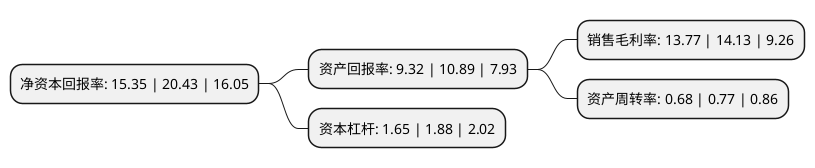

> 本页面由自动化程序生成于 2022年5月20日 01:17
> 内容可能存在错误，如有bug请提交issue至：https://github.com/Eroleice/doc-pi/issues
{.is-warning}

# 上市公司基本情况

## 基本资料

芒果超媒股份有限公司（以下简称“芒果超媒”）成立于2005年12月28日，长沙市。于2015年01月21日在深交所创业板上市。

芒果超媒注册资本187,072.082万元，新媒体平台运营业务，新媒体互动娱乐内容制作，媒体零售业务以下是详细信息：

- 公司名称: 芒果超媒股份有限公司
- 股票代码: 300413.SZ
- 所在地: 湖南 - 长沙市
- 成立日期: 2005年12月28日
- 注册资本: 187,072.082万元
- 法定代表人: 张华立
- 主营业务: 新媒体平台运营业务，新媒体互动娱乐内容制作，媒体零售业务
- 公司官网: www.mgtv.com
- 公司介绍: 公司是湖南广播电视台旗下统一的新媒体产业及资本运营平台，与湖南卫视共同构成芒果生态内的双平台驱动、全媒体融合发展格局。公司聚焦媒体主业，以芒果TV融合媒体平台为主阵地，秉持平台精准内容与核心自主技术双轮驱动理念，充分发挥研发、生产、发行、牌照、政策优势，服务全国及海外亿级新媒体用户，持续打造A股市场第一家以融合发展为标志，具有引领力、传播力和影响力的国有新媒体上市公司，全力向国内最具创新活力和有全球影响力的新型主流媒体集团战略目标迈进。

## 股东及高管情况

上市公司第一大股东为芒果传媒有限公司，持股1,049,300,301股，占比56.09%，为上市公司实际控制人。

截至2022年03月31日，上市公司的前十大股东中，共有3名机构股东，6个产品账户，1个海外主体，其中5%以上大股东共有3名。上市公司前十大股东明细如下：

> 截至2022年03月31日，上市公司前十大股东信息如下：

| 股东名称 | 持股数量（股） | 持股比例 |
| --- | --- | --- |
| 芒果传媒有限公司 | 1,049,300,301 | 56.09% |
| 中移资本控股有限责任公司 | 131,188,792 | 7.01% |
| 湖南财信精果股权投资合伙企业(有限合伙) | 93,647,857 | 5.01% |
| 香港中央结算有限公司(陆股通) | 48,902,114 | 2.61% |
| 招商银行股份有限公司-兴全合润混合型证券投资基金 | 34,253,283 | 1.83% |
| 兴业银行股份有限公司-兴全趋势投资混合型证券投资基金 | 28,168,649 | 1.51% |
| 招商银行股份有限公司-兴全合宜灵活配置混合型证券投资基金(LOF) | 21,862,356 | 1.17% |
| 中国工商银行股份有限公司-兴全绿色投资混合型证券投资基金(LOF) | 18,715,039 | 1% |
| 兴业银行股份有限公司-富国兴远优选12个月持有期混合型证券投资基金 | 11,214,866 | 0.6% |
| 中国光大银行股份有限公司-兴全商业模式优选混合型证券投资基金(LOF) | 10,108,990 | 0.54% |

## 利润表分析

上市公司2021年总收入为153.55亿元，净利润为21.14亿元，实现盈利。

## 杜邦分析

> 数据列示周期：2021年 | 2020年 | 2019年
{.is-info}

上市公司的净资产收益率在近一年有所下降，下降幅度为-24.87%，其变化情况分解如下：
- 上市公司的销售毛利率在近一年下降了-2.55%，可能是生产效率的下降、商品原材料价格上涨或商品价格的下跌所致。
- 上市公司的资产周转率在近一年下降了-11.69%，可能是源自于更慢的销售回款或库存管理效果下降。
- 上市公司的财务杠杆比率在近一年下降了-12.23%，可能是减少负债降低财务费用。

