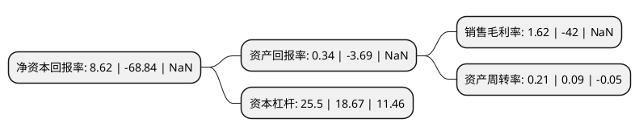

> 本页面由自动化程序生成于 2022年5月20日 01:17
> 内容可能存在错误，如有bug请提交issue至：https://github.com/Eroleice/doc-pi/issues
{.is-warning}

# 上市公司基本情况

## 基本资料

浙江唐德影视股份有限公司（以下简称“唐德影视”）成立于2006年10月30日，金华市。于2015年02月17日在深交所创业板上市。

唐德影视注册资本41,477.15万元，主要从事电视剧投资，制作，发行和衍生业务;电影投资，制作，发行和衍生业务;艺人经纪及相关服务业务;影视广告制作及相关服务业务;影视剧后期制作服务业务。公司的主要产品为电视剧作品以及衍生产品与电影作品以及衍生产品。以下是详细信息：

- 公司名称: 浙江唐德影视股份有限公司
- 股票代码: 300426.SZ
- 所在地: 浙江 - 金华市
- 成立日期: 2006年10月30日
- 注册资本: 41,477.15万元
- 法定代表人: 许东良
- 主营业务: 主要从事电视剧投资，制作，发行和衍生业务;电影投资，制作，发行和衍生业务;艺人经纪及相关服务业务;影视广告制作及相关服务业务;影视剧后期制作服务业务公司的主要产品为电视剧作品以及衍生产品与电影作品以及衍生产品
- 公司官网: www.tangde.com.cn
- 公司介绍: 公司是一家以影视剧投资、制作、发行为核心业务的影视公司，具备国家影视剧生产甲级资质。公司先后覆盖了影视剧投资与制作、艺人经纪、影视广告制作、影视剧后期制作、电影发行、电视综艺投资与制作、电影院线投资与管理、影视剧海外发行、娱乐整合营销等多个领域，并不断向游戏、动漫等泛娱乐产业延伸，业已成长为布局全产业链的影视标杆和国内影视内容生产的龙头企业之一。公司始终秉持稳健、极致的影视投资制作理念，以匠心精神为观众创作了一大批品质优良、制作精细、深受观众喜爱的影视作品。如范冰冰主演的电视连续剧《武媚娘传奇》、成龙主演的电影《绝地逃亡》，谍战经典剧《永不消逝的电波》、新疆军垦题材的《花儿与远方》，以及“亚洲电视剧制作历史单体最大投资”的《巴清传》、年度爆款电视剧《那年花开月正圆》、《急诊科医生》等。其中多部作品还曾荣获中宣部“五个一工程”奖，在艺术质量和社会效益上也取得双赢，获得业内普遍好评。

## 股东及高管情况

上市公司第一大股东为吴宏亮，持股106,959,426股，占比25.79%，**疑似为**上市公司实际控制人。

截至2022年03月31日，上市公司的前十大股东中，共有5名自然人股东，5名机构股东，其中5%以上大股东共有3名。上市公司前十大股东明细如下：

> 未能通过持股比例判定出上市公司实际控制人（持股30%以上）
> 可能存在通过间接持股、联合持股、协议控制等方式拥有实际控制权的主体，具体请参考上市公司定期公告！
{.is-warning}

> 截至2022年03月31日，上市公司前十大股东信息如下：

| 股东名称 | 持股数量（股） | 持股比例 |
| --- | --- | --- |
| 吴宏亮 | 106,959,426 | 25.79% |
| 东阳东控聚文文化发展有限公司 | 28,067,573 | 6.77% |
| 浙江易通传媒投资有限公司 | 20,945,950 | 5.05% |
| 太易控股集团有限公司 | 19,390,295 | 4.67% |
| 陈蓉 | 9,818,981 | 2.37% |
| 古元峰 | 7,642,560 | 1.84% |
| 北京鼎石源泉投资咨询中心(有限合伙) | 6,900,170 | 1.66% |
| 北京翔乐科技有限公司 | 6,347,403 | 1.53% |
| 刘朝晨 | 6,260,607 | 1.51% |
| 赵薇 | 5,849,850 | 1.41% |

## 利润表分析

上市公司2021年总收入为4.76亿元，净利润为0.07亿元，实现盈利。

## 杜邦分析

> 数据列示周期：2021年 | 2020年 | 2019年
{.is-info}

上市公司的净资产收益率在近一年有所下降，下降幅度为-112.52%，其变化情况分解如下：
- 上市公司的销售毛利率在近一年下降了-103.86%，可能是生产效率的下降、商品原材料价格上涨或商品价格的下跌所致。
- 上市公司的资产周转率在近一年上升了133.33%，可能是源自于更快的销售回款或库存管理效果提升。
- 上市公司的财务杠杆比率在近一年上升了36.58%，可能是增加负债扩大生产规模。

