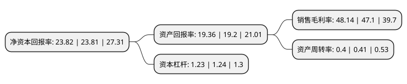

> 本页面由自动化程序生成于 2022年5月20日 01:20
> 内容可能存在错误，如有bug请提交issue至：https://github.com/Eroleice/doc-pi/issues
{.is-warning}

# 上市公司基本情况

## 基本资料

广东南方新媒体股份有限公司（以下简称“新媒股份”）成立于2010年07月12日，广州市。于2019年04月19日在深交所创业板上市。

新媒股份注册资本23,105.815万元，公司主营业务包括IPTV，互联网电视，有线电视网络增值服务，省外专网视听节目综合服务等新媒体业务。公司目前互联网电视业务的主要产品为“云视听”系列。以下是详细信息：

- 公司名称: 广东南方新媒体股份有限公司
- 股票代码: 300770.SZ
- 所在地: 广东 - 广州市
- 成立日期: 2010年07月12日
- 注册资本: 23,105.815万元
- 法定代表人: 杨德建
- 主营业务: 公司主营业务包括IPTV，互联网电视，有线电视网络增值服务，省外专网视听节目综合服务等新媒体业务公司目前互联网电视业务的主要产品为“云视听”系列
- 公司官网: www.snm.gd.cn
- 公司介绍: 公司是全国领先的新媒体业务运营商。经广东广播电视台授权，公司独家运营与广东IPTV集成播控服务、互联网电视集成服务、互联网电视内容服务配套的经营性业务。报告期内，公司主营业务包括IPTV、互联网电视、有线电视网络增值服务、省外专网视听节目综合服务、手机视频等新媒体业务。其中：IPTV、互联网电视为主要业务；有线电视网络增值服务、省外专网视听节目综合服务为报告期内新增业务；手机视频为报告期内曾经存在但报告期内已停止经营的业务.2018年公司被评选为广州未来独角兽创新企业20强、网络视听年度代表人物-年度产品/技术创新团队、2018-2019中国管理创新先进单位以及2018年度广东省最具社会责任感企业奖。

## 股东及高管情况

上市公司第一大股东为广东南方广播影视传媒集团有限公司，持股89,524,119股，占比38.75%，为上市公司实际控制人。

截至2022年03月31日，上市公司的前十大股东中，共有5名机构股东，4个产品账户，1个海外主体，其中5%以上大股东共有2名。上市公司前十大股东明细如下：

> 截至2022年03月31日，上市公司前十大股东信息如下：

| 股东名称 | 持股数量（股） | 持股比例 |
| --- | --- | --- |
| 广东南方广播影视传媒集团有限公司 | 89,524,119 | 38.75% |
| 横琴红土融耀创业投资合伙企业(有限合伙) | 11,648,478 | 5.04% |
| 东方邦信创业投资有限公司 | 11,131,482 | 4.82% |
| 广东省广播电视网络股份有限公司 | 7,538,163 | 3.26% |
| 东方邦信资本管理有限公司 | 4,082,694 | 1.77% |
| 香港中央结算有限公司(陆股通) | 2,353,038 | 1.02% |
| 全国社保基金一一八组合 | 1,999,826 | 0.87% |
| 浙商期货-浙商证券股份有限公司-浙商期货融畅1号单一资产管理计划 | 1,260,600 | 0.55% |
| 山东省国际信托股份有限公司-鼎萨2期证券投资集合资金信托计划 | 1,157,948 | 0.5% |
| 浙商期货-浙商证券股份有限公司-浙商期货融畅4号单一资产管理计划 | 1,100,000 | 0.48% |

## 利润表分析

上市公司2021年总收入为14.09亿元，净利润为6.78亿元，实现盈利。

## 杜邦分析

> 数据列示周期：2021年 | 2020年 | 2019年
{.is-info}

上市公司的净资产收益率在近一年有所上升，上升幅度为0.04%，其变化情况分解如下：
- 上市公司的销售毛利率在近一年上升了2.21%，可能是生产效率的提升、商品原材料价格下跌或商品价格的上涨所致。
- 上市公司的资产周转率在近一年下降了-2.44%，可能是源自于更慢的销售回款或库存管理效果下降。
- 上市公司的财务杠杆比率在近一年下降了-0.81%，可能是减少负债降低财务费用。

