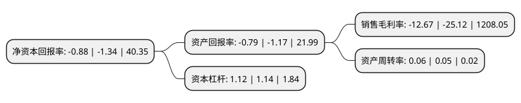

> 本页面由自动化程序生成于 2022年5月20日 01:24
> 内容可能存在错误，如有bug请提交issue至：https://github.com/Eroleice/doc-pi/issues
{.is-warning}

# 上市公司基本情况

## 基本资料

浙江东望时代科技股份有限公司（以下简称“东望时代”）成立于1993年07月13日，金华市。于1997年04月15日在上交所主板上市。

东望时代注册资本84,419.474万元，主要业务:房地产销售，旅游服务，销售材料，其他。以下是详细信息：

- 公司名称: 浙江东望时代科技股份有限公司
- 股票代码: 600052.SH
- 所在地: 浙江 - 金华市
- 成立日期: 1993年07月13日
- 注册资本: 84,419.474万元
- 法定代表人: 蒋旭峰
- 主营业务: 房地产销售，旅游服务，销售材料，其他
- 公司官网: www.gsgf.com
- 公司介绍: 浙江广厦股份有限公司，成立于1993年7月，并于1997年4月15日在上海证券交易所挂牌上市，成为国家建设部推荐的全国建筑业首家上市公司。2001年公司进行重大资产重组，主营业务由建筑施工业转为房地产开发。2007年公司成功实施了股权分置改革，进一步改善了公司资产质量，扩大了资产规模，大幅提高了盈利能力。2015年下半年，公司提出三年内逐步退出房地产行业，进入有发展潜力和增长空间的新领域的产业转型新战略。近年来，公司围绕上述战略转型目标，有序推进各项工作的开展，目前公司已基本完成房地产业务的退出。　接下来，公司一方面将整合市场优质资源，加强项目的储备工作，做到多个影视项目滚动式开发，通过完善产品开发体系及管控流程，提升产品开发能力，形成具有自身特色的精品化开发路线；另一方面，公司也将根据市场契机，在充分调研、研究的基础上利用上市公司资本优势，加大对外产业投资并购力度，加快进行大文化行业的相关资产及业务布局，选取优质标的进行产业整合，实现打造大文化产业平台的目标。

## 股东及高管情况

上市公司第一大股东为东阳市东科数字科技有限公司，持股244,675,676股，占比28.98%，**疑似为**上市公司实际控制人。

截至2022年04月29日，上市公司的前十大股东中，共有5名自然人股东，4名机构股东，1名其他股东，其中5%以上大股东共有2名。上市公司前十大股东明细如下：

> 未能通过持股比例判定出上市公司实际控制人（持股30%以上）
> 可能存在通过间接持股、联合持股、协议控制等方式拥有实际控制权的主体，具体请参考上市公司定期公告！
{.is-warning}

> 截至2022年04月29日，上市公司前十大股东信息如下：

| 股东名称 | 持股数量（股） | 持股比例 |
| --- | --- | --- |
| 东阳市东科数字科技有限公司 | 244,675,676 | 28.98% |
| 广厦控股集团有限公司 | 108,250,000 | 12.82% |
| 广厦建设集团有限责任公司 | 41,161,190 | 4.88% |
| 楼明 | 15,950,000 | 1.89% |
| 楼忠福 | 14,591,420 | 1.73% |
| 杭州股权管理中心 | 12,311,088 | 1.46% |
| 方素婵 | 5,982,401 | 0.71% |
| 浙江广厦投资有限公司 | 4,867,229 | 0.58% |
| 况亦民 | 4,670,400 | 0.55% |
| 曹文浩 | 4,635,950 | 0.55% |

## 利润表分析

上市公司2021年总收入为2.33亿元，净利润为-0.3亿元，**未实现盈利**。

## 杜邦分析

> 数据列示周期：2021年 | 2020年 | 2019年
{.is-info}

上市公司的净资产收益率在近一年有所下降，下降幅度为-34.33%，其变化情况分解如下：
- 上市公司的销售毛利率在近一年下降了-49.56%，可能是生产效率的下降、商品原材料价格上涨或商品价格的下跌所致。
- 上市公司的资产周转率在近一年上升了20%，可能是源自于更快的销售回款或库存管理效果提升。
- 上市公司的财务杠杆比率在近一年下降了-1.75%，可能是减少负债降低财务费用。

