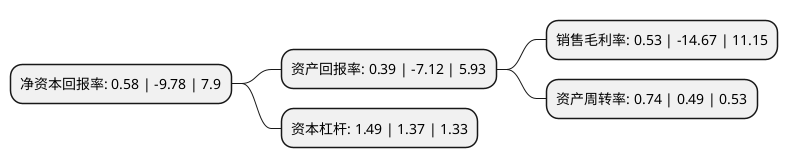

> 本页面由自动化程序生成于 2022年5月20日 01:24
> 内容可能存在错误，如有bug请提交issue至：https://github.com/Eroleice/doc-pi/issues
{.is-warning}

# 上市公司基本情况

## 基本资料

中视传媒股份有限公司（以下简称“中视传媒”）成立于2002年05月31日，上海市。于1997年06月16日在上交所主板上市。

中视传媒注册资本39,770.64万元，主要业务:影视拍摄，电视剧节目制作，销售经营，影视设备租赁，高清晰度影视技术，代理各类广告业务，影视拍摄基地开发，经营等。以下是详细信息：

- 公司名称: 中视传媒股份有限公司
- 股票代码: 600088.SH
- 所在地: 上海 - 上海市
- 成立日期: 2002年05月31日
- 注册资本: 39,770.64万元
- 法定代表人: 唐世鼎
- 主营业务: 影视拍摄，电视剧节目制作，销售经营，影视设备租赁，高清晰度影视技术，代理各类广告业务，影视拍摄基地开发，经营等
- 公司官网: www.ctv-media.com.cn
- 公司介绍: 公司作为中央电视台控股的传媒类A股上市公司，主营影视拍摄、电视节目制作与销售、影视拍摄基地开发和经营、影视设备租赁和技术服务、媒体广告代理等业务。公司坚持与时俱进、开拓创新，“影视、旅游、广告”三大主业齐头并进。公司拥有雄厚的技术力量、全套先进的影视制作设备和专业的制作团队，全面支持影视制作全流程业务，是国内最早进入高清晰度电视制作领域的企业，成功配合中央电视台完成频道改版制作任务，并为中央电视台重大题材和报道任务提供设备支持和技术服务，全力保障播出安全。公司在江苏无锡、广东南海拥有3000多亩影视拍摄基地，景观纵跨中国魏晋、唐宋、明清、民国等历史年代。其中，无锡影视基地是国内建成最早的影视拍摄基地和文化旅游胜地，也是首家获评5A级旅游景区的影视文化旅游景区、首批国家影视指定拍摄基地和首批全国低碳旅游实验区。公司独家代理经营中央电视台CCTV-10科教频道全频道广告资源，以独特的企业文化和创新服务理念，为国内外众多知名企业提供服务，先后获得“中央电视台优秀广告代理公司”、“中国最具影响力本土广告公司100强称号”、“中央电视台年度广告承包公司特别贡献奖”等荣誉称号。

## 股东及高管情况

上市公司第一大股东为中央电视台无锡太湖影视城，持股216,182,194股，占比54.37%，为上市公司实际控制人。

截至2022年03月31日，上市公司的前十大股东中，共有5名自然人股东，4名机构股东，1名其他股东，其中5%以上大股东共有1名。上市公司前十大股东明细如下：

> 截至2022年03月31日，上市公司前十大股东信息如下：

| 股东名称 | 持股数量（股） | 持股比例 |
| --- | --- | --- |
| 中央电视台无锡太湖影视城 | 216,182,194 | 54.37% |
| 北京中电高科技电视发展有限公司 | 3,351,663 | 0.84% |
| 中国国际电视总公司 | 3,351,663 | 0.84% |
| 北京未来广告有限公司 | 3,351,663 | 0.84% |
| 董小琳 | 3,001,062 | 0.75% |
| 张宏伟 | 1,403,572 | 0.35% |
| 郑小华 | 1,153,438 | 0.29% |
| 马红光 | 1,140,000 | 0.29% |
| 北京荧屏汽车租赁有限公司 | 1,117,221 | 0.28% |
| 李岩 | 1,098,620 | 0.28% |

## 利润表分析

上市公司2021年总收入为11.88亿元，净利润为0.06亿元，实现盈利。

## 杜邦分析

> 数据列示周期：2021年 | 2020年 | 2019年
{.is-info}

上市公司的净资产收益率在近一年有所下降，下降幅度为-105.93%，其变化情况分解如下：
- 上市公司的销售毛利率在近一年下降了-103.61%，可能是生产效率的下降、商品原材料价格上涨或商品价格的下跌所致。
- 上市公司的资产周转率在近一年上升了51.02%，可能是源自于更快的销售回款或库存管理效果提升。
- 上市公司的财务杠杆比率在近一年上升了8.76%，可能是增加负债扩大生产规模。

