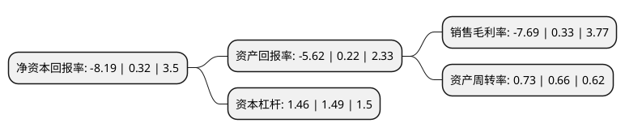

> 本页面由自动化程序生成于 2022年5月20日 01:27
> 内容可能存在错误，如有bug请提交issue至：https://github.com/Eroleice/doc-pi/issues
{.is-warning}

# 上市公司基本情况

## 基本资料

新国脉数字文化股份有限公司（以下简称“新国脉”）成立于1992年04月01日，上海市。于1993年04月07日在上交所主板上市。

新国脉注册资本79,569.594万元，旅预订及酒店经营和输出管理以下是详细信息：

- 公司名称: 新国脉数字文化股份有限公司
- 股票代码: 600640.SH
- 所在地: 上海 - 上海市
- 成立日期: 1992年04月01日
- 注册资本: 79,569.594万元
- 法定代表人: 李安民
- 主营业务: 旅预订及酒店经营和输出管理
- 公司官网: www.besttoneh.com
- 公司介绍: 公司是中国电信旗下上市公司，是中国电信旗下统一的互联网文娱业务平台,拥有国有企业的定位优势、中国电信的资源优势和天翼生态的战略优势，通过打造手机和电视融合、内容和流量融合和ToB和ToC融合的泛娱乐休闲生态体系,实现自身业务的枝繁叶茂。公司致力于成为领先的互联网智能文娱服务企业。公司及下属子公司主要业务为互联网视频内容应用、游戏、数字阅读、数字动漫新媒体、应用分发、积分运营、商旅预订、酒店运营管理等。公司拥有线上丰富的文娱内容及分发资源和线下商旅、旅行社、酒店资源，同时具有中国电信积分运营权，旗下视频、游戏、阅读、动漫、商旅、酒店等业务面向公众、政企两类人群，拥有庞大的用户基础。公司业务种类丰富，子公司拥有各类资质和牌照，包括全国增值电信业务经营许可证、网络文化经营许可证、广播电视节目制作经营许可证、信息网络传播视听节目许可证、网络出版服务许可证、出版物经营许可证、互联网出版许可证、保险兼业代理业务许可证、旅行社业务经营许可证以及视频播放全牌照等，为各类业务的合法经营和发展提供有力保障。

## 股东及高管情况

上市公司第一大股东为中国电信集团有限公司，持股407,061,147股，占比51.16%，为上市公司实际控制人。

截至2022年03月31日，上市公司的前十大股东中，共有3名自然人股东，5名机构股东，2个产品账户，其中5%以上大股东共有2名。上市公司前十大股东明细如下：

> 截至2022年03月31日，上市公司前十大股东信息如下：

| 股东名称 | 持股数量（股） | 持股比例 |
| --- | --- | --- |
| 中国电信集团有限公司 | 407,061,147 | 51.16% |
| 中国电信集团实业资产管理有限公司 | 112,178,462 | 14.1% |
| 中国电信股份有限公司 | 32,823,936 | 4.13% |
| 同方投资有限公司 | 7,126,733 | 0.9% |
| 上海捷时达邮政专递有限公司 | 3,879,383 | 0.49% |
| 吴刚 | 3,600,000 | 0.45% |
| 中国工商银行股份有限公司-广发中证传媒交易型开放式指数证券投资基金 | 2,953,501 | 0.37% |
| 孔令国 | 2,322,600 | 0.29% |
| 黄明嵩 | 2,146,563 | 0.27% |
| 中国工商银行股份有限公司-金鹰科技创新股票型证券投资基金 | 1,510,000 | 0.19% |

## 利润表分析

上市公司2021年总收入为46.1亿元，净利润为-3.55亿元，**未实现盈利**。

## 杜邦分析

> 数据列示周期：2021年 | 2020年 | 2019年
{.is-info}

上市公司的净资产收益率在近一年有所下降，下降幅度为-2659.37%，其变化情况分解如下：
- 上市公司的销售毛利率在近一年下降了-2430.3%，可能是生产效率的下降、商品原材料价格上涨或商品价格的下跌所致。
- 上市公司的资产周转率在近一年上升了10.61%，可能是源自于更快的销售回款或库存管理效果提升。
- 上市公司的财务杠杆比率在近一年下降了-2.01%，可能是减少负债降低财务费用。

