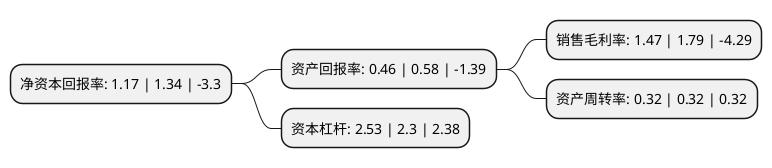

> 本页面由自动化程序生成于 2022年5月20日 01:29
> 内容可能存在错误，如有bug请提交issue至：https://github.com/Eroleice/doc-pi/issues
{.is-warning}

# 上市公司基本情况

## 基本资料

陕西广电网络传媒(集团)股份有限公司（以下简称“广电网络”）成立于1996年12月31日，西安市。于1994年02月24日在上交所主板上市。

广电网络注册资本71,048.636万元，主要业务:从原来传统的有线电视传输业务，集团/家庭网络接入业务，逐步发展为以视频，数据，智慧三大业务为主业。以下是详细信息：

- 公司名称: 陕西广电网络传媒(集团)股份有限公司
- 股票代码: 600831.SH
- 所在地: 陕西 - 西安市
- 成立日期: 1996年12月31日
- 注册资本: 71,048.636万元
- 法定代表人: 王立强
- 主营业务: 从原来传统的有线电视传输业务，集团/家庭网络接入业务，逐步发展为以视频，数据，智慧三大业务为主业
- 公司官网: www.600831.com
- 公司介绍: 公司是陕西省行政区域内一家有线电视网络运营商，陕西省电子政务传输网建设支撑企业，合法的ISP接入业务服务商，也是全国首家实现省域网络全程全网整体上市的省级广电网络公司，拥有国家广电总局有线数字电视应用技术实验室。公司主要负责陕西省内广播电视网络的规划建设和运营管理，对全省广电网络实行统一规划、统一建设、统一运营、统一管理，实现省、市、县、乡、村五级贯通，通过有线+无线方式覆盖全省上千万家庭用户。公司业务范围已从原来传统的有线电视传输业务、集团/家庭网络接入业务，逐步发展为以视频、数据、智慧三大业务为主业，涵盖特色内容、系统集成、互联网金融等在内的全媒体、多网络、综合性业务。目前，公司以智慧新广电为方向，推出了新一代业务品牌“秦岭云”，并积极布局智慧社区业务，加速推动公司由“传统有线电视传输企业”向“融合网络媒体服务商”转型。历经十多年的创新发展，实现了由事业变企业、小网变大网、模拟变数字、单向变双向、传统单一业务变多元产业集群、粗放式管理变集约化经营等“六大转变”，以生动成功的实践诠释了改革激发活力、创新引领发展的深刻道理，走出了一条具有陕西特色的广电网络发展之路。

## 股东及高管情况

上市公司第一大股东为陕西广电融媒体集团有限公司，持股207,590,648股，占比29.22%，**疑似为**上市公司实际控制人。

截至2022年03月31日，上市公司的前十大股东中，共有5名自然人股东，4名机构股东，1个海外主体，其中5%以上大股东共有1名。上市公司前十大股东明细如下：

> 未能通过持股比例判定出上市公司实际控制人（持股30%以上）
> 可能存在通过间接持股、联合持股、协议控制等方式拥有实际控制权的主体，具体请参考上市公司定期公告！
{.is-warning}

> 截至2022年03月31日，上市公司前十大股东信息如下：

| 股东名称 | 持股数量（股） | 持股比例 |
| --- | --- | --- |
| 陕西广电融媒体集团有限公司 | 207,590,648 | 29.22% |
| 东方明珠新媒体股份有限公司 | 19,526,952 | 2.75% |
| 同方股份有限公司 | 9,413,472 | 1.32% |
| 乔海水 | 9,277,997 | 1.31% |
| 刘自林 | 5,292,800 | 0.74% |
| 西安黄河机器制造有限公司 | 4,985,473 | 0.7% |
| JPMORGAN CHASE BANK,NATIONAL ASSOCIATION | 3,506,884 | 0.49% |
| 沙克堂 | 3,235,300 | 0.46% |
| 万武光 | 2,824,400 | 0.4% |
| 彭少华 | 2,700,000 | 0.38% |

## 利润表分析

上市公司2021年总收入为30.05亿元，净利润为0.44亿元，实现盈利。

## 杜邦分析

> 数据列示周期：2021年 | 2020年 | 2019年
{.is-info}

上市公司的净资产收益率在近一年有所下降，下降幅度为-12.69%，其变化情况分解如下：
- 上市公司的销售毛利率在近一年下降了-17.88%，可能是生产效率的下降、商品原材料价格上涨或商品价格的下跌所致。
- 上市公司的资产周转率在近一年下降了0%，可能是源自于更慢的销售回款或库存管理效果下降。
- 上市公司的财务杠杆比率在近一年上升了10%，可能是增加负债扩大生产规模。

