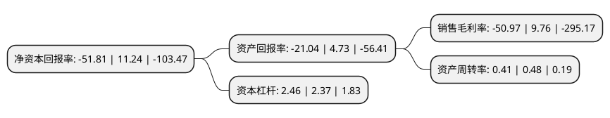

> 本页面由自动化程序生成于 2022年5月20日 01:29
> 内容可能存在错误，如有bug请提交issue至：https://github.com/Eroleice/doc-pi/issues
{.is-warning}

# 上市公司基本情况

## 基本资料

大晟时代文化投资股份有限公司（以下简称“大晟文化”）成立于1993年09月01日，深圳市。于1996年03月15日在上交所主板上市。

大晟文化注册资本55,946.419万元，主要经营贸易业务。以下是详细信息：

- 公司名称: 大晟时代文化投资股份有限公司
- 股票代码: 600892.SH
- 所在地: 广东 - 深圳市
- 成立日期: 1993年09月01日
- 注册资本: 55,946.419万元
- 法定代表人: 黄苹
- 主营业务: 主要经营贸易业务
- 公司官网: www.600892.com.cn
- 公司介绍: 公司位于深圳市，旗下有多家全资控股或参股子公司。公司(包括其子公司)的主要业务集中在影视投资与制作、游戏开发及教育等板块。公司的主营业务为影视投资与制作、游戏开放以及教育等文化领域。围绕“大文化战略格局，打造泛娱乐产业平台”的战略目标进行战略布局，促进“文娱、教育”产业融合。公司将继续开展业务整合，在原有影视和游戏业务的基础上，进一步拓展和增强电视剧、电影、端游、手游、传媒等业务，同时依托影视和游戏的品牌IP及粉丝价值，实现“影游互动”系统效应的最大化，完全发掘品牌价值，从而打造全产业链影视文化娱乐公司。

## 股东及高管情况

上市公司第一大股东为周镇科，持股167,553,120股，占比29.95%，**疑似为**上市公司实际控制人。

截至2022年03月31日，上市公司的前十大股东中，共有8名自然人股东，2名机构股东，其中5%以上大股东共有4名。上市公司前十大股东明细如下：

> 未能通过持股比例判定出上市公司实际控制人（持股30%以上）
> 可能存在通过间接持股、联合持股、协议控制等方式拥有实际控制权的主体，具体请参考上市公司定期公告！
{.is-warning}

> 截至2022年03月31日，上市公司前十大股东信息如下：

| 股东名称 | 持股数量（股） | 持股比例 |
| --- | --- | --- |
| 周镇科 | 167,553,120 | 29.95% |
| 深圳市大晟资产管理有限公司 | 50,682,752 | 9.06% |
| 北京天创文投文化发展集团有限公司 | 50,245,359 | 8.98% |
| 许锦光 | 34,188,164 | 6.11% |
| 陈乐强 | 18,993,424 | 3.39% |
| 陈佳潮 | 15,194,740 | 2.72% |
| 江波 | 9,824,416 | 1.76% |
| 高源隆 | 4,392,696 | 0.79% |
| 黄永建 | 4,010,140 | 0.72% |
| 熊永庭 | 3,806,200 | 0.68% |

## 利润表分析

上市公司2021年总收入为2.14亿元，净利润为-1.1亿元，**未实现盈利**。

## 杜邦分析

> 数据列示周期：2021年 | 2020年 | 2019年
{.is-info}

上市公司的净资产收益率在近一年有所下降，下降幅度为-560.94%，其变化情况分解如下：
- 上市公司的销售毛利率在近一年下降了-622.23%，可能是生产效率的下降、商品原材料价格上涨或商品价格的下跌所致。
- 上市公司的资产周转率在近一年下降了-14.58%，可能是源自于更慢的销售回款或库存管理效果下降。
- 上市公司的财务杠杆比率在近一年上升了3.8%，可能是增加负债扩大生产规模。

