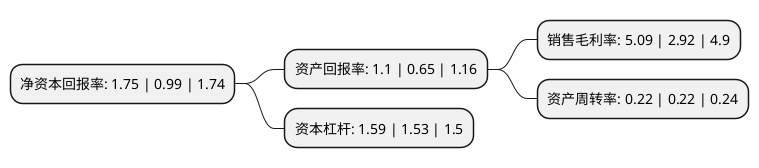

> 本页面由自动化程序生成于 2022年5月20日 01:30
> 内容可能存在错误，如有bug请提交issue至：https://github.com/Eroleice/doc-pi/issues
{.is-warning}

# 上市公司基本情况

## 基本资料

江苏省广电有线信息网络股份有限公司（以下简称“江苏有线”）成立于2008年07月10日，南京市。于2015年04月28日在上交所主板上市。

江苏有线注册资本500,071.769万元，主营业务:主要从事广电网络的建设运营，广播电视节目传输，数据宽带业务以及数字电视增值业务的开发与经营。以下是详细信息：

- 公司名称: 江苏省广电有线信息网络股份有限公司
- 股票代码: 600959.SH
- 所在地: 江苏 - 南京市
- 成立日期: 2008年07月10日
- 注册资本: 500,071.769万元
- 法定代表人: 姜龙
- 主营业务: 主营业务:主要从事广电网络的建设运营，广播电视节目传输，数据宽带业务以及数字电视增值业务的开发与经营
- 公司官网: www.jscnnet.com
- 公司介绍: 公司是江苏省委、省政府根据中央文化体制改革精神,在整合全省广电网络资源基础上组建的国有大型文化企业。公司主要从事广电网络的建设运营，广播电视节目传输、数据宽带业务以及数字电视增值业务的开发与经营。公司自设立以来，一直致力于成为国内一流的综合信息服务运营商，要成为：先进思想的引导者，智能电视的主导者，新内容新业务的开拓者，综合信息平台的提供者和转型升级发展的践行者。公司先后被中央部委评为“全国文化体制改革先进企业”，并连续多年入选“全国文化企业30强”。2018年公司通过重大资产重组收购控股子公司发展公司除上市公司持股外的剩余70%股权，有利于进一步增强江苏有线对发展公司的整体经营决策能力和效率，符合公司发展战略。

## 股东及高管情况

上市公司第一大股东为江苏省国金集团信息网络投资有限公司，持股2,285,514,129股，占比45.7%，为上市公司实际控制人。

截至2022年03月31日，上市公司的前十大股东中，共有7名机构股东，3个产品账户，其中5%以上大股东共有1名。上市公司前十大股东明细如下：

> 截至2022年03月31日，上市公司前十大股东信息如下：

| 股东名称 | 持股数量（股） | 持股比例 |
| --- | --- | --- |
| 江苏省国金集团信息网络投资有限公司 | 2,285,514,129 | 45.7% |
| 中信证券股份有限公司 | 139,303,517 | 2.79% |
| 视京呈通信(上海)有限公司 | 103,312,910 | 2.07% |
| 黑龙江电信国脉工程股份有限公司 | 70,257,611 | 1.4% |
| 北京泰铼投资管理有限公司-泰铼信铼6号私募证券投资基金 | 45,024,353 | 0.9% |
| 江苏紫金文化产业二期创业投资基金(有限合伙) | 44,223,702 | 0.88% |
| 北京泰铼投资管理有限公司-泰铼信铼12号私募证券投资基金 | 38,000,000 | 0.76% |
| 无锡市交通产业集团有限公司 | 32,328,047 | 0.65% |
| 如东县广视网络传媒有限公司 | 32,148,525 | 0.64% |
| 无锡商业大厦大东方股份有限公司 | 28,250,034 | 0.56% |

## 利润表分析

上市公司2021年总收入为74.58亿元，净利润为3.79亿元，实现盈利。

## 杜邦分析

> 数据列示周期：2021年 | 2020年 | 2019年
{.is-info}

上市公司的净资产收益率在近一年有所上升，上升幅度为76.77%，其变化情况分解如下：
- 上市公司的销售毛利率在近一年上升了74.32%，可能是生产效率的提升、商品原材料价格下跌或商品价格的上涨所致。
- 上市公司的资产周转率在近一年下降了0%，可能是源自于更慢的销售回款或库存管理效果下降。
- 上市公司的财务杠杆比率在近一年上升了3.92%，可能是增加负债扩大生产规模。

