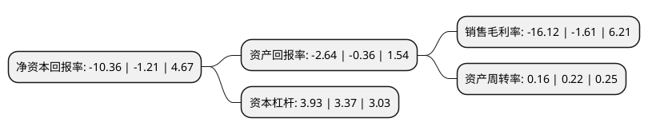

> 本页面由自动化程序生成于 2022年5月20日 01:30
> 内容可能存在错误，如有bug请提交issue至：https://github.com/Eroleice/doc-pi/issues
{.is-warning}

# 上市公司基本情况

## 基本资料

贵州省广播电视信息网络股份有限公司（以下简称“贵广网络”）成立于2008年03月26日，贵阳市。于2016年12月26日在上交所主板上市。

贵广网络注册资本105,170.958万元，主要从事广播电视网络的建设运营，主要业务包括广播电视节目收视服务，数字电视增值业务的开发与经营，数据业务，有线电视相关工程及安装，节目传输等，业务区域覆盖贵州省全境。以下是详细信息：

- 公司名称: 贵州省广播电视信息网络股份有限公司
- 股票代码: 600996.SH
- 所在地: 贵州 - 贵阳市
- 成立日期: 2008年03月26日
- 注册资本: 105,170.958万元
- 法定代表人: 李巍
- 主营业务: 主要从事广播电视网络的建设运营，主要业务包括广播电视节目收视服务，数字电视增值业务的开发与经营，数据业务，有线电视相关工程及安装，节目传输等，业务区域覆盖贵州省全境
- 公司官网: www.gzgdwl.com
- 公司介绍: 公司是贵州广电传媒集团旗下三家大型企业之一。公司主要从事广播电视网络的建设运营，主要业务包括广播电视节目收视服务、数字电视增值业务的开发与经营、数据业务、有线电视相关工程及安装、节目传输、终端销售等，业务区域覆盖贵州省全境。公司大力发展数字电视、高清互动、个人宽带等三网融合业务，试点推进有线无线融合网业务，积极推动传统媒体和新媒体融合，旨在打造全新的全媒体服务平台和家庭娱乐中心。公司加快全媒体产业布局，推进传统媒体和新兴媒体融合发展，构建智慧广电新生态，形成“跨区域、跨网络、跨行业、跨终端、跨所有制”和“全媒体服务、全方位覆盖、全业态呈现”的发展新格局，构建“一云、双网、三用”的贵州智慧广电新体系，推动智慧广电与智慧社会建设全面融合发展，实现广电网络全面融合创新和转型升级。公司被评为全国文化体制改革先进企业(单位)，全国文化企业30强提名，是国家火炬计划重点高新技术企业，全国重信誉、守合同企业，贵州省创新型领军企业，贵州文化产业示范基地，贵州省最佳信用企业。

## 股东及高管情况

上市公司第一大股东为贵州广播影视投资有限公司，持股443,274,686股，占比41.63%，为上市公司实际控制人。

截至2022年03月31日，上市公司的前十大股东中，共有2名自然人股东，5名机构股东，3个产品账户，其中5%以上大股东共有3名。上市公司前十大股东明细如下：

> 截至2022年03月31日，上市公司前十大股东信息如下：

| 股东名称 | 持股数量（股） | 持股比例 |
| --- | --- | --- |
| 贵州广播影视投资有限公司 | 443,274,686 | 41.63% |
| 中国贵州茅台酒厂(集团)有限责任公司 | 121,423,728 | 11.4% |
| 贵州电信实业有限公司 | 61,263,752 | 5.75% |
| 北京歌华有线电视网络股份有限公司 | 39,963,285 | 3.75% |
| 贵州广电传媒集团有限公司 | 21,631,050 | 2.03% |
| 上海纯达资产管理有限公司-纯达量化对冲稳健2号私募证券投资基金 | 18,905,535 | 1.78% |
| 肖明昌 | 5,359,300 | 0.5% |
| 张兵峰 | 3,380,000 | 0.32% |
| 上海通怡投资管理有限公司-通怡麒麟5号私募证券投资基金 | 3,152,400 | 0.3% |
| 上海通怡投资管理有限公司-通怡麒麟6号私募证券投资基金 | 2,458,400 | 0.23% |

## 利润表分析

上市公司2021年总收入为27.83亿元，净利润为-4.49亿元，**未实现盈利**。

## 杜邦分析

> 数据列示周期：2021年 | 2020年 | 2019年
{.is-info}

上市公司的净资产收益率在近一年有所上升，上升幅度为756.2%，其变化情况分解如下：
- 上市公司的销售毛利率在近一年上升了901.24%，可能是生产效率的提升、商品原材料价格下跌或商品价格的上涨所致。
- 上市公司的资产周转率在近一年下降了-27.27%，可能是源自于更慢的销售回款或库存管理效果下降。
- 上市公司的财务杠杆比率在近一年上升了16.62%，可能是增加负债扩大生产规模。

