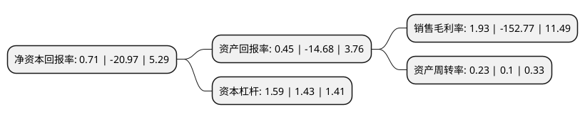

> 本页面由自动化程序生成于 2022年5月20日 01:31
> 内容可能存在错误，如有bug请提交issue至：https://github.com/Eroleice/doc-pi/issues
{.is-warning}

# 上市公司基本情况

## 基本资料

上海电影股份有限公司（以下简称“上海电影”）成立于1994年10月07日，上海市。于2016年08月17日在上交所主板上市。

上海电影注册资本44,820万元，主营业务为电影发行及放映业务，具体包括电影发行和版权销售，院线经营以及影院投资，开发和经营业务。以下是详细信息：

- 公司名称: 上海电影股份有限公司
- 股票代码: 601595.SH
- 所在地: 上海 - 上海市
- 成立日期: 1994年10月07日
- 注册资本: 44,820万元
- 法定代表人: 王健儿
- 主营业务: 主营业务为电影发行及放映业务，具体包括电影发行和版权销售，院线经营以及影院投资，开发和经营业务
- 公司官网: www.sh-sfc.com
- 公司介绍: 公司的主营业务为电影发行及放映业务，具体包括电影发行和版权销售、院线经营以及影院投资、开发和经营业务。公司是行业内少数形成“专业化发行公司+综合型院线+高端影院经营”的完整电影发行放映产业链的公司，在电影发行及放映业务的各个领域均具有领先的市场地位。公司还是全国最早从事市场化电影发行业务、累计发行影片最多的专业化电影发行公司之一，下属联和院线为全国票房排名第二位的院线，并且拥有上海影城、上海永华影城等一批技术先进、经营良好、票房领先的影院。公司将继续以建设“全球影业最具影响力的现代企业”为愿景，将公司打造成为市场占有率领先、综合竞争力强的标杆企业。

## 股东及高管情况

上市公司第一大股东为上海电影(集团)有限公司，持股310,228,317股，占比69.22%，为上市公司实际控制人。

截至2022年03月31日，上市公司的前十大股东中，共有5名自然人股东，4名机构股东，1个产品账户，其中5%以上大股东共有1名。上市公司前十大股东明细如下：

> 截至2022年03月31日，上市公司前十大股东信息如下：

| 股东名称 | 持股数量（股） | 持股比例 |
| --- | --- | --- |
| 上海电影(集团)有限公司 | 310,228,317 | 69.22% |
| 上海精文投资有限公司 | 11,479,790 | 2.56% |
| 阿拉丁文化传媒(北京)集团有限公司 | 2,983,086 | 0.67% |
| 中国工商银行股份有限公司-中证上海国企交易型开放式指数证券投资基金 | 2,439,634 | 0.54% |
| 吴进进 | 1,375,300 | 0.31% |
| 陈平 | 1,085,600 | 0.24% |
| 吴永杰 | 784,712 | 0.18% |
| 张彤 | 727,320 | 0.16% |
| 李辉 | 692,075 | 0.15% |
| 临沂金升非融资担保有限公司 | 628,560 | 0.14% |

## 利润表分析

上市公司2021年总收入为7.31亿元，净利润为0.14亿元，实现盈利。

## 杜邦分析

> 数据列示周期：2021年 | 2020年 | 2019年
{.is-info}

上市公司的净资产收益率在近一年有所下降，下降幅度为-103.39%，其变化情况分解如下：
- 上市公司的销售毛利率在近一年下降了-101.26%，可能是生产效率的下降、商品原材料价格上涨或商品价格的下跌所致。
- 上市公司的资产周转率在近一年上升了130%，可能是源自于更快的销售回款或库存管理效果提升。
- 上市公司的财务杠杆比率在近一年上升了11.19%，可能是增加负债扩大生产规模。

