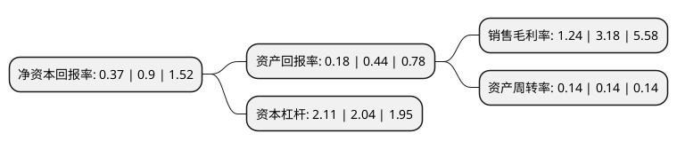

> 本页面由自动化程序生成于 2022年5月20日 01:31
> 内容可能存在错误，如有bug请提交issue至：https://github.com/Eroleice/doc-pi/issues
{.is-warning}

# 上市公司基本情况

## 基本资料

吉视传媒股份有限公司（以下简称“吉视传媒”）成立于2001年05月09日，长春市。于2012年02月23日在上交所主板上市。

吉视传媒注册资本311,117.665万元，主要业务:主要依托数字电视智能光网的规划建设与运行管理，交互式现代多媒体综合信息服务平台的支撑，从事广播电视节目内容的接收，转发和传输等基本业务;依托IP数据网，VOD交换网和DCN网三大承载网络，开展各类宽带互联网等双向数据增值业务服务。以下是详细信息：

- 公司名称: 吉视传媒股份有限公司
- 股票代码: 601929.SH
- 所在地: 吉林 - 长春市
- 成立日期: 2001年05月09日
- 注册资本: 311,117.665万元
- 法定代表人: 王胜杰
- 主营业务: 主要依托数字电视智能光网的规划建设与运行管理，交互式现代多媒体综合信息服务平台的支撑，从事广播电视节目内容的接收，转发和传输等基本业务;依托IP数据网，VOD交换网和DCN网三大承载网络，开展各类宽带互联网等双向数据增值业务服务
- 公司官网: www.jishimedia.com
- 公司介绍: 公司是吉林地区大型的文化产业类国有企业，在吉林省范围内主要依托数字电视智能光网的规划建设与运行管理、交互式现代多媒体综合信息服务平台的支撑，从事广播电视节目内容的接收、转发和传输等基本业务；依托IP数据网、VOD交换网和DCN网三大承载网络，开展各类宽带互联网等双向数据增值业务服务。同时，为了在国家“三网融合”产业政策全面放开，网络技术迭代加速等市场竞争格局下实现企业垂直跃升，公司以国家全面促进社会信息化发展这一重大战略部署为产业升级方向，围绕政企行业客户及智慧产业领域开展各类社会信息化应用与服务业务。公司先后多次获得国家版权局批准的计算机软件著作权登记，国家广播电影电视总局科技类创新奖，国家知识产权局颁发专利证书。

## 股东及高管情况

上市公司第一大股东为吉林广播电视台，持股983,337,364股，占比29.79%，**疑似为**上市公司实际控制人。

截至2022年03月31日，上市公司的前十大股东中，共有3名机构股东，7名其他股东，其中5%以上大股东共有1名。上市公司前十大股东明细如下：

> 未能通过持股比例判定出上市公司实际控制人（持股30%以上）
> 可能存在通过间接持股、联合持股、协议控制等方式拥有实际控制权的主体，具体请参考上市公司定期公告！
{.is-warning}

> 截至2022年03月31日，上市公司前十大股东信息如下：

| 股东名称 | 持股数量（股） | 持股比例 |
| --- | --- | --- |
| 吉林广播电视台 | 983,337,364 | 29.79% |
| 长春广播电视台 | 152,113,414 | 4.61% |
| 吉林省吉视投资有限责任公司 | 92,726,300 | 2.81% |
| 延吉市融媒体中心(延吉广播电视台) | 70,653,136 | 2.14% |
| 敦化市融媒体中心(敦化广播电视台) | 61,177,828 | 1.85% |
| 桦甸市文化旅游发展有限公司 | 37,626,218 | 1.14% |
| 榆树广播电视台 | 32,711,374 | 0.99% |
| 白山市江源区融媒体中心(白山市江源广播电视台) | 18,856,092 | 0.57% |
| 农安县兴龙农业基础设施开发有限公司 | 17,400,000 | 0.53% |
| 扶余市融媒体中心(扶余广播电视台) | 14,526,066 | 0.44% |

## 利润表分析

上市公司2021年总收入为20.79亿元，净利润为0.25亿元，实现盈利。

## 杜邦分析

> 数据列示周期：2021年 | 2020年 | 2019年
{.is-info}

上市公司的净资产收益率在近一年有所下降，下降幅度为-58.89%，其变化情况分解如下：
- 上市公司的销售毛利率在近一年下降了-61.01%，可能是生产效率的下降、商品原材料价格上涨或商品价格的下跌所致。
- 上市公司的资产周转率在近一年下降了0%，可能是源自于更慢的销售回款或库存管理效果下降。
- 上市公司的财务杠杆比率在近一年上升了3.43%，可能是增加负债扩大生产规模。

